# OhMyOrch


<https://josoroma.github.io/OhMyOrch/docs/OhMyOrch.html>

[Plugin handbook](plugins/ohmyorch/README.md) · [Installation & updates](docs/distribution.md)

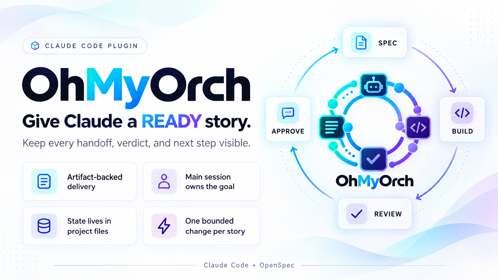

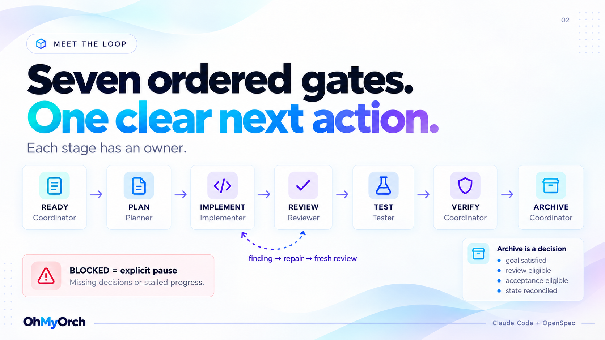

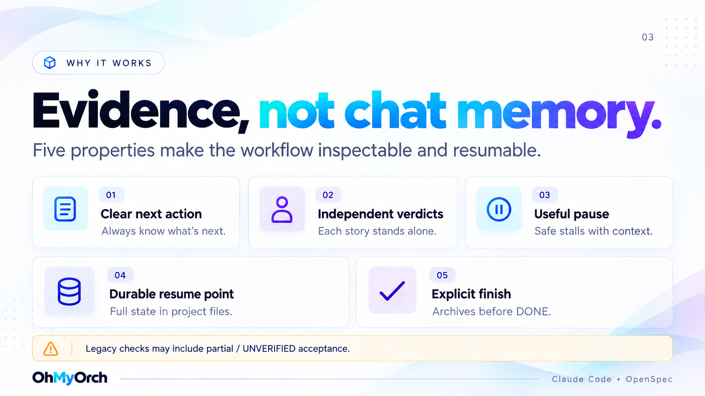

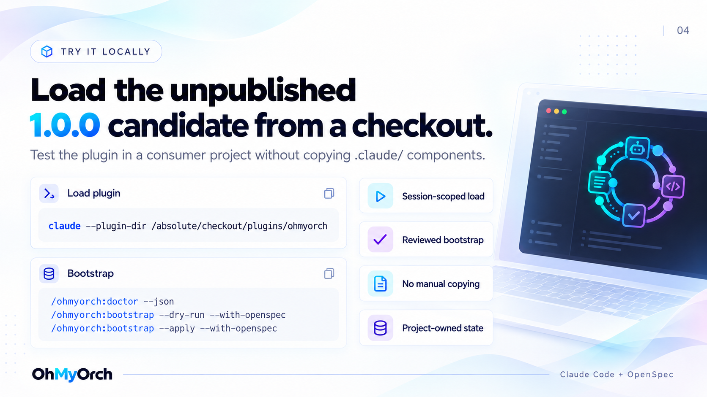

**0.0.1 is published.** For a local preview, run from this repository:

```bash
claude --plugin-dir ./plugins/ohmyorch
```

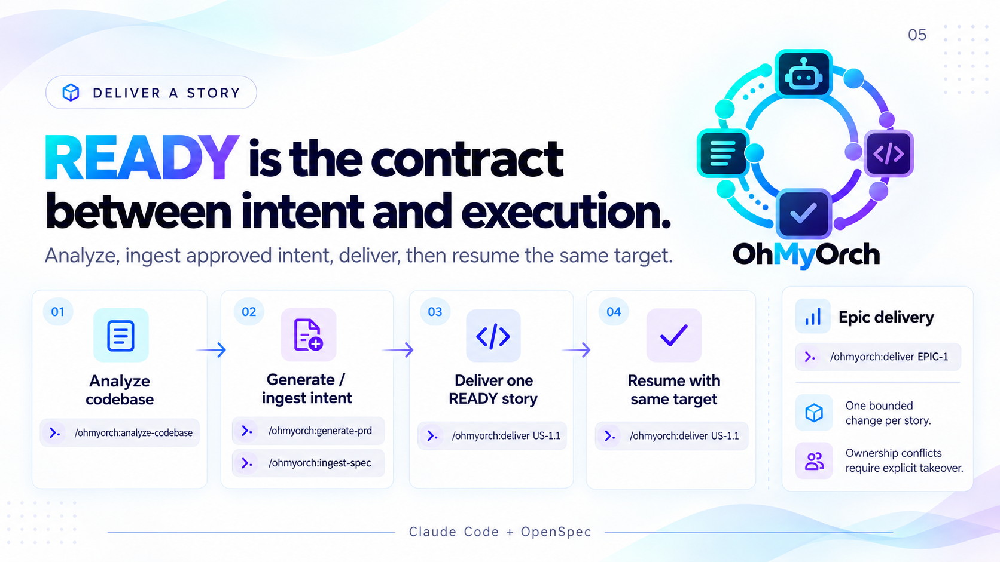

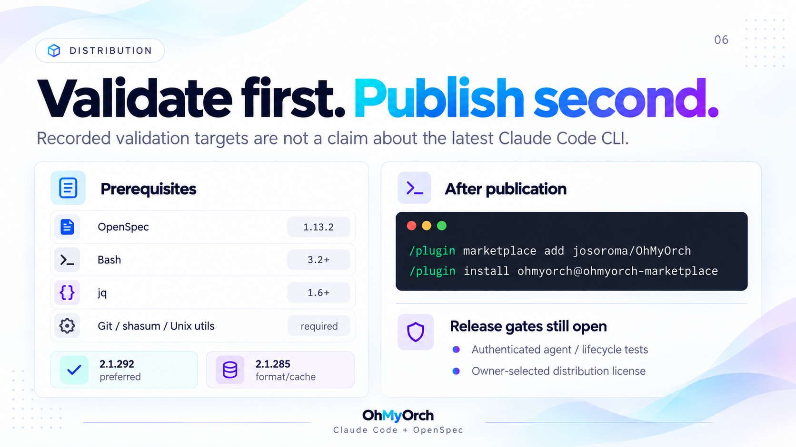

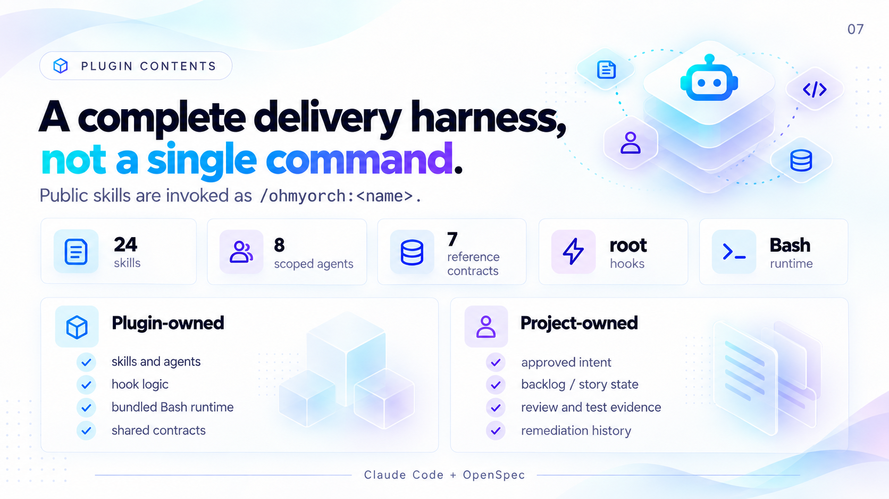

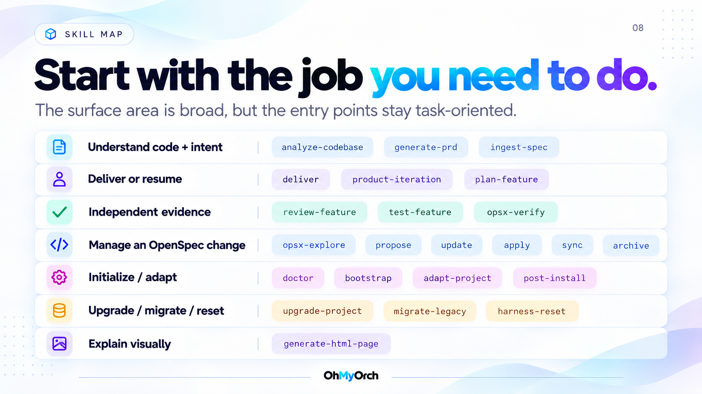

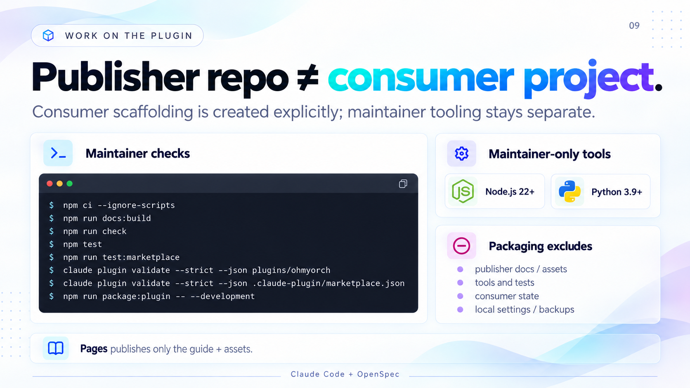

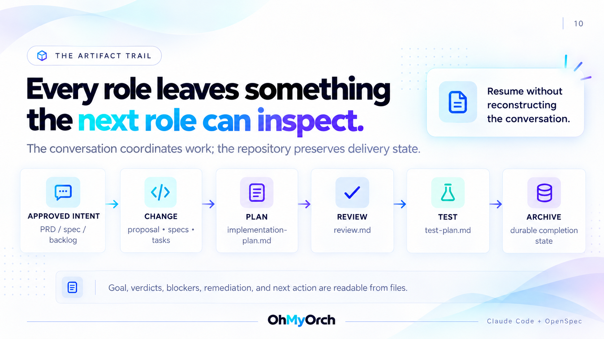

## See your specification as a workspace

[SPECS-APP.hml](SPECS-APP.hml) turns your backlog into a Kanban board. Open a story to see its criteria, tasks, and dependencies, or switch to Document for the complete specification.

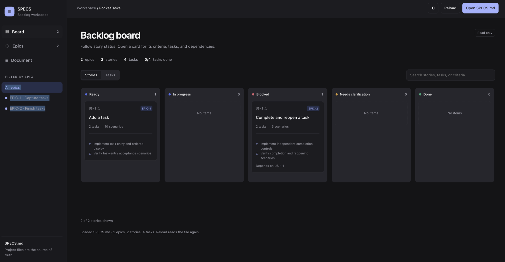

### Setup and run

Requires **Python 3**. The viewer needs no build step or Claude session.

```bash
git clone https://github.com/josoroma/OhMyOrch.git
cd OhMyOrch
python3 -c 'import http.server,mimetypes; mimetypes.add_type("text/html",".hml"); http.server.test(HandlerClass=http.server.SimpleHTTPRequestHandler,port=8000,bind="127.0.0.1")'
```

Already cloned? Run the Python command beside `package.json`. It serves `.hml` as HTML.

Open **[localhost:8000/SPECS-APP.hml](http://127.0.0.1:8000/SPECS-APP.hml)**. The app starts with your root `SPECS.md`; when that file is missing, it opens [the example backlog](docs/SPECS-EXAMPLE/SPECS.md). Use the file selector to switch between them.

### Use it

Switch between Stories, Tasks, and Epics; search or filter to focus on the work that matters. Document keeps the context and acceptance criteria visible, with a Markdown source view and download.

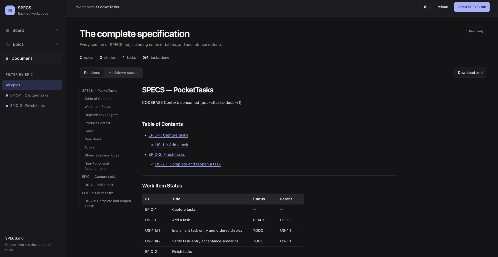

Edit the Markdown file, then click **Reload**. The workspace is read only: it never changes delivery status. **Open SPECS.md** also lets you inspect another local backlog.

The sample includes a matching [PRD](docs/SPECS-EXAMPLE/PRD.md) and [codebase context](docs/SPECS-EXAMPLE/CODEBASE.md).
