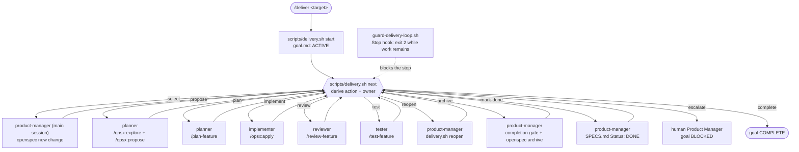
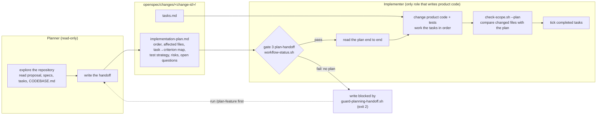
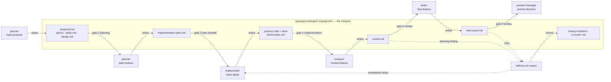

# OhMyOrch Harness

A reusable, spec-driven multi-agent workflow for Claude Code and OpenSpec.

The harness supports greenfield and brownfield repositories. For an existing codebase it first creates a durable `CODEBASE.md` describing the current system, then uses product source material plus that context to generate or update `PRD.md` and an iterable `SPECS.md`. It delivers one bounded feature at a time through separate planning, implementation, review, testing, and archival stages.

**Documentation site:** <https://josoroma.github.io/OhMyOrch>

## Table of Contents

- [Why this exists](#why-this-exists)
- [Team](#team)
- [Core Idea](#core-idea)
- [Repository Layout](#repository-layout)
- [1. Install OpenSpec](#1-install-openspec)
- [2. Initialize OpenSpec for Claude Code](#2-initialize-openspec-for-claude-code)
- [3. Enable the Verify Workflow](#3-enable-the-verify-workflow)
- [4. Add the Harness Files](#4-add-the-harness-files)
- [5. Bootstrap an Existing Codebase](#5-bootstrap-an-existing-codebase)
- [6. Working with a Greenfield Project](#6-working-with-a-greenfield-project)
- [7. Generate or Update PRD.md](#7-generate-or-update-prdmd)
- [8. Generate or Update SPECS.md](#8-generate-or-update-specsmd)
- [9. Before Starting Implementation](#9-before-starting-implementation)
- [10. Start a Feature Iteration](#10-start-a-feature-iteration)
- [11. Explore](#11-explore)
- [12. Propose](#12-propose)
- [13. Create the Planner Handoff](#13-create-the-planner-handoff)
- [14. Implement](#14-implement)
- [15. Review](#15-review)
- [16. Acceptance Test](#16-acceptance-test)
- [17. Archive](#17-archive)
- [18. Goal-Driven Delivery](#18-goal-driven-delivery)
- [19. The Orchestrator Loop and the Plan Handoff](#19-the-orchestrator-loop-and-the-plan-handoff)
- [20. Resume Work in a New Claude Session](#20-resume-work-in-a-new-claude-session)
- [21. Common Command Cookbook](#21-common-command-cookbook)
- [22. Workflow State](#22-workflow-state)
- [23. Team Rules](#23-team-rules)
- [24. Example End-to-End Session](#24-example-end-to-end-session)
- [25. What OpenSpec Provides vs What This Harness Adds](#25-what-openspec-provides-vs-what-this-harness-adds)
- [26. The Executable Harness](#26-the-executable-harness)
- [27. References](#27-references)

## Why this exists

A single coding agent can easily mix six different jobs:

1. deciding what the product means;
2. planning implementation;
3. writing code;
4. judging its own code;
5. deciding whether tests are sufficient;
6. declaring the feature done.

This harness separates those responsibilities and persists the handoffs in the repository.

## Team

| Role | Responsibility | May edit product code? |
|---|---|---:|
| Codebase Analyst | Inspect an existing repository and create/refresh `CODEBASE.md` | No |
| Product Specifier | Generate/update `PRD.md` from product sources plus `CODEBASE.md` when present | No |
| Spec Ingestor | Generate/update `SPECS.md` from product artifacts plus `CODEBASE.md` when present | No |
| Product Manager | Select work, orchestrate agents, control gates and archive | No by default |
| Planner | Explore repository and create implementation handoff | No |
| Implementer | Implement the approved change and implementation tests | Yes |
| Reviewer | Verify implementation against the specification and write findings | No |
| Tester | Validate acceptance criteria independently and write test evidence | No |

The human Product Manager remains the product authority when requirements are missing, ambiguous, or contradictory.

## Core Idea

`CODEBASE.md` is the reusable description of the current system when a codebase exists.

`PRD.md` is the product-intent document.

`SPECS.md` is the iterable product backlog.

OpenSpec changes are implementation-sized slices of that backlog.

Do **not** turn an entire multi-epic `SPECS.md` into one OpenSpec change. Select one independently verifiable `READY` user story or cohesive feature at a time.

```text
Existing codebase? ---- yes ----> Codebase Analyst ----> CODEBASE.md
       |                                                   |
       | no                                                |
       +--------------------------+------------------------+
                                  v
Product source documents ---> Product Specifier ---> PRD.md
                                  |
                                  v
                             Spec Ingestor
                                  |
                                  v
                               SPECS.md
                                  |
                                  v
PM selects one READY story
   |
   v
/opsx:explore
   |
   v
/opsx:propose
   |
   v
Planner -> implementation-plan.md
   |
   v
/opsx:apply
   |
   v
Implementer
   |
   v
Reviewer -> review.md
   |          |
   |          +-- changes requested --> Implementer
   v
Tester -> test-report.md
   |          |
   |          +-- FAIL --> Implementer -> Reviewer -> Tester
   v
Accepted
   |
   v
/opsx:archive
   |
   v
Next READY story
```

## Repository Layout

Product documents may live at the repository root (as in this repository) or under
`docs/`. Every harness script resolves **both** places: it prefers `docs/` when the
file is there and falls back to the root, so a relocated `SPECS.md` needs no flags.

```text
.
├── CLAUDE.md
├── PRD.md                   # or docs/PRD.md
├── SPECS.md                 # or docs/SPECS.md
├── README.md
├── CODEBASE.md              # optional for greenfield; generated for brownfield
├── SPEC-LOGS/             # per-epic delivery records
├── docs/pages/              # themed single-page HTML (see §26, Themed HTML pages)
├── openspec/
│   ├── config.yaml
│   ├── specs/               # canonical capability specs (one per delivered capability)
│   ├── delivery/
│   │   └── goal.md          # the recorded delivery goal (see §18)
│   └── changes/
│       └── archive/         # one archived change per delivered story
├── scripts/                 # the executable harness (see §26)
└── .claude/
    ├── agents/
    │   ├── codebase-analyst.md
    │   ├── product-specifier.md
    │   ├── spec-ingestor.md
    │   ├── product-manager.md
    │   ├── planner.md
    │   ├── implementer.md
    │   ├── reviewer.md
    │   └── tester.md
    ├── skills/
    │   ├── analyze-codebase/SKILL.md
    │   ├── generate-prd/SKILL.md
    │   ├── ingest-spec/SKILL.md
    │   ├── product-iteration/SKILL.md
    │   ├── deliver/SKILL.md          # goal-driven delivery orchestrator
    │   ├── plan-feature/SKILL.md
    │   ├── review-feature/SKILL.md
    │   ├── test-feature/SKILL.md
    │   └── generate-html-page/SKILL.md  # themed single-page HTML
    ├── rules/
    │   ├── team-responsibilities.md
    │   ├── codebase-context.md
    │   ├── openspec.md
    │   ├── gherkin.md
    │   ├── testing.md
    │   ├── specification-ingestion.md
    │   └── delivery-loop.md
    └── settings.json
```

An active change may also contain harness-specific handoff files:

```text
openspec/changes/<change-id>/
├── proposal.md
├── specs/
├── design.md
├── tasks.md
├── implementation-plan.md
├── review.md
├── test-report.md
├── status.md
└── completion.md
```

## 1. Install OpenSpec

OpenSpec currently documents global installation with:

```bash
npm install -g @fission-ai/openspec@latest
```

Confirm installation:

```bash
openspec --version
```

## 2. Initialize OpenSpec for Claude Code

From the repository root:

```bash
openspec init --tools claude
```

OpenSpec installs its Claude workflows and creates `openspec/config.yaml`.

Useful checks:

```bash
openspec list
openspec status
openspec view
```

## 3. Enable the Verify Workflow

OpenSpec's default core profile includes `explore`, `propose`, `apply`, `update`, `sync`, and `archive`. `verify` is an optional workflow.

This harness requires verification before acceptance, so configure OpenSpec to include `verify` in the workflow set used by the project.

OpenSpec exposes profile configuration through:

```bash
openspec config profile
```

Select a custom profile that includes at least:

```text
explore
propose
apply
update
sync
verify
archive
```

Then refresh the current project if needed:

```bash
openspec update
```

Confirm that `/opsx:verify` is available in Claude Code.

## 4. Add the Harness Files

Copy the harness files into the target project:

```text
PRD.md
SPECS.md
CLAUDE.md
.claude/agents/*
.claude/skills/*
.claude/rules/*
.claude/settings.json
```

`PRD.md` describes the harness product itself.

`SPECS.md` is an iterable implementation backlog for building the harness.

For a target product repository, `CODEBASE.md` is generated when an existing codebase is analyzed, `PRD.md` captures product intent, and `SPECS.md` becomes the backlog the harness operates on.

## 5. Bootstrap an Existing Codebase

If the target repository already contains application code, establish reusable technical context before generating product artifacts.

Run:

```text
/analyze-codebase
```

Expected artifact:

```text
CODEBASE.md
```

`CODEBASE.md` is a **current-state repository map**, not a product requirements document. It should describe only what repository evidence supports, including where available:

- analyzed Git revision or other snapshot identifier;
- repository structure and important paths;
- languages, frameworks, package managers, and runtime;
- application entry points and major modules;
- architecture and important data flows;
- persistence and data stores;
- external services and integrations;
- authentication/authorization mechanisms;
- tests, linting, type checking, build tooling, and CI-relevant commands;
- local development and validation commands;
- conventions and architectural patterns already used;
- material existing user-visible behavior;
- known technical constraints, debt, and migration concerns;
- unknowns that could not be verified from repository evidence.

A recommended header is:

```markdown
# CODEBASE

Analyzed revision: <git-sha-or-snapshot>
Working tree: clean | dirty | unknown

## System Summary
## Repository Map
## Runtime and Tooling
## Architecture
## Entry Points
## Data and Persistence
## External Integrations
## Authentication and Authorization
## Existing Product Behavior
## Tests and Quality Gates
## Common Commands
## Conventions
## Constraints and Technical Debt
## Evidence Paths
## Unknowns
```

### CODEBASE.md is descriptive, not normative

The Codebase Analyst may report that the application currently behaves a certain way. That fact does **not** automatically mean the behavior belongs in the target product requirements.

Use this precedence:

```text
Explicit Product Manager decision / approved product source
                      |
                      v
                 Product intent

CODEBASE.md --------------------> current-state evidence and constraints
```

If the desired product behavior conflicts with the existing implementation, preserve the desired behavior and record the implementation difference as a gap, migration concern, constraint, or open question.

### When CODEBASE.md is missing

If the repository contains a meaningful existing codebase but `CODEBASE.md` does not exist, `/generate-prd` and `/ingest-spec` should run `/analyze-codebase` first, unless the Product Manager explicitly records a decision to skip codebase analysis.

### When CODEBASE.md is stale

`CODEBASE.md` should record the repository snapshot it analyzed. If a later workflow can determine that material repository changes have made that snapshot stale, the harness should surface the condition and refresh the file before treating it as current.

The file is a durable optimization for shared understanding; it does not replace feature-specific `/opsx:explore`.

## 6. Working with a Greenfield Project

A greenfield repository has no meaningful application code yet. The brownfield steps
above are then skipped rather than performed emptily.

**Do not run `/analyze-codebase`.** With no code to inspect there is nothing to
describe, and the skill's own contract requires it to report that no meaningful
codebase was found and to fabricate no architecture, integrations, commands, or
existing behavior. A fabricated `CODEBASE.md` is worse than none: later agents would
treat invented "current behavior" as evidence.

The workflow shortens to:

```text
1. Product sources           ->  /generate-prd      (no CODEBASE.md to consult)
2. Backlog                   ->  /ingest-spec
3. One READY story           ->  /product-iteration <story-id>
4. Everything else unchanged
```

Two guards behave differently, and both are correct:

| Guard | Greenfield behavior |
|---|---|
| `guard-context-preflight.sh` | allows — detects no meaningful codebase, so there is no context to require |
| `validate-product-artifacts.sh` | allows — `CODEBASE.md` absent means no context acknowledgment is required |

```text
$ scripts/guard-context-preflight.sh --file docs/PRD.md
ALLOW  no meaningful codebase detected (greenfield)
```

`CODEBASE.md` becomes required the moment a meaningful codebase exists. If code is
added later, run `/analyze-codebase` before the next `PRD.md` or `SPECS.md` update;
`guard-context-preflight.sh` will block that update until you do, or until you record
an explicit skip:

```text
CODEBASE Context: skipped (<reason>)
```

## 7. Generate or Update PRD.md

Use the Product Specifier when turning raw product material into the project's product requirements document.

Intended harness command:

```text
/generate-prd path/to/product-source.md
```

Multiple source documents may be supplied when the skill supports them.

The Product Specifier should use context in this order:

```text
1. Explicit Product Manager decisions
2. Approved product source documents
3. Existing PRD.md when updating it
4. CODEBASE.md as descriptive current-state evidence, when present
```

When `CODEBASE.md` exists, `/generate-prd` must read it before materially updating `PRD.md`.

The generated PRD may use codebase evidence to document:

- current capabilities that the requested product will preserve or extend;
- compatibility requirements;
- known integration or runtime constraints;
- migration requirements;
- target-vs-current gaps;
- risks and open questions exposed by the existing system.

It must **not** infer product intent merely because a behavior, dependency, route, schema, or architectural decision already exists in code.

For a greenfield repository with no meaningful codebase, PRD generation proceeds from product sources without fabricating a current architecture.

## 8. Generate or Update SPECS.md

Use the ingestion skill with `PRD.md` and/or other product source material.

Intended harness command:

```text
/ingest-spec PRD.md
```

or:

```text
/ingest-spec path/to/product-requirements.md
```

When `CODEBASE.md` exists, the Spec Ingestor must read it as part of the generation context.

The Spec Ingestor should:

- inspect the complete product source material;
- read `PRD.md` when available;
- read `CODEBASE.md` when present;
- extract explicit product behavior;
- organize it into epics and user stories;
- use codebase evidence to identify existing capabilities, constraints, dependencies, integration points, and likely migration work;
- generate Gherkin acceptance criteria only when product behavior is supported;
- mark incomplete stories `NEEDS CLARIFICATION`;
- mark contradictory stories `BLOCKED`;
- preserve source references;
- distinguish product requirements from current implementation details;
- avoid target implementation design unless the source explicitly mandates it.

### Expected story shape

````markdown
#### US-4.2: Example Story

Status: READY

As a user
I want ...
So that ...

Source:
- PRD.md / Authentication / Password reset

Codebase Context:
- CODEBASE.md / Authentication and Authorization
- src/auth/... when relevant

Dependencies:
- US-4.1

Acceptance Criteria:

```gherkin
Scenario: Successful behavior
  Given ...
  When ...
  Then ...
```

Tasks:
- [ ] High-level task

Open Questions:
- None
````

`Codebase Context` is optional for greenfield stories and should only cite relevant repository evidence. It does not replace the product `Source` field.

### Generation guard

The harness should enforce the context contract mechanically where Claude Code hook capabilities permit it:

- before `PRD.md` is generated or materially updated, detect `CODEBASE.md`; if it exists, require the Product Specifier to consume it;
- before `SPECS.md` is generated or materially updated, detect `CODEBASE.md`; if it exists, require the Spec Ingestor to consume it;
- if a meaningful codebase exists but `CODEBASE.md` is absent, run `/analyze-codebase` first or require an explicit recorded skip decision;
- if the recorded codebase snapshot is detectably stale, surface that condition before treating the file as current.

These guards protect context consumption. They do not make `CODEBASE.md` authoritative over product intent.


## 9. Before Starting Implementation

A story should be `READY` before it enters delivery.

A `READY` story should have:

- a stable story identifier;
- defined observable behavior;
- no unresolved blocking product ambiguity;
- known critical dependencies;
- at least one acceptance scenario;
- a scope small enough to implement and verify as one change.

Do not "fix" an incomplete story by asking the coding agent to guess.

Move it to `NEEDS CLARIFICATION` and resolve the product decision first.

## 10. Start a Feature Iteration

The intended harness entry point is:

```text
/product-iteration US-2.3
```

The Product Manager agent should:

1. locate the story in `SPECS.md`;
2. confirm it is `READY`;
3. identify dependencies;
4. create or locate one OpenSpec change;
5. move the story to `IN PROGRESS`;
6. orchestrate the workflow below.

You can also run the underlying OpenSpec workflow explicitly.

## 11. Explore

Use exploration to understand the feature and repository before creating implementation artifacts.

```text
/opsx:explore US-2.3
```

The Planner should inspect:

- the selected story;
- relevant acceptance criteria;
- existing architecture;
- relevant source files;
- tests;
- dependencies;
- risks and ambiguities.

Explore is not implementation.

If a product ambiguity is discovered, return it to the Product Manager instead of inventing behavior.

## 12. Propose

Create the OpenSpec change:

```text
/opsx:propose implement US-2.3
```

OpenSpec's spec-driven proposal normally creates:

```text
openspec/changes/<change-id>/
├── proposal.md
├── specs/
├── design.md      # when needed
└── tasks.md
```

Review these artifacts before implementation begins.

The highest-value review is the spec itself: does it correctly describe what "done" means?

## 13. Create the Planner Handoff

After the proposal is accepted, run the harness planning skill:

```text
/plan-feature <change-id>
```

Expected output:

```text
openspec/changes/<change-id>/implementation-plan.md
```

It should identify:

- story ID;
- affected requirements;
- implementation order;
- expected files or modules when supported by repository evidence;
- test strategy;
- dependencies;
- risks;
- mapping from tasks to acceptance criteria.

The Planner does not modify product source code.

## 14. Implement

Run:

```text
/opsx:apply <change-id>
```

The Implementer should:

- read the OpenSpec change;
- read `implementation-plan.md`;
- work through `tasks.md`;
- modify product source code and implementation tests;
- run relevant project validation;
- avoid unrelated cleanup or scope expansion;
- stop and report requirement conflicts rather than weakening acceptance criteria.

OpenSpec tracks apply progress through the `tasks.md` checkboxes, so an interrupted apply can resume from unfinished tasks.

## 15. Review

Run the harness reviewer:

```text
/review-feature <change-id>
```

The Reviewer should inspect:

- `proposal.md`;
- delta specs;
- `design.md` when present;
- `tasks.md`;
- `implementation-plan.md`;
- source diff;
- relevant tests;
- acceptance criteria.

The reviewer should also run:

```text
/opsx:verify <change-id>
```

Expected artifact:

```text
openspec/changes/<change-id>/review.md
```

If blocking findings exist:

```text
Reviewer -> Implementer -> Reviewer
```

The Reviewer reports defects. The Reviewer does not silently fix the product code it is evaluating.

## 16. Acceptance Test

After review passes:

```text
/test-feature <change-id>
```

The Tester maps every acceptance scenario to executable evidence.

Depending on the project, this may include:

- unit tests;
- integration tests;
- API tests;
- browser/end-to-end tests;
- type checking;
- linting;
- build validation;
- project-specific validation commands.

Expected artifact:

```text
openspec/changes/<change-id>/test-report.md
```

Every required acceptance criterion should receive `PASS` or `FAIL` plus the evidence used.

If acceptance fails:

```text
Tester -> Implementer -> Reviewer -> Tester
```

A code change made after testing failure must pass review again before final acceptance.

## 17. Archive

A change is archive-eligible only when:

- required tasks are complete;
- review has no blocking findings;
- acceptance tests pass;
- OpenSpec verification has no blocking mismatch.

Then run:

```text
/opsx:archive <change-id>
```

OpenSpec archives the completed change and updates its canonical specifications as appropriate.

After successful archive, the Product Manager may mark the corresponding `SPECS.md` story `DONE`.

### What archival leaves behind

`openspec archive` moves the change to `openspec/changes/archive/<YYYY-MM-DD>-<change-id>/`
and merges its delta spec into `openspec/specs/<capability>/spec.md`. The archived
directory keeps the full audit trail — `proposal.md`, `specs/`, `tasks.md`,
`implementation-plan.md`, `review.md`, `test-report.md`, `status.md`, `completion.md` —
so a shipped story traces from `SPECS.md` to its evidence (NFR-001).

This repository is its own worked example: every delivered story in `SPECS.md` is `DONE`
and links to its archived change, whose files record how it was delivered. EPIC-12
was delivered by the orchestrator it built (see §18 and `SPEC-LOGS/README-EPIC-12.md`).
The canonical capabilities are listed by:

```bash
openspec list --specs
openspec validate --all --strict
```

Asking a reporter about an archived change is not an error — it says the change is done:

```text
$ scripts/status.sh --resume --change us-9-1-change-status
change 'us-9-1-change-status' is ARCHIVED (openspec/changes/archive/2026-09-24-us-9-1-change-status) — nothing to resume.
```

## 18. Goal-Driven Delivery

`/product-iteration` moves one story through the gates, and a human prompts each stage.
`/deliver` takes one **delivery target** from `SPECS.md` and keeps working until it is
delivered or a human decision is needed. The target can be an epic, a story, or a task.
For each story it plans, implements, reviews, tests, and archives, and each story is its
own OpenSpec change.

### The command, per target kind

| You want to deliver | Command | What it delivers |
|---|---|---|
| an epic | `/deliver EPIC-3` | every `US-3.*` story, in `SPECS.md` order, one change each |
| a user story | `/deliver US-3.2` | that story |
| a task, by index | `/deliver US-3.2#2` | the parent story US-3.2; task 2 is recorded as the goal's **Focus** |
| a task, by text | `/deliver "widget parser"` | the parent story of the one task whose text matches (ambiguous text is refused) |

A task is never delivered alone, because it has no acceptance criteria of its own
(BR-005). The Focus tells the Planner and Implementer what to prioritise. The story's
scenarios are still the definition of done.

Preview a target without recording anything:

```text
$ scripts/delivery.sh resolve EPIC-12
Target: EPIC-12
Kind:   epic
Focus:  -

   1  US-12.1  DONE                 us-12-1-resolve-delivery-target-report   Resolve a Delivery Target and Report the Next Action
   2  US-12.2  DONE                 us-12-2-run-delivery-goal-loop           Run the Delivery Goal Loop
   3  US-12.3  IN PROGRESS          us-12-3-document-delivery-orchestrator   Document the Delivery Orchestrator
```

An unknown target exits `1` and names the target, and no goal is recorded.

### How the loop runs

```text
/deliver <target>
  scripts/delivery.sh start <target>     -> openspec/delivery/goal.md, Status ACTIVE
  repeat:
    scripts/delivery.sh next             -> action, owner, command (derived, never remembered)
    delegate the action to its owner
    scripts/status.sh --change <id>; scripts/delivery.sh refresh
```

`next` is recomputed on every call from `SPECS.md`, the seven gates
(`workflow-status.sh`), and the four completion conditions (`completion-gate.sh`):

```text
$ scripts/delivery.sh next EPIC-12
Action:  implement
Story:   US-12.3
Change:  us-12-3-document-delivery-orchestrator
Owner:   implementer
Command: /opsx:apply us-12-3-document-delivery-orchestrator
Reason:  gate implementation: 0/10 tasks complete
```

| Action | Owner | Performed by |
|---|---|---|
| `select` | product-manager | `openspec new change`, story set `IN PROGRESS` with a `Change:` line |
| `propose`, `plan` | planner | `/opsx:explore` + `/opsx:propose`, then `/plan-feature` |
| `implement` | implementer | `/opsx:apply` |
| `review` | reviewer | `/review-feature` (records `/opsx:verify`) |
| `test` | tester | `/test-feature` |
| `reopen` | product-manager | `scripts/delivery.sh reopen`: preserves the failing verdict in `history/` and adds one remediation task per finding |
| `archive` | product-manager | `completion-gate.sh --record` then `openspec archive` (guarded) |
| `mark-done` | product-manager | story `Status: DONE` (guarded) |
| `escalate` | human Product Manager | the loop halts |
| `complete` | — | the loop ends |

The orchestrator is the Product Manager role in the main session. It never writes
`review.md` or `test-report.md`. While a goal is `ACTIVE`, `guard-delivery-loop.sh`
blocks main-session writes to them, so only the `reviewer` and `tester` subagents can
author verdicts.

### Every way the loop stops

`scripts/guard-delivery-loop.sh` is wired as a Claude Code `Stop` hook. The session
cannot end its turn while work remains. The hook blocks with exit `2` and tells Claude
the next action, its owner, and its command. It allows the stop only for one of these
reasons, and it records the reason in `goal.md`:

| Stop reason | Goal status | What caused it |
|---|---|---|
| every story is `DONE` | `COMPLETE` | the target is delivered |
| next action is `escalate` | `BLOCKED` + reason | a story is not `READY`/`IN PROGRESS`, a dependency is not `DONE`, another change is already active, the gate reporter could not report, an unmapped gate, the acceptance gate fails, or gates pass but a completion condition fails |
| no progress | `BLOCKED` "no progress" | the derived next action, including gate detail such as `3/10 tasks complete`, did not change across `DELIVERY_MAX_STALLS` (default 3) blocked stop attempts — the stop is allowed after that many blocked attempts, so the default allows it on the 4th. Override with `--max-stalls <n>` or `DELIVERY_MAX_STALLS` |
| the goal cannot be derived | `BLOCKED` "could not be derived" | the recorded target no longer resolves, or `SPECS.md` is missing |
| a human stops it | `STOPPED` | `scripts/delivery.sh stop [--reason <text>]` |

Claude Code also overrides any `Stop` hook after 8 consecutive blocks in one turn. The
default stall limit sits below that cap, so the harness records *why* it stopped
before Claude Code gives up on the hook.

The loop has **no gate exceptions**. `guard-archive.sh` still rejects a premature
`openspec archive`, and `guard-story-done.sh` still rejects a premature `Status: DONE`.

### Resume an interrupted goal

Nothing lives in the transcript. The goal record is `openspec/delivery/goal.md`: its
field table, Stories, and Next Action are derived, and its Notes are authored. The
stall counter `openspec/delivery/loop.state` is per-machine and git-ignored.

```text
/deliver <same target>          # or: scripts/delivery.sh start <same target>
```

- A `BLOCKED` or `STOPPED` goal becomes `ACTIVE` again, and the stall counter restarts
  from zero.
- Work resumes at the first undelivered story's first incomplete gate. Completed
  stories and passing gates are never redone.
- For a `BLOCKED` goal, resolve the recorded reason first. That might mean deciding
  the story, delivering the dependency, or fixing the failing condition. Otherwise the
  goal blocks again at once.
- Starting a *different* target while a goal is `ACTIVE` or `BLOCKED` is refused. Run
  `scripts/delivery.sh stop` first.

## 19. The Orchestrator Loop and the Plan Handoff

§18 describes the delivery loop from the outside. This section shows what runs inside
it: which agent and skill performs each step, and how the plan reaches the Implementer.

### The loop

The orchestrator is the Product Manager role in the main session. It never plans,
implements, reviews, or tests. It asks `scripts/delivery.sh next` what to do, delegates
that one action to its owner, and asks again. The action is recomputed from the
repository every time, so the loop cannot drift from the gates.



| Action | Owner | Skill or command | Produces |
|---|---|---|---|
| `select` | product-manager | `openspec new change` | the change directory; story set `IN PROGRESS` |
| `propose` | planner | `/opsx:explore`, `/opsx:propose` | `proposal.md`, `specs/`, `tasks.md`, `design.md` |
| `plan` | planner | `/plan-feature` | `implementation-plan.md` |
| `implement` | implementer | `/opsx:apply` | product code, tests, ticked `tasks.md` |
| `review` | reviewer | `/review-feature` | `review.md` (records `/opsx:verify`) |
| `test` | tester | `/test-feature` | `test-report.md` |
| `reopen` | product-manager | `scripts/delivery.sh reopen` | failing verdict moved to `history/`, remediation tasks appended |
| `archive` | product-manager | `completion-gate.sh --record`, `openspec archive` | archived change, updated canonical specs |
| `mark-done` | product-manager | a `SPECS.md` edit | story `Status: DONE` |
| `escalate` | human Product Manager | — | goal `BLOCKED` with the reason |
| `complete` | — | — | goal `COMPLETE` |

The orchestrator performs the Product Manager actions itself and delegates the rest.
It never writes `review.md` or `test-report.md`: while a goal is `ACTIVE`,
`guard-delivery-loop.sh` blocks a main-session write to either, so only the `reviewer`
and `tester` subagents can author a verdict.

### How the plan reaches the Implementer

This is a **file handoff with a mechanical gate**, not a message passed between agents.
The Planner writes a file into the change directory; the Implementer reads that file;
and a hook blocks the Implementer's product-code writes until the file exists. Nothing
is carried in conversation, so the handoff survives a new session.



The gate is enforced twice, and both are mechanical:

| Mechanism | What it does |
|---|---|
| `scripts/workflow-status.sh` gate 3 (`plan-handoff`) | reports whether `implementation-plan.md` exists; the Implementer confirms it before starting |
| `scripts/guard-planning-handoff.sh` | a `PreToolUse` hook on `Write\|Edit\|MultiEdit` that rejects a product-code write with exit `2` while the plan is missing, and tells the agent to run `/plan-feature` first |

The guard allows harness control surfaces (`.claude/`, `scripts/`), change artifacts
(`openspec/`), and `CLAUDE.md`, so the Planner can still write the plan and the
Implementer can still tick `tasks.md`. It fails open when the repository does not use
the harness, so a copied `settings.json` never blocks an unrelated project.

`SPECS.md` is **not** on that allow-list. While the plan is missing, a `SPECS.md` write
is rejected too, so the Product Manager's `Status:` edit waits until the plan exists —
which is the normal order anyway, since the story is set `IN PROGRESS` at selection,
before planning.

After implementation, `scripts/check-scope.sh --plan` compares the files that changed
with the files the plan predicted. A file outside the prediction means either the plan
was incomplete or the work drifted; both are findings, not silent scope expansion.

### How every artifact reaches the next role

The plan is not special. Every handoff in the loop works the same way: a role writes an
artifact into `openspec/changes/<change-id>/`, the next role reads that file, and a gate
blocks the next role until the artifact exists. Nothing is passed in conversation, so
every handoff survives a new session.



| Handoff | Artifact | Written by | Read by | Gate that blocks the reader |
|---|---|---|---|---|
| proposal → plan | `proposal.md`, `specs/`, `tasks.md`, `design.md` | planner (`/opsx:propose`) | planner (`/plan-feature`) | gate 2 `planning` |
| plan → implement | `implementation-plan.md` | planner (`/plan-feature`) | implementer (`/opsx:apply`) | gate 3 `plan-handoff` |
| implement → review | product code, tests, ticked `tasks.md` | implementer (`/opsx:apply`) | reviewer (`/review-feature`) | gate 4 `implementation` |
| review → test | `review.md` | reviewer (`/review-feature`) | tester (`/test-feature`) | gate 5 `review` |
| test → archive | `test-report.md` | tester (`/test-feature`) | product-manager (archive decision) | gate 6 `testing`, then `guard-archive.sh` |

Each reader confirms its gate before starting, and stops if it is not passing:

| Reader | Confirms | Refuses with |
|---|---|---|
| planner (`/plan-feature`) | gate 2 `planning` | "Planning cannot begin: no planning artifacts" |
| implementer (`/opsx:apply`) | gate 3 `plan-handoff` | "Cannot implement: gate 3 is not passing" |
| reviewer (`/review-feature`) | gate 4 `implementation` | "reviewing an implementation that began without a handoff" |
| tester (`/test-feature`) | gate 5 `review` | "Cannot test: gate 5 is not passing" |
| product-manager (archive) | gate 6 `testing` + the four completion conditions | "not archive-eligible", naming the failing condition |

The gates are reported by `scripts/workflow-status.sh`, which is read-only: it reports
the seven gates in order (`selection`, `planning`, `plan-handoff`, `implementation`,
`review`, `testing`, `acceptance`) and never advances one. The archive decision adds
`scripts/completion-gate.sh`, which evaluates four conditions from four artifacts —
`tasks.md`, `review.md`, `test-report.md`, and `openspec validate` — and
`scripts/guard-archive.sh` rejects the archive while any of them fails.

### When a verdict fails, the work goes back

A failing verdict is a handoff in reverse. `scripts/delivery.sh reopen` **moves** the
failing `review.md` or `test-report.md` to
`openspec/changes/<change-id>/history/<artifact>-r<round>.md`, byte-identical, and
appends one unticked remediation task per finding to `tasks.md`. That re-opens gate 4,
so the next derived action is `implement` again, owned by the Implementer.

```text
reviewer finds a blocking issue   -> reopen -> implementer -> reviewer -> tester
tester records a FAIL             -> reopen -> implementer -> reviewer -> tester
```

A test failure also moves `review.md` aside, because a change made after an acceptance
failure must be reviewed again before the failed criteria are retested. The preserved
verdicts are never deleted, so the audit trail keeps every round.

## 20. Resume Work in a New Claude Session

Do not reconstruct workflow state from memory.

Start by inspecting repository state.

Useful OpenSpec commands:

```bash
openspec list
openspec status
openspec view
openspec show <change-id>
```

Then ask the Product Manager agent to continue the active change.

Intended harness command:

```text
/product-iteration <story-id>
```

The agent should inspect:

```text
CODEBASE.md   # when present
PRD.md
SPECS.md
openspec/changes/<change-id>/tasks.md
openspec/changes/<change-id>/implementation-plan.md
openspec/changes/<change-id>/review.md
openspec/changes/<change-id>/test-report.md
openspec/changes/<change-id>/status.md
```

and resume from the first incomplete required gate.

If a delivery goal was running, check it first. It names the story and the gate:

```bash
cat openspec/delivery/goal.md       # target, status, last recorded reason
scripts/delivery.sh next            # the live next action
```

Then resume it with `/deliver <same target>` (see §18).

## 21. Common Command Cookbook

### Install OpenSpec

```bash
npm install -g @fission-ai/openspec@latest
```

### Initialize current project for Claude Code

```bash
openspec init --tools claude
```

### Configure OpenSpec workflows

```bash
openspec config profile
openspec update
```

### Inspect changes

```bash
openspec list
openspec status
openspec view
```

### Validate OpenSpec artifacts

```bash
openspec validate
```

### Analyze an existing codebase

```text
/analyze-codebase
```

### Generate or update PRD.md

```text
/generate-prd path/to/product-source.md
```

### Generate or update SPECS.md

```text
/ingest-spec PRD.md
```

### Start or resume one backlog story

```text
/product-iteration US-X.Y
```

### Deliver an epic, story, or task (goal loop)

```text
/deliver EPIC-N
/deliver US-X.Y
/deliver US-X.Y#k
/deliver "task text"
```

```bash
scripts/delivery.sh resolve <target>   # preview, records nothing
scripts/delivery.sh next               # derived next action of the recorded goal
scripts/delivery.sh stop               # halt the goal (STOPPED)
```

### Explore

```text
/opsx:explore <story-or-change>
```

### Propose

```text
/opsx:propose <change description>
```

### Plan implementation handoff

```text
/plan-feature <change-id>
```

### Implement

```text
/opsx:apply <change-id>
```

### Review

```text
/review-feature <change-id>
/opsx:verify <change-id>
```

### Acceptance test

```text
/test-feature <change-id>
```

### Archive

```text
/opsx:archive <change-id>
```

### Generate a themed HTML page

```text
/generate-html-page <topic or slug>
```

```bash
scripts/validate-html-page.sh --page docs/pages/<slug>.html
```

## 22. Workflow State

Two different questions, two different commands. Run both.

| Question | Command |
|---|---|
| Where is this change in the workflow? | `scripts/workflow-status.sh --change <id>` |
| May this change be shipped? | `scripts/completion-gate.sh --change <id>` |

They are **not the same list**, and neither contains the other. The gate chain has a
seventh gate (artifact contracts) that is not a completion condition, and the completion
gate has a fourth condition (OpenSpec verification) that has no gate.

### Where to continue — the seven workflow gates

```bash
scripts/workflow-status.sh --change <change-id>
scripts/workflow-status.sh --change <change-id> --json
```

| # | Gate | Satisfied when | Owner |
|---|---|---|---|
| 1 | `selection` | a change exists for one selected story | product-manager |
| 2 | `planning` | `proposal.md`, `specs/**`, `tasks.md` exist | planner |
| 3 | `plan-handoff` | `implementation-plan.md` satisfies the US-4.1 contract | planner |
| 4 | `implementation` | every task checkbox is complete | implementer |
| 5 | `review` | `review.md` exists with no blocking findings | reviewer |
| 6 | `testing` | `test-report.md` exists with no `FAIL` | tester |
| 7 | `acceptance` | SPECS readiness and CODEBASE-context contracts hold | product-manager |

### May it be shipped — the four completion conditions

```bash
scripts/completion-gate.sh --change <change-id>
scripts/completion-gate.sh --change <change-id> --record
scripts/completion-gate.sh --change <change-id> --json
```

| # | Condition | Source |
|---|---|---|
| 1 | All required tasks complete | `tasks.md` |
| 2 | Review has no blocking findings | `review.md` |
| 3 | All required acceptance criteria pass | `test-report.md` |
| 4 | OpenSpec verification has no blocking mismatch | `openspec validate` + the recorded `/opsx:verify` outcome |

```text
$ scripts/completion-gate.sh --change add-planner

  PASS  tasks                    4/4 tasks complete
  PASS  review                   verdict 'pass', blocking: none
  PASS  acceptance               5 acceptance criterion/criteria PASS
  FAIL  openspec-verification    recorded /opsx:verify outcome reports a blocking mismatch

  NOT ELIGIBLE FOR ARCHIVE
  First failing condition: openspec-verification
exit=1
```

`--record` writes `openspec/changes/<id>/completion.md`: the four rows are **derived**
from the repository, and the `## Notes` section is **authored** and preserved across
re-evaluations.

### Durable state — `status.md`

`scripts/status.sh` writes `openspec/changes/<id>/status.md` so a fresh session resumes
from the right gate without hidden chat history:

```bash
scripts/status.sh --change <change-id>                # refresh
scripts/status.sh --change <change-id> --blocker "waiting on CI runner"
scripts/status.sh --resume --change <change-id>       # where to continue
scripts/validate-status.sh --change <change-id>       # is the record still current?
```

The file holds two kinds of content, and the distinction matters:

- **Derived** — the gates table, `State`, `Current owner`, and Resume line. Never
  hand-edit these; refresh them. A hand-edited gate table is a second source of truth
  that can silently disagree with the reporter.
- **Authored** — the `## Blockers` section, between
  `BEGIN/END AUTHORED: blockers` markers, preserved verbatim across refreshes so
  recording progress never destroys a human decision.

```text
$ scripts/status.sh --resume --change add-planner

  PASS  selection        change 'add-planner' exists
  PASS  planning         proposal.md, specs/, tasks.md present
  PASS  plan-handoff     implementation-plan.md satisfies the Planner-handoff contract
  ----  implementation   1/2 tasks complete
  ----  review           review.md missing
  ----  testing          test-report.md missing
  ----  acceptance       artifact contracts not yet satisfied

  First incomplete gate: implementation
  Next owner:            implementer

  Recorded blocker(s):
    - waiting on CI runner

  Read-only. status.md was not written.
```

`validate-status.sh` exiting `1` on a current record means the file is **STALE**, not
malformed: someone advanced the change without refreshing. Re-run `status.sh`.

### State vocabulary

Use exactly these values; do not invent intermediate states.

```text
PROJECT_DISCOVERY
CODEBASE_ANALYSIS
CODEBASE_READY
SOURCE_DOCUMENTS
PRD_GENERATION
PRD_READY
SPEC_INGESTION
SPECS_READY
SELECTED
EXPLORING
PROPOSED
PLANNED
IMPLEMENTING
REVIEWING
CHANGES_REQUESTED
TESTING
TEST_FAILED
ACCEPTED
ARCHIVED
BLOCKED
```

`State` in `status.md` is derived from the first incomplete gate:

| First incomplete gate | `State` |
|---|---|
| `selection` | `SELECTED` |
| `planning` | `PROPOSED` |
| `plan-handoff` | `PLANNED` |
| `implementation` | `IMPLEMENTING` |
| `review` | `REVIEWING` |
| `testing` | `TESTING` |
| `acceptance` | `CHANGES_REQUESTED` |
| none — all gates pass | `ACCEPTED` |
| anything unmappable | `BLOCKED` |

## 23. Team Rules

1. The Codebase Analyst describes the repository as it exists and may not turn existing behavior into product intent.
2. `CODEBASE.md` must be read by PRD/SPECS generation workflows whenever it exists.
3. The Product Specifier may synthesize product intent from approved sources but may not let current code silently override those sources.
4. The Spec Ingestor may normalize requirements but may not invent product decisions.
5. Product requirements are normative for desired behavior; `CODEBASE.md` is descriptive current-state evidence.
6. The Product Manager selects scope and controls lifecycle transitions.
7. The Planner may plan but may not implement product code.
8. The Implementer may implement but may not approve its own work.
9. The Reviewer may reject implementation but should not silently repair the code being reviewed.
10. The Tester validates acceptance independently and should not silently repair implementation failures.
11. New implementation changes after review or test failure return through the required downstream gates.
12. A story is not `DONE` merely because code exists.
13. `SPECS.md` represents the product backlog; OpenSpec changes represent bounded implementation changes.
14. Repository artifacts, not conversation memory, are the durable workflow state.

## 24. Example End-to-End Session

For a brownfield project, establish codebase context first:

```text
/analyze-codebase
```

Then generate or update the PRD from product source material:

```text
/generate-prd docs/customer-notifications-product-brief.md
```

Generate the iterable backlog:

```text
/ingest-spec PRD.md
```

For a greenfield project, skip `/analyze-codebase` when no meaningful application code exists.

Review generated `PRD.md` and `SPECS.md`, resolve any `NEEDS CLARIFICATION` stories, then select one story:

```text
/product-iteration US-4.2
```

Or drive the underlying workflow explicitly:

```text
/opsx:explore US-4.2
/opsx:propose implement US-4.2
/plan-feature us-4-2-notification-preferences
/opsx:apply us-4-2-notification-preferences
/review-feature us-4-2-notification-preferences
/opsx:verify us-4-2-notification-preferences
/test-feature us-4-2-notification-preferences
/opsx:archive us-4-2-notification-preferences
```

If review fails, return to implementation before testing.

If testing fails, return to implementation, then review the new implementation, then retest.

## 25. What OpenSpec Provides vs What This Harness Adds

### OpenSpec provides

- change-oriented specification workflow;
- proposal artifacts;
- delta specs;
- design artifact support;
- task tracking;
- apply/resume behavior;
- verification workflow when enabled;
- archival into canonical specs.

### This harness adds

- existing-codebase analysis into durable `CODEBASE.md`;
- CODEBASE-aware `PRD.md` generation;
- CODEBASE-aware document-to-`SPECS.md` ingestion;
- Product Manager orchestration;
- eight-role responsibility model;
- Gherkin-based backlog readiness;
- implementation planning handoff;
- independent review artifact;
- independent acceptance-test artifact;
- workflow status artifact;
- completion gate;
- goal-driven delivery: `/deliver` drives an epic, story, or task to completion under a `Stop` hook that only lets the session stop for a recorded reason;
- project-level rules and hooks, including pre-generation guards that require `CODEBASE.md` context when present.

## 26. The Executable Harness

The workflow above is enforced, not merely described. `scripts/` holds the machinery,
and `.claude/settings.json` wires the guards into Claude Code as hooks.

Everything here is pure `bash` with no Node or Python dependency, so it runs on any
host repository without installing a runtime (NFR-001). The single exception is
`check-frontmatter.js`, which is a development-time check on this repository and
parses YAML — which has no reasonable bash equivalent.

### Script inventory

| Script | Purpose | Implements |
|---|---|---|
| `validate-product-artifacts.sh` | Validate `SPECS.md`, `CODEBASE.md`, and context markers | US-2.7 |
| `workflow-status.sh` | Report the seven workflow gates (read-only) | US-3.1, US-3.2 |
| `validate-implementation-plan.sh` | Validate an `implementation-plan.md` Planner handoff | US-4.1 |
| `check-write-scope.sh` | Enforce role write scope (separation of duties) | US-5.1, BR-002 |
| `check-scope.sh` | Report changed files the plan did not predict | US-5.1 |
| `test-write-scope.sh` | Regression matrix for `check-write-scope.sh` (36 cases) | US-5.1 |
| `validate-review.sh` | Validate a `review.md` verdict, findings, and consistency | US-6.1 |
| `validate-test-report.sh` | Validate a `test-report.md` and its acceptance evidence | US-7.1 |
| `check-frontmatter.js` | Validate every agent and skill definition loads | US-7.1 |
| `guard-planning-handoff.sh` | Block product-code writes before the planning handoff | US-8.2 |
| `guard-context-preflight.sh` | Block PRD/SPECS generation from missing or stale CODEBASE context | US-8.2 |
| `guard-archive.sh` | Reject archive while any completion condition is unmet | US-8.2, US-10.1 |
| `run-project-validation.sh` | Run the project's configured fast validation | US-8.2 |
| `test-guards.sh` | Regression suite for the US-8.2 guards and the PRD/SPECS context marker (103 cases) | US-8.2, US-2.7 |
| `status.sh` | Write or report durable workflow state | US-9.1 |
| `validate-status.sh` | Validate a `status.md`, including freshness | US-9.1 |
| `test-status.sh` | Regression suite for durable state, including archived changes (46 cases) | US-9.1 |
| `completion-gate.sh` | Evaluate the four definition-of-done conditions | US-10.1 |
| `validate-verification.sh` | Validate a `completion.md` completion record | US-10.1 |
| `guard-story-done.sh` | Block `Status: DONE` before archival | US-10.1 |
| `test-completion.sh` | Regression suite for the completion gate and the DONE guard (63 cases) | US-10.1 |
| `delivery.sh` | Resolve a delivery target; derive the next action; record, refresh, reopen, stop, and block a goal | US-12.1, US-12.2 |
| `guard-delivery-loop.sh` | `Stop` hook that keeps a goal running; blocks the orchestrator from authoring verdicts | US-12.2 |
| `test-delivery.sh` | Regression suite for goal-driven delivery (179 cases) | US-12.1, US-12.2 |
| `validate-html-page.sh` | Validate a themed HTML page: Luma tokens, toggle, TOC, SVG labels, self-contained, sources | US-14.1 |
| `test-html-page.sh` | Regression suite for themed HTML pages (151 cases) | US-14.1 |

Supporting content: `scripts/templates/` (plan, status, completion, and HTML page formats),
`scripts/fixtures/` (valid and invalid samples for every validator), and
`scripts/README.md` (full reference for each script).

### Exit-code convention

| Code | Meaning |
|---|---|
| `0` | pass, allow, or reported successfully |
| `1` | a required check failed, or not eligible |
| `2` | usage error — or, for hooks, **blocked** |
| `3` | usage error (guards) or unknown role |

A well-formed report that describes a *failure* still exits `0` when it is a validator
whose job is judging the artifact's shape. Use the reporters (`workflow-status.sh`,
`completion-gate.sh`) for the actual verdict.

### Mechanical guards

`.claude/settings.json` wires eight hooks. Each is fail-open: if the script is absent,
the `test -x … && exec …; exit 0` idiom lets the operation proceed, so a copied settings
file never bricks an unrelated repository.

| Event | Matcher | Guard | Prevents |
|---|---|---|---|
| `PreToolUse` | `Write\|Edit\|MultiEdit` | `guard-planning-handoff.sh` | implementation before a plan exists |
| `PreToolUse` | `Write\|Edit\|MultiEdit` | `guard-context-preflight.sh` | PRD/SPECS generation without CODEBASE context |
| `PreToolUse` | `Write\|Edit\|MultiEdit` | `guard-story-done.sh` | `Status: DONE` before archival |
| `PreToolUse` | `Write\|Edit\|MultiEdit` | `guard-delivery-loop.sh` | the orchestrator authoring `review.md` / `test-report.md` during an ACTIVE goal |
| `PreToolUse` | `Bash` | `guard-archive.sh` | `openspec archive` while a condition fails |
| `Stop` | — | `guard-delivery-loop.sh` | ending the turn while an ACTIVE goal has work left |
| `PostToolUse` | `Write\|Edit\|MultiEdit` | `validate-product-artifacts.sh` | malformed product artifacts |
| `PostToolUse` | `Write\|Edit\|MultiEdit` | `run-project-validation.sh` | handing off unvalidated code |

Rules versus guards: `.claude/rules/*` tell an agent what it *should* do; the hooks
determine what it *can* do. Every rule that matters has a guard behind it.

### Running the suites

```bash
scripts/test-write-scope.sh    # 36 cases — separation of duties
scripts/test-guards.sh         # 103 cases — workflow guards + context marker
scripts/test-status.sh         # 46 cases — durable state
scripts/test-completion.sh     # 63 cases — completion gate + DONE guard
scripts/test-delivery.sh       # 179 cases — goal-driven delivery + Stop hook
scripts/test-html-page.sh      # 151 cases — themed HTML pages
node scripts/check-frontmatter.js   # 24 definitions (8 agents, 16 skills)
openspec validate --all --strict    # canonical specs in openspec/specs/ (+ any active change)
```

A run of `scripts/test-guards.sh` ends like this:

```text
=======================================================
  passed: 103
  failed: 0

  RESULT: PASS — all guard behaviours hold.
```

### Themed HTML pages

`/generate-html-page <topic>` (skill `.claude/skills/generate-html-page/`) writes one
self-contained page to `docs/pages/<slug>.html`. Use it to demo codebase status, or
to explain a codebase or spec-driven development to developers.

- **Theme.** The page carries the shadcn Luma palette verbatim: 32 `:root` tokens and
  31 `.dark` tokens. A header button switches light and dark, remembers the choice in
  `localStorage`, and follows the system preference until one is made.
- **Structure.** A table of contents opens the page and links every `<section id>`.
- **Components.** The template `scripts/templates/html-page.html` provides stats,
  tables, lists, callouts, an SVG diagram with a numbered overlay (each note opens
  beside its pin, and a click anywhere else closes them), an SVG ER diagram
  with key badges and crow's-foot relationships, and an SVG infrastructure diagram
  with trust boundaries. Every colour is a token, so diagrams switch with the theme.
- **Self-contained.** No external script, stylesheet, or font. The validator rejects
  `<script src>`, stylesheet or preload links, `@import`, remote `url()`, and
  `@font-face`. Every page also opens `<head>` with a Content-Security-Policy
  (`default-src 'none'`, with inline script and style and `data:` images allowed), so
  the browser refuses any network load, even one a static check cannot see.
- **Evidence.** A page that reports status keeps `section#sources`, listing the file
  or command behind every figure. The skill never invents a figure.

`scripts/validate-html-page.sh --page <file>` checks the theme, structure, SVG
labels, self-containment, and sources, and exits 0 or 1;
`--no-sources` skips the evidence rule for the template itself. The example
`docs/pages/harness-overview.html` explains this harness and reports its status.

### Troubleshooting

| Symptom | Cause | Fix |
|---|---|---|
| `SPECS.md not found` | documents live under `docs/` and you passed no flag | scripts resolve both; pass `--specs docs/SPECS.md` explicitly if your layout differs |
| `US-x.y: N of M scenario(s) lack Given/When/Then` | a `READY` story has an untestable scenario | add the missing keyword, or mark the story `NEEDS CLARIFICATION` (BR-005) |
| `status.md` validates but reports STALE | the change advanced without a refresh | `scripts/status.sh --change <id>` |
| `openspec archive` blocked | a completion condition fails | `scripts/completion-gate.sh --change <id>` names it |
| Write blocked with "no implementation plan" | the change has no `implementation-plan.md` | run `/plan-feature <change-id>` |
| Write blocked with "stale CODEBASE context" | `CODEBASE.md` describes an older revision | `/analyze-codebase`, or record `CODEBASE Context: consumed (<rev>, staleness accepted)` |
| A guard never fires | the script is not executable | `chmod +x scripts/*.sh` — hooks using `test -x` fail open, so a missing bit means silence |
| Claude keeps working and says "Delivery goal … is ACTIVE — do not stop yet" | the `Stop` hook: a goal has work left | follow the named action, or `scripts/delivery.sh stop` to halt deliberately |
| `a different goal is ACTIVE (…) — run scripts/delivery.sh stop first` | one goal at a time | `scripts/delivery.sh stop`, then `/deliver <new target>` |
| goal recorded `BLOCKED` | escalation or no progress; the reason is in `goal.md` | resolve the reason, then `/deliver <same target>` |
| main-session write to `review.md` blocked | an ACTIVE goal; the orchestrator never authors verdicts | delegate to the `reviewer` / `tester` subagent |

## 27. References

- OpenSpec: https://openspec.dev/
- OpenSpec Quickstart: https://openspec.dev/docs/quickstart
- OpenSpec CLI: https://openspec.dev/docs/cli
- OpenSpec Project Setup: https://openspec.dev/docs/setup
- OpenSpec Profiles: https://openspec.dev/docs/profiles
- OpenSpec Skills: https://openspec.dev/docs/skills
- Claude Code: https://code.claude.com/docs/
