# OhMyOrch Harness — Iterable Product Specification

CODEBASE Context: absent (greenfield — no meaningful application codebase; `scripts/guard-context-preflight.sh` reports greenfield)

## Table of Contents

- [EPIC-1: Harness Bootstrap](#epic-1-harness-bootstrap)
  - [US-1.1: Initialize OpenSpec for Claude Code](#us-11-initialize-openspec-for-claude-code)
  - [US-1.2: Create Harness Repository Structure](#us-12-create-harness-repository-structure)
- [EPIC-2: Codebase Understanding and Product Specification](#epic-2-codebase-understanding-and-product-specification)
  - [US-2.1: Create Codebase Analyst Agent](#us-21-create-codebase-analyst-agent)
  - [US-2.2: Create Analyze Codebase Skill](#us-22-create-analyze-codebase-skill)
  - [US-2.3: Create Product Specifier Agent](#us-23-create-product-specifier-agent)
  - [US-2.4: Create Generate PRD Skill](#us-24-create-generate-prd-skill)
  - [US-2.5: Create Spec Ingestor Agent](#us-25-create-spec-ingestor-agent)
  - [US-2.6: Create Ingest Spec Skill](#us-26-create-ingest-spec-skill)
  - [US-2.7: Validate Product Artifacts and Context](#us-27-validate-product-artifacts-and-context)
- [EPIC-3: Product Manager Orchestration](#epic-3-product-manager-orchestration)
  - [US-3.1: Create Product Manager Agent](#us-31-create-product-manager-agent)
  - [US-3.2: Create Product Iteration Skill](#us-32-create-product-iteration-skill)
- [EPIC-4: Planning](#epic-4-planning)
  - [US-4.1: Create Planner Agent](#us-41-create-planner-agent)
- [EPIC-5: Implementation](#epic-5-implementation)
  - [US-5.1: Create Implementer Agent](#us-51-create-implementer-agent)
- [EPIC-6: Independent Review](#epic-6-independent-review)
  - [US-6.1: Create Reviewer Agent](#us-61-create-reviewer-agent)
- [EPIC-7: Independent Acceptance Testing](#epic-7-independent-acceptance-testing)
  - [US-7.1: Create Tester Agent](#us-71-create-tester-agent)
- [EPIC-8: Workflow Rules and Mechanical Gates](#epic-8-workflow-rules-and-mechanical-gates)
  - [US-8.1: Define Team Responsibility Rules](#us-81-define-team-responsibility-rules)
  - [US-8.2: Add Workflow Hooks](#us-82-add-workflow-hooks)
- [EPIC-9: Durable Workflow State](#epic-9-durable-workflow-state)
  - [US-9.1: Persist Change Status](#us-91-persist-change-status)
- [EPIC-10: Completion and Archival](#epic-10-completion-and-archival)
  - [US-10.1: Enforce Definition of Done](#us-101-enforce-definition-of-done)
- [EPIC-11: Harness Documentation and Adoption](#epic-11-harness-documentation-and-adoption)
  - [US-11.1: Publish Team README](#us-111-publish-team-readme)
- [EPIC-12: Goal-Driven Delivery Orchestration](#epic-12-goal-driven-delivery-orchestration)
  - [US-12.1: Resolve a Delivery Target and Report the Next Action](#us-121-resolve-a-delivery-target-and-report-the-next-action)
  - [US-12.2: Run the Delivery Goal Loop](#us-122-run-the-delivery-goal-loop)
  - [US-12.3: Document the Delivery Orchestrator](#us-123-document-the-delivery-orchestrator)
  - [US-12.4: Close the Delivery Loop Follow-Ups](#us-124-close-the-delivery-loop-follow-ups)
- [EPIC-13: Backlog Navigation and Structure](#epic-13-backlog-navigation-and-structure)
  - [US-13.1: Generate a Navigable SPECS.md Structure](#us-131-generate-a-navigable-specsmd-structure)
  - [US-13.2: Document the Orchestrator Loop and the Plan Handoff](#us-132-document-the-orchestrator-loop-and-the-plan-handoff)
  - [US-13.3: Document Every Artifact Handoff Between Roles](#us-133-document-every-artifact-handoff-between-roles)
- [EPIC-14: Themed HTML Documentation Pages](#epic-14-themed-html-documentation-pages)
  - [US-14.1: Generate Themed HTML Documentation Pages](#us-141-generate-themed-html-documentation-pages)

## Work Item Status

| ID | Title | Status | Parent |
|---|---|---|---|
| EPIC-1 | Harness Bootstrap | — | — |
| US-1.1 | Initialize OpenSpec for Claude Code | DONE | EPIC-1 |
| US-1.1#1 | Document OpenSpec installation command. | DONE | US-1.1 |
| US-1.1#2 | Document `openspec init --tools claude`. | DONE | US-1.1 |
| US-1.1#3 | Configure a custom OpenSpec workflow profile that includes `verify`, or document the exact equivalent supported by the installed OpenSpec version. | DONE | US-1.1 |
| US-1.1#4 | Add `openspec/config.yaml` project guidance. | DONE | US-1.1 |
| US-1.2 | Create Harness Repository Structure | DONE | EPIC-1 |
| US-1.2#1 | Create top-level `CLAUDE.md` contract. | DONE | US-1.2 |
| US-1.2#2 | Create `.claude/agents/`. | DONE | US-1.2 |
| US-1.2#3 | Create `.claude/skills/`. | DONE | US-1.2 |
| US-1.2#4 | Create `.claude/rules/`. | DONE | US-1.2 |
| US-1.2#5 | Create `.claude/settings.json`. | DONE | US-1.2 |
| EPIC-2 | Codebase Understanding and Product Specification | — | — |
| US-2.1 | Create Codebase Analyst Agent | DONE | EPIC-2 |
| US-2.1#1 | Create `.claude/agents/codebase-analyst.md`. | DONE | US-2.1 |
| US-2.1#2 | Define repository read boundaries and prohibit product-code edits. | DONE | US-2.1 |
| US-2.1#3 | Define evidence and unknown-handling rules. | DONE | US-2.1 |
| US-2.1#4 | Define the `CODEBASE.md` schema. | DONE | US-2.1 |
| US-2.2 | Create Analyze Codebase Skill | DONE | EPIC-2 |
| US-2.2#1 | Create `.claude/skills/analyze-codebase/SKILL.md`. | DONE | US-2.2 |
| US-2.2#2 | Define codebase-detection guidance. | DONE | US-2.2 |
| US-2.2#3 | Define snapshot metadata and evidence-path format. | DONE | US-2.2 |
| US-2.2#4 | Define refresh behavior. | DONE | US-2.2 |
| US-2.3 | Create Product Specifier Agent | DONE | EPIC-2 |
| US-2.3#1 | Create `.claude/agents/product-specifier.md`. | DONE | US-2.3 |
| US-2.3#2 | Define source precedence rules. | DONE | US-2.3 |
| US-2.3#3 | Define current-state vs target-state language. | DONE | US-2.3 |
| US-2.3#4 | Define ambiguity and conflict handling. | DONE | US-2.3 |
| US-2.4 | Create Generate PRD Skill | DONE | EPIC-2 |
| US-2.4#1 | Create `.claude/skills/generate-prd/SKILL.md`. | DONE | US-2.4 |
| US-2.4#2 | Define input source handling. | DONE | US-2.4 |
| US-2.4#3 | Define create-vs-update behavior for PRD.md. | DONE | US-2.4 |
| US-2.4#4 | Define CODEBASE.md preflight behavior. | DONE | US-2.4 |
| US-2.5 | Create Spec Ingestor Agent | DONE | EPIC-2 |
| US-2.5#1 | Create `.claude/agents/spec-ingestor.md`. | DONE | US-2.5 |
| US-2.5#2 | Define read/write boundaries. | DONE | US-2.5 |
| US-2.5#3 | Define source-traceability rules. | DONE | US-2.5 |
| US-2.5#4 | Define CODEBASE.md consumption rules. | DONE | US-2.5 |
| US-2.5#5 | Define ambiguity and conflict handling. | DONE | US-2.5 |
| US-2.6 | Create Ingest Spec Skill | DONE | EPIC-2 |
| US-2.6#1 | Create `.claude/skills/ingest-spec/SKILL.md`. | DONE | US-2.6 |
| US-2.6#2 | Define create-vs-update behavior. | DONE | US-2.6 |
| US-2.6#3 | Define ingestion summary format. | DONE | US-2.6 |
| US-2.6#4 | Define CODEBASE.md preflight behavior. | DONE | US-2.6 |
| US-2.7 | Validate Product Artifacts and Context | DONE | EPIC-2 |
| US-2.7#1 | Define `CODEBASE.md` validation contract. | DONE | US-2.7 |
| US-2.7#2 | Define `PRD.md` context-consumption validation. | DONE | US-2.7 |
| US-2.7#3 | Define `SPECS.md` readiness validation contract. | DONE | US-2.7 |
| US-2.7#4 | Add hook or validation-script integration. | DONE | US-2.7 |
| US-2.7#5 | Make validation failures actionable. | DONE | US-2.7 |
| EPIC-3 | Product Manager Orchestration | — | — |
| US-3.1 | Create Product Manager Agent | DONE | EPIC-3 |
| US-3.1#1 | Create `.claude/agents/product-manager.md`. | DONE | US-3.1 |
| US-3.1#2 | Define story-selection rules. | DONE | US-3.1 |
| US-3.1#3 | Define state-transition rules. | DONE | US-3.1 |
| US-3.1#4 | Define completion gate. | DONE | US-3.1 |
| US-3.2 | Create Product Iteration Skill | DONE | EPIC-3 |
| US-3.2#1 | Create `.claude/skills/product-iteration/SKILL.md`. | DONE | US-3.2 |
| US-3.2#2 | Define fresh-start flow. | DONE | US-3.2 |
| US-3.2#3 | Define resume flow. | DONE | US-3.2 |
| EPIC-4 | Planning | — | — |
| US-4.1 | Create Planner Agent | DONE | EPIC-4 |
| US-4.1#1 | Create `.claude/agents/planner.md`. | DONE | US-4.1 |
| US-4.1#2 | Create `.claude/skills/plan-feature/SKILL.md`. | DONE | US-4.1 |
| US-4.1#3 | Define `implementation-plan.md` template. | DONE | US-4.1 |
| EPIC-5 | Implementation | — | — |
| US-5.1 | Create Implementer Agent | DONE | EPIC-5 |
| US-5.1#1 | Create `.claude/agents/implementer.md`. | DONE | US-5.1 |
| US-5.1#2 | Define allowed write scope. | DONE | US-5.1 |
| US-5.1#3 | Define required handoff to Reviewer. | DONE | US-5.1 |
| EPIC-6 | Independent Review | — | — |
| US-6.1 | Create Reviewer Agent | DONE | EPIC-6 |
| US-6.1#1 | Create `.claude/agents/reviewer.md`. | DONE | US-6.1 |
| US-6.1#2 | Create `.claude/skills/review-feature/SKILL.md`. | DONE | US-6.1 |
| US-6.1#3 | Define `review.md` schema. | DONE | US-6.1 |
| US-6.1#4 | Integrate `/opsx:verify` into review flow. | DONE | US-6.1 |
| EPIC-7 | Independent Acceptance Testing | — | — |
| US-7.1 | Create Tester Agent | DONE | EPIC-7 |
| US-7.1#1 | Create `.claude/agents/tester.md`. | DONE | US-7.1 |
| US-7.1#2 | Create `.claude/skills/test-feature/SKILL.md`. | DONE | US-7.1 |
| US-7.1#3 | Define `test-report.md` schema. | DONE | US-7.1 |
| EPIC-8 | Workflow Rules and Mechanical Gates | — | — |
| US-8.1 | Define Team Responsibility Rules | DONE | EPIC-8 |
| US-8.1#1 | Create `team-responsibilities.md`. | DONE | US-8.1 |
| US-8.1#2 | Create `codebase-context.md`. | DONE | US-8.1 |
| US-8.1#3 | Create `openspec.md`. | DONE | US-8.1 |
| US-8.1#4 | Create `gherkin.md`. | DONE | US-8.1 |
| US-8.1#5 | Create `testing.md`. | DONE | US-8.1 |
| US-8.1#6 | Create `specification-ingestion.md`. | DONE | US-8.1 |
| US-8.2 | Add Workflow Hooks | DONE | EPIC-8 |
| US-8.2#1 | Define `.claude/settings.json` hook configuration. | DONE | US-8.2 |
| US-8.2#2 | Add PRD/SPECS CODEBASE-context preflight guards. | DONE | US-8.2 |
| US-8.2#3 | Define portable hook scripts or project-adaptation strategy. | DONE | US-8.2 |
| US-8.2#4 | Add archive gate validation. | DONE | US-8.2 |
| EPIC-9 | Durable Workflow State | — | — |
| US-9.1 | Persist Change Status | DONE | EPIC-9 |
| US-9.1#1 | Define `status.md` format. | DONE | US-9.1 |
| US-9.1#2 | Add status updates to orchestration skill. | DONE | US-9.1 |
| US-9.1#3 | Add resume logic. | DONE | US-9.1 |
| EPIC-10 | Completion and Archival | — | — |
| US-10.1 | Enforce Definition of Done | DONE | EPIC-10 |
| US-10.1#1 | Implement completion-gate check. | DONE | US-10.1 |
| US-10.1#2 | Document `/opsx:archive` usage. | DONE | US-10.1 |
| US-10.1#3 | Update SPECS.md story state to DONE only after successful completion. | DONE | US-10.1 |
| EPIC-11 | Harness Documentation and Adoption | — | — |
| US-11.1 | Publish Team README | DONE | EPIC-11 |
| US-11.1#1 | Write installation section. | DONE | US-11.1 |
| US-11.1#2 | Write role model. | DONE | US-11.1 |
| US-11.1#3 | Write command cookbook. | DONE | US-11.1 |
| US-11.1#4 | Write greenfield-project workflow. | DONE | US-11.1 |
| US-11.1#5 | Write brownfield codebase-analysis and product-generation workflow. | DONE | US-11.1 |
| US-11.1#6 | Document `/analyze-codebase`, `/generate-prd`, and CODEBASE-aware `/ingest-spec`. | DONE | US-11.1 |
| US-11.1#7 | Write recovery/resume workflow. | DONE | US-11.1 |
| EPIC-12 | Goal-Driven Delivery Orchestration | — | — |
| US-12.1 | Resolve a Delivery Target and Report the Next Action | DONE | EPIC-12 |
| US-12.1#1 | Create `scripts/delivery.sh` with `resolve`, `start`, `next`, `refresh`, `reopen`, and `stop`. | DONE | US-12.1 |
| US-12.1#2 | Define the `openspec/delivery/goal.md` format (derived story table, authored notes). | DONE | US-12.1 |
| US-12.1#3 | Map every gate and completion condition to one next action and owner. | DONE | US-12.1 |
| US-12.1#4 | Add `scripts/test-delivery.sh` regression suite. | DONE | US-12.1 |
| US-12.2 | Run the Delivery Goal Loop | DONE | EPIC-12 |
| US-12.2#1 | Create `.claude/skills/deliver/SKILL.md`. | DONE | US-12.2 |
| US-12.2#2 | Create `.claude/rules/delivery-loop.md`. | DONE | US-12.2 |
| US-12.2#3 | Create `scripts/guard-delivery-loop.sh` and wire it as a `Stop` hook. | DONE | US-12.2 |
| US-12.2#4 | Add goal-driven delivery to `.claude/agents/product-manager.md`. | DONE | US-12.2 |
| US-12.2#5 | Extend `scripts/test-delivery.sh` with Stop-hook cases. | DONE | US-12.2 |
| US-12.3 | Document the Delivery Orchestrator | DONE | EPIC-12 |
| US-12.3#1 | Add a goal-driven delivery section to `README.md`. | DONE | US-12.3 |
| US-12.3#2 | Update `CLAUDE.md`, `.claude/rules/README.md`, `.claude/agents/README.md`, and `scripts/README.md`. | DONE | US-12.3 |
| US-12.3#3 | Write `SPEC-LOGS/README-EPIC-12.md`. | DONE | US-12.3 |
| US-12.4 | Close the Delivery Loop Follow-Ups | DONE | EPIC-12 |
| US-12.4#1 | Correct the stall-limit wording in `README.md` and `.claude/rules/delivery-loop.md`. | DONE | US-12.4 |
| US-12.4#2 | Add the two missing escalation causes to `README.md`. | DONE | US-12.4 |
| US-12.4#3 | Make `delivery.sh stop` record the halt when the target no longer resolves. | DONE | US-12.4 |
| US-12.4#4 | Correct the `guard-archive.sh` row in `scripts/README.md`. | DONE | US-12.4 |
| US-12.4#5 | Add a regression case for the stop fallback. | DONE | US-12.4 |
| EPIC-13 | Backlog Navigation and Structure | — | — |
| US-13.1 | Generate a Navigable SPECS.md Structure | DONE | EPIC-13 |
| US-13.1#1 | Extend `.claude/agents/spec-ingestor.md` with the required SPECS.md structure and section order. | DONE | US-13.1 |
| US-13.1#2 | Extend `.claude/skills/ingest-spec/SKILL.md` to require and validate the new sections. | DONE | US-13.1 |
| US-13.1#3 | Add the table of contents, work-item status table, and dependency diagram to `SPECS.md`. | DONE | US-13.1 |
| US-13.1#4 | Add a regression case for the new SPECS.md structure. | DONE | US-13.1 |
| US-13.2 | Document the Orchestrator Loop and the Plan Handoff | DONE | EPIC-13 |
| US-13.2#1 | Add a table of contents to `README.md`. | DONE | US-13.2 |
| US-13.2#2 | Add a section explaining the orchestrator loop, its agents and skills, and the plan-to-implement handoff. | DONE | US-13.2 |
| US-13.2#3 | Add the loop and handoff diagrams. | DONE | US-13.2 |
| US-13.2#4 | Add a regression case for the README table of contents and the new section. | DONE | US-13.2 |
| US-13.3 | Document Every Artifact Handoff Between Roles | DONE | EPIC-13 |
| US-13.3#1 | Extend README.md §19 to explain every artifact handoff, not only the plan. | DONE | US-13.3 |
| US-13.3#2 | Add a diagram of the artifact handoffs. | DONE | US-13.3 |
| US-13.3#3 | Add a regression case for the artifact-handoff explanation. | DONE | US-13.3 |
| EPIC-14 | Themed HTML Documentation Pages | — | — |
| US-14.1 | Generate Themed HTML Documentation Pages | DONE | EPIC-14 |
| US-14.1#1 | Create `.claude/skills/generate-html-page/SKILL.md`. | DONE | US-14.1 |
| US-14.1#2 | Create the page template `scripts/templates/html-page.html` with the Luma tokens and every supported component. | DONE | US-14.1 |
| US-14.1#3 | Create `scripts/validate-html-page.sh`. | DONE | US-14.1 |
| US-14.1#4 | Add `scripts/test-html-page.sh` regression suite. | DONE | US-14.1 |
| US-14.1#5 | Generate an example page that explains the harness and reports its status. | DONE | US-14.1 |
| US-14.1#6 | Document the skill and scripts in `README.md` and `scripts/README.md`. | DONE | US-14.1 |

## Dependency Diagram

Epics and user stories, with the declared dependencies between them:

```mermaid
flowchart TD
  subgraph EPIC_1["EPIC-1: Harness Bootstrap"]
    US-1_1["US-1.1: Initialize OpenSpec for Claude Co…"]
    US-1_2["US-1.2: Create Harness Repository Structu…"]
  end
  subgraph EPIC_2["EPIC-2: Codebase Understanding and Product Specification"]
    US-2_1["US-2.1: Create Codebase Analyst Agent"]
    US-2_2["US-2.2: Create Analyze Codebase Skill"]
    US-2_3["US-2.3: Create Product Specifier Agent"]
    US-2_4["US-2.4: Create Generate PRD Skill"]
    US-2_5["US-2.5: Create Spec Ingestor Agent"]
    US-2_6["US-2.6: Create Ingest Spec Skill"]
    US-2_7["US-2.7: Validate Product Artifacts and Co…"]
  end
  subgraph EPIC_3["EPIC-3: Product Manager Orchestration"]
    US-3_1["US-3.1: Create Product Manager Agent"]
    US-3_2["US-3.2: Create Product Iteration Skill"]
  end
  subgraph EPIC_4["EPIC-4: Planning"]
    US-4_1["US-4.1: Create Planner Agent"]
  end
  subgraph EPIC_5["EPIC-5: Implementation"]
    US-5_1["US-5.1: Create Implementer Agent"]
  end
  subgraph EPIC_6["EPIC-6: Independent Review"]
    US-6_1["US-6.1: Create Reviewer Agent"]
  end
  subgraph EPIC_7["EPIC-7: Independent Acceptance Testing"]
    US-7_1["US-7.1: Create Tester Agent"]
  end
  subgraph EPIC_8["EPIC-8: Workflow Rules and Mechanical Gates"]
    US-8_1["US-8.1: Define Team Responsibility Rules"]
    US-8_2["US-8.2: Add Workflow Hooks"]
  end
  subgraph EPIC_9["EPIC-9: Durable Workflow State"]
    US-9_1["US-9.1: Persist Change Status"]
  end
  subgraph EPIC_10["EPIC-10: Completion and Archival"]
    US-10_1["US-10.1: Enforce Definition of Done"]
  end
  subgraph EPIC_11["EPIC-11: Harness Documentation and Adoption"]
    US-11_1["US-11.1: Publish Team README"]
  end
  subgraph EPIC_12["EPIC-12: Goal-Driven Delivery Orchestration"]
    US-12_1["US-12.1: Resolve a Delivery Target and Rep…"]
    US-12_2["US-12.2: Run the Delivery Goal Loop"]
    US-12_3["US-12.3: Document the Delivery Orchestrator"]
    US-12_4["US-12.4: Close the Delivery Loop Follow-Ups"]
  end
  subgraph EPIC_13["EPIC-13: Backlog Navigation and Structure"]
    US-13_1["US-13.1: Generate a Navigable SPECS.md Str…"]
    US-13_2["US-13.2: Document the Orchestrator Loop an…"]
    US-13_3["US-13.3: Document Every Artifact Handoff B…"]
  end
  subgraph EPIC_14["EPIC-14: Themed HTML Documentation Pages"]
    US-14_1["US-14.1: Generate Themed HTML Documentatio…"]
  end
  US-3_2 -.-> US-12_1
  US-9_1 -.-> US-12_1
  US-10_1 -.-> US-12_1
  US-12_1 -.-> US-12_2
  US-12_1 -.-> US-12_3
  US-12_2 -.-> US-12_3
  US-12_1 -.-> US-12_4
  US-12_2 -.-> US-12_4
  US-12_3 -.-> US-12_4
  US-2_5 -.-> US-13_1
  US-2_6 -.-> US-13_1
  US-11_1 -.-> US-13_2
  US-12_3 -.-> US-13_2
  US-13_2 -.-> US-13_3
  US-2_2 -.-> US-14_1
```

Each epic's user stories and their tasks:

### EPIC-1: Harness Bootstrap

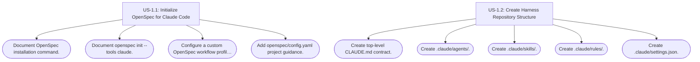

### EPIC-2: Codebase Understanding and Product Specification

```mermaid
flowchart TD
  US-2_1["US-2.1: Create Codebase Analyst Agent"]
  US-2_1 --> US-2_1_t1(["Create .claude/agents/codebase-analyst.md."])
  US-2_1 --> US-2_1_t2(["Define repository read boundaries and prohi…"])
  US-2_1 --> US-2_1_t3(["Define evidence and unknown-handling rules."])
  US-2_1 --> US-2_1_t4(["Define the CODEBASE.md schema."])
  US-2_2["US-2.2: Create Analyze Codebase Skill"]
  US-2_2 --> US-2_2_t1(["Create .claude/skills/analyze-codebase/SKIL…"])
  US-2_2 --> US-2_2_t2(["Define codebase-detection guidance."])
  US-2_2 --> US-2_2_t3(["Define snapshot metadata and evidence-path…"])
  US-2_2 --> US-2_2_t4(["Define refresh behavior."])
  US-2_3["US-2.3: Create Product Specifier Agent"]
  US-2_3 --> US-2_3_t1(["Create .claude/agents/product-specifier.md."])
  US-2_3 --> US-2_3_t2(["Define source precedence rules."])
  US-2_3 --> US-2_3_t3(["Define current-state vs target-state langua…"])
  US-2_3 --> US-2_3_t4(["Define ambiguity and conflict handling."])
  US-2_4["US-2.4: Create Generate PRD Skill"]
  US-2_4 --> US-2_4_t1(["Create .claude/skills/generate-prd/SKILL.md."])
  US-2_4 --> US-2_4_t2(["Define input source handling."])
  US-2_4 --> US-2_4_t3(["Define create-vs-update behavior for PRD.md."])
  US-2_4 --> US-2_4_t4(["Define CODEBASE.md preflight behavior."])
  US-2_5["US-2.5: Create Spec Ingestor Agent"]
  US-2_5 --> US-2_5_t1(["Create .claude/agents/spec-ingestor.md."])
  US-2_5 --> US-2_5_t2(["Define read/write boundaries."])
  US-2_5 --> US-2_5_t3(["Define source-traceability rules."])
  US-2_5 --> US-2_5_t4(["Define CODEBASE.md consumption rules."])
  US-2_5 --> US-2_5_t5(["Define ambiguity and conflict handling."])
  US-2_6["US-2.6: Create Ingest Spec Skill"]
  US-2_6 --> US-2_6_t1(["Create .claude/skills/ingest-spec/SKILL.md."])
  US-2_6 --> US-2_6_t2(["Define create-vs-update behavior."])
  US-2_6 --> US-2_6_t3(["Define ingestion summary format."])
  US-2_6 --> US-2_6_t4(["Define CODEBASE.md preflight behavior."])
  US-2_7["US-2.7: Validate Product Artifacts and Context"]
  US-2_7 --> US-2_7_t1(["Define CODEBASE.md validation contract."])
  US-2_7 --> US-2_7_t2(["Define PRD.md context-consumption validatio…"])
  US-2_7 --> US-2_7_t3(["Define SPECS.md readiness validation contra…"])
  US-2_7 --> US-2_7_t4(["Add hook or validation-script integration."])
  US-2_7 --> US-2_7_t5(["Make validation failures actionable."])
```

### EPIC-3: Product Manager Orchestration

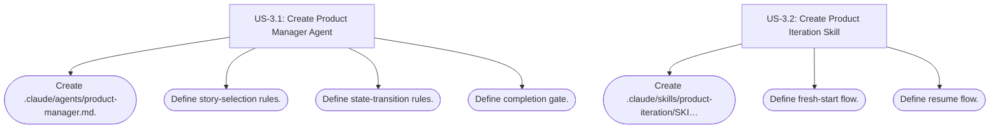

### EPIC-4: Planning

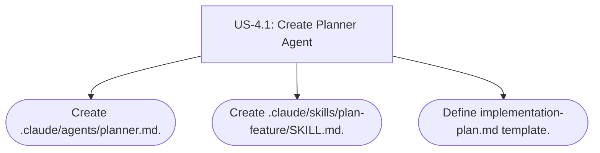

### EPIC-5: Implementation

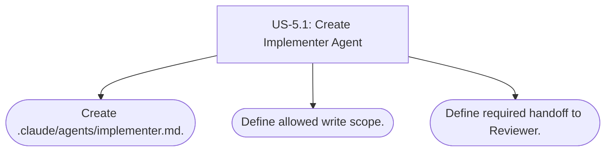

### EPIC-6: Independent Review

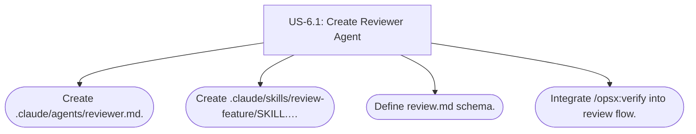

### EPIC-7: Independent Acceptance Testing

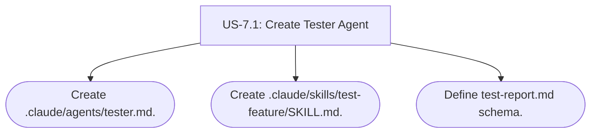

### EPIC-8: Workflow Rules and Mechanical Gates

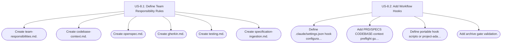

### EPIC-9: Durable Workflow State

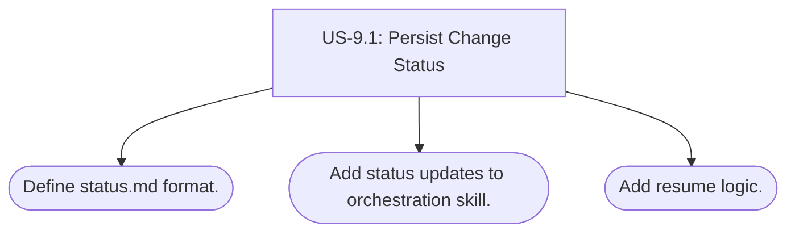

### EPIC-10: Completion and Archival

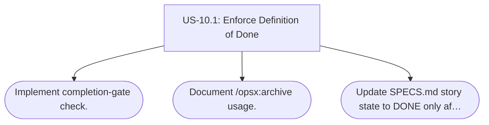

### EPIC-11: Harness Documentation and Adoption

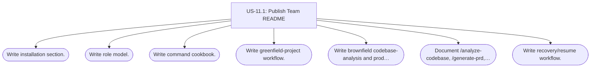

### EPIC-12: Goal-Driven Delivery Orchestration

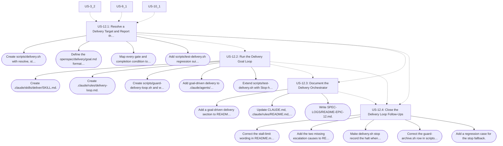

### EPIC-13: Backlog Navigation and Structure

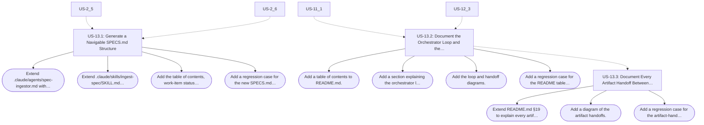

### EPIC-14: Themed HTML Documentation Pages

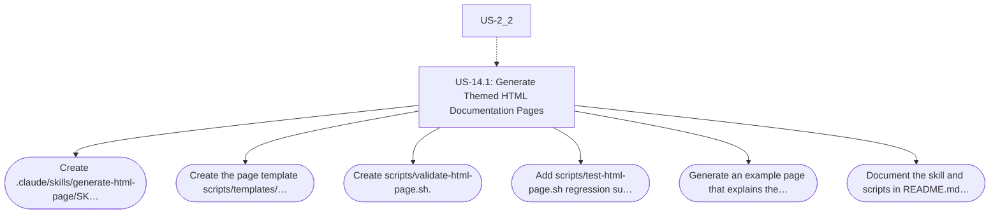

## Product Context

The OhMyOrch Harness provides a reusable multi-agent software-delivery workflow for arbitrary Git repositories. It supports greenfield and brownfield projects. When an existing codebase is present, a Codebase Analyst persists a reusable current-state model in `CODEBASE.md`; product-definition agents then consider product source material together with that codebase context when generating `PRD.md` and `SPECS.md`. Delivery proceeds one bounded product change at a time through specification, implementation, independent review, independent testing, and archival.

## Goals

- Make existing codebase architecture and constraints explicit in `CODEBASE.md` when a codebase exists.
- Make product requirements explicit and traceable through `PRD.md` and `SPECS.md`.
- Require PRD and SPECS generation to consider `CODEBASE.md` whenever it exists.
- Make `SPECS.md` iterable by a Product Manager agent.
- Make every implementation change acceptance-driven.
- Separate specification, planning, implementation, review, and testing responsibilities.
- Make work resumable across Claude sessions.
- Integrate OpenSpec as the per-change specification protocol.

## Non-Goals

- Autonomous product decision-making when source material is ambiguous.
- Treating existing implementation as desired product intent solely because it exists.
- Hardcoded project-specific target architecture before repository and requirement analysis.
- Replacing Git, CI/CD, pull requests, or human product ownership.

## Actors

- Human Product Manager
- Codebase Analyst Agent
- Product Specifier Agent
- Spec Ingestor Agent
- Product Manager Agent
- Planner Agent
- Implementer Agent
- Reviewer Agent
- Tester Agent

## Global Business Rules

### BR-001 — No Silent Product Assumptions

Agents MUST NOT invent missing externally observable product behavior.

### BR-002 — Separation of Duties

The agent that implements a change MUST NOT be the authority that approves its implementation or acceptance result.

### BR-003 — One Manageable Change

A large project backlog MUST be delivered through multiple bounded OpenSpec changes rather than one project-sized change.

### BR-004 — Repository Artifacts Are Durable State

Workflow state required for resumption MUST be persisted in repository artifacts.

### BR-005 — Acceptance Is Mandatory for Ready Product Behavior

A user story MUST NOT be marked `READY` unless its expected observable behavior is testable.

### BR-006 — CODEBASE.md Is Required Context When Present

Any harness workflow that creates or materially updates `PRD.md` or `SPECS.md` MUST read `CODEBASE.md` when that file exists. Existing implementation is descriptive evidence, not automatic product intent.

## Non-Functional Requirements

### NFR-001 — Portability

The harness MUST be reusable across arbitrary technology stacks.

### NFR-002 — Traceability

A shipped story SHOULD be traceable from source material through acceptance evidence.

### NFR-003 — Resumability

A new Claude session MUST be able to resume active work without requiring hidden prior-chat state.

### NFR-004 — Auditability

Planning, review, and testing outcomes MUST be represented by readable repository artifacts.

### NFR-005 — Codebase Evidence Fidelity

`CODEBASE.md` MUST distinguish repository-backed observations from unknowns and SHOULD identify the repository revision or other available snapshot used for analysis.

---

# EPIC-1: Harness Bootstrap

## Objective

Establish the reusable repository structure, OpenSpec integration, Claude agents, skills, rules, and workflow conventions required by the harness.

## Dependencies

None.

### US-1.1: Initialize OpenSpec for Claude Code

Status: DONE

Change: `openspec/changes/archive/2026-09-24-us-1-1-initialize-openspec/`

As a Product Manager
I want OpenSpec initialized for Claude Code
So that each product change follows a consistent specification workflow.

Source:
- PRD.md sections 8 and 11

Acceptance Criteria:

```gherkin
Scenario: Initialize OpenSpec in a project
  Given a Git project does not yet contain OpenSpec configuration
  When the team runs OpenSpec initialization for Claude Code
  Then an "openspec/" project structure MUST exist
  And Claude-compatible OpenSpec workflow files MUST be installed
  And the project MUST be able to create a new OpenSpec change
```

```gherkin
Scenario: Enable verification workflow
  Given independent implementation verification is required by this harness
  When OpenSpec workflows are configured
  Then the "verify" workflow MUST be available to Claude Code
```

Tasks:
- [x] Document OpenSpec installation command.
- [x] Document `openspec init --tools claude`.
- [x] Configure a custom OpenSpec workflow profile that includes `verify`, or document the exact equivalent supported by the installed OpenSpec version.
- [x] Add `openspec/config.yaml` project guidance.

Open Questions:
- None.

### US-1.2: Create Harness Repository Structure

Status: DONE

Change: `openspec/changes/archive/2026-09-24-us-1-2-harness-structure/`

As an Engineering Lead
I want a predictable harness directory layout
So that every project exposes the same control surfaces.

Source:
- PRD.md section 11

Acceptance Criteria:

```gherkin
Scenario: Required harness files exist
  Given the harness has been installed into a project
  When the repository root is inspected
  Then "CLAUDE.md" MUST exist
  And ".claude/agents/" MUST exist
  And ".claude/skills/" MUST exist
  And ".claude/rules/" MUST exist
  And ".claude/settings.json" MUST exist
  And "SPECS.md" MUST exist
```

Tasks:
- [x] Create top-level `CLAUDE.md` contract.
- [x] Create `.claude/agents/`.
- [x] Create `.claude/skills/`.
- [x] Create `.claude/rules/`.
- [x] Create `.claude/settings.json`.

Open Questions:
- None.

---

# EPIC-2: Codebase Understanding and Product Specification

## Objective

Support both greenfield and brownfield projects by creating a durable model of an existing repository in `CODEBASE.md`, then requiring product-definition workflows to consider that evidence when generating or updating `PRD.md` and `SPECS.md`.

## Dependencies

- EPIC-1

### US-2.1: Create Codebase Analyst Agent

Status: DONE

Change: `openspec/changes/archive/2026-09-24-us-2-1-codebase-analyst-agent/`

As an Engineering Lead
I want a Codebase Analyst agent
So that an existing repository can be understood once and its current-state architecture can be reused by later agents.

Source:
- PRD.md sections 5 and 6
- PRD.md FR-013 through FR-018

Acceptance Criteria:

```gherkin
Scenario: Analyze an existing codebase
  Given the target project contains a meaningful existing codebase
  When the Codebase Analyst inspects the repository
  Then it MUST identify repository structure, runtime configuration, entry points, major modules, data flows, persistence, external integrations, tests, quality tooling, common commands, and material conventions when supported by repository evidence
  And it MUST persist the resulting current-state understanding in "CODEBASE.md"
  And it MUST NOT modify application source code
```

```gherkin
Scenario: Keep codebase claims evidence-backed
  Given the Codebase Analyst writes a claim into CODEBASE.md
  When the claim describes the repository
  Then the claim MUST be supported by inspected files, configuration, tests, commands, or other repository evidence
  And unsupported assumptions MUST be recorded as unknowns rather than facts
```

```gherkin
Scenario: Existing behavior is not promoted to product intent
  Given the codebase currently implements a behavior
  When the Codebase Analyst documents that behavior
  Then CODEBASE.md MAY describe it as current behavior
  But it MUST NOT label that behavior as a desired product requirement unless a product source explicitly requires it
```

Tasks:
- [x] Create `.claude/agents/codebase-analyst.md`.
- [x] Define repository read boundaries and prohibit product-code edits.
- [x] Define evidence and unknown-handling rules.
- [x] Define the `CODEBASE.md` schema.

Open Questions:
- None.

### US-2.2: Create Analyze Codebase Skill

Status: DONE

Change: `openspec/changes/archive/2026-09-24-us-2-2-analyze-codebase-skill/`

As a Product Manager
I want a reusable codebase-analysis command
So that brownfield projects can establish durable technical context before product artifacts are generated.

Source:
- PRD.md FR-013, FR-014, and FR-017

Acceptance Criteria:

```gherkin
Scenario: Generate CODEBASE.md from an existing repository
  Given a meaningful codebase exists
  When the Product Manager invokes the codebase-analysis skill
  Then the skill MUST delegate repository analysis to the Codebase Analyst
  And CODEBASE.md MUST be created or refreshed
  And the result MUST include an analyzed revision or other available snapshot identifier
  And the result MUST identify important evidence paths
```

```gherkin
Scenario: Do not fabricate a brownfield context for a greenfield project
  Given the project does not yet contain a meaningful application codebase
  When codebase analysis runs
  Then the skill MUST report that no meaningful codebase was found
  And it MUST NOT fabricate architecture, integrations, commands, or existing behavior
```

```gherkin
Scenario: Refresh stale codebase understanding
  Given CODEBASE.md exists
  And material repository changes make its recorded snapshot stale
  When codebase analysis is invoked again
  Then CODEBASE.md MUST be refreshed against the current repository evidence
```

```gherkin
Scenario: CODEBASE.md uses a stable current-state schema
  Given codebase analysis succeeds
  When CODEBASE.md is written
  Then it MUST identify the analyzed revision or snapshot when available
  And it MUST contain a system summary
  And it MUST contain a repository map
  And it MUST document runtime and tooling
  And it MUST document architecture and entry points when discoverable
  And it MUST document data, integrations, tests, quality gates, and common commands when discoverable
  And it MUST contain evidence paths
  And it MUST contain unknowns for material facts that could not be verified
```

Tasks:
- [x] Create `.claude/skills/analyze-codebase/SKILL.md`.
- [x] Define codebase-detection guidance.
- [x] Define snapshot metadata and evidence-path format.
- [x] Define refresh behavior.

Open Questions:
- The exact stale-context detector MAY vary by host repository, but Git revision and working-tree state SHOULD be used when available.

### US-2.3: Create Product Specifier Agent

Status: DONE

Change: `openspec/changes/archive/2026-09-24-us-2-3-product-specifier-agent/`

As a Product Manager
I want a Product Specifier agent
So that product source material and existing-system context can be turned into a PRD without confusing current implementation with desired behavior.

Source:
- PRD.md sections 5 and 6
- PRD.md FR-015, FR-017, and FR-018

Acceptance Criteria:

```gherkin
Scenario: Generate PRD with codebase context when available
  Given product source material is available
  And CODEBASE.md exists
  When the Product Specifier creates or materially updates PRD.md
  Then it MUST read CODEBASE.md before writing PRD.md
  And it MUST consider relevant existing capabilities, compatibility constraints, integrations, technical boundaries, migration concerns, and known gaps
  And desired product behavior MUST remain grounded in explicit product sources or Product Manager decisions
```

```gherkin
Scenario: Generate PRD for a greenfield project
  Given product source material is available
  And no meaningful existing codebase is present
  When the Product Specifier creates PRD.md
  Then PRD.md MUST be generated from the product source material
  And it MUST NOT invent a nonexistent current architecture
```

```gherkin
Scenario: Product intent conflicts with current implementation
  Given a product source requires behavior that differs from behavior documented in CODEBASE.md
  When PRD.md is generated
  Then the desired behavior MUST remain represented as product intent
  And the current-state difference SHOULD be recorded as a gap, constraint, migration consideration, or open question
  And current code MUST NOT silently override the product requirement
```

Tasks:
- [x] Create `.claude/agents/product-specifier.md`.
- [x] Define source precedence rules.
- [x] Define current-state vs target-state language.
- [x] Define ambiguity and conflict handling.

Open Questions:
- None.

### US-2.4: Create Generate PRD Skill

Status: DONE

Change: `openspec/changes/archive/2026-09-24-us-2-4-generate-prd-skill/`

As a Product Manager
I want a reusable PRD-generation command
So that project product intent can be normalized consistently for both greenfield and brownfield repositories.

Source:
- PRD.md FR-015, FR-017, and FR-018

Acceptance Criteria:

```gherkin
Scenario: Generate PRD after considering repository context
  Given one or more product source documents are supplied
  When the Product Manager invokes the PRD-generation skill
  Then the skill MUST determine whether CODEBASE.md exists
  And when CODEBASE.md exists it MUST be included in the Product Specifier context
  And PRD.md MUST be created or incrementally updated
```

```gherkin
Scenario: Existing codebase has not yet been analyzed
  Given a meaningful existing codebase is detected
  And CODEBASE.md does not exist
  When PRD generation is requested
  Then the workflow MUST run codebase analysis first or explicitly record that codebase analysis was intentionally skipped
  And PRD generation MUST NOT silently pretend that repository context was considered
```

```gherkin
Scenario: Stale CODEBASE.md is surfaced
  Given CODEBASE.md exists
  And the harness can determine that its recorded repository snapshot is materially stale
  When PRD generation is requested
  Then the workflow MUST surface the stale-context condition before treating CODEBASE.md as current
```

Tasks:
- [x] Create `.claude/skills/generate-prd/SKILL.md`.
- [x] Define input source handling.
- [x] Define create-vs-update behavior for PRD.md.
- [x] Define CODEBASE.md preflight behavior.

Open Questions:
- None.

### US-2.5: Create Spec Ingestor Agent

Status: DONE

Change: `openspec/changes/archive/2026-09-24-us-2-5-spec-ingestor-agent/`

As a Product Manager
I want a Spec Ingestor agent
So that PRD and source documents become structured requirements without silently fabricated behavior.

Source:
- PRD.md sections 5 and 6
- PRD.md FR-001 through FR-005
- PRD.md FR-016 through FR-018

Acceptance Criteria:

```gherkin
Scenario: Convert product artifacts into structured requirements
  Given PRD.md or other product source documents are available
  When the Spec Ingestor processes them
  Then it MUST identify explicit goals, actors, requirements, constraints, dependencies, and acceptance information when present
  And it MUST organize supported product information into SPECS.md
  And it MUST NOT modify application source code
```

```gherkin
Scenario: Consume CODEBASE.md when it exists
  Given CODEBASE.md exists
  When the Spec Ingestor creates or materially updates SPECS.md
  Then it MUST read CODEBASE.md
  And it SHOULD use relevant codebase evidence to identify existing capabilities, integration points, constraints, likely dependencies, and compatibility concerns
  And acceptance criteria MUST remain grounded in explicit product requirements or Product Manager decisions
```

```gherkin
Scenario: Missing product behavior is not invented
  Given the source contains a requirement whose success condition is not defined
  When the Spec Ingestor writes SPECS.md
  Then the requirement MUST remain represented
  And the story MUST be marked "NEEDS CLARIFICATION" when the missing information blocks acceptance
  And the missing decision MUST be listed under Open Questions
```

```gherkin
Scenario: Conflicting source requirements are preserved
  Given two product source statements prescribe incompatible product behavior
  When the Spec Ingestor processes them
  Then both source statements MUST remain traceable
  And the conflict MUST be recorded
  And the affected story MUST be marked "BLOCKED"
```

Tasks:
- [x] Create `.claude/agents/spec-ingestor.md`.
- [x] Define read/write boundaries.
- [x] Define source-traceability rules.
- [x] Define CODEBASE.md consumption rules.
- [x] Define ambiguity and conflict handling.

Open Questions:
- None.

### US-2.6: Create Ingest Spec Skill

Status: DONE

Change: `openspec/changes/archive/2026-09-24-us-2-6-ingest-spec-skill/`

As a Product Manager
I want a reusable specification-ingestion command
So that product artifacts can be normalized consistently into an iterable backlog.

Source:
- PRD.md FR-001, FR-002, FR-016, FR-017, and FR-018

Acceptance Criteria:

```gherkin
Scenario: Ingest product artifacts into SPECS.md
  Given PRD.md or another product source document exists
  When the Product Manager invokes the harness ingestion skill
  Then the skill MUST delegate extraction to the Spec Ingestor
  And when CODEBASE.md exists it MUST be provided as context
  And SPECS.md MUST be created or incrementally updated
  And an ingestion summary MUST be returned
```

```gherkin
Scenario: Incrementally merge a new source document
  Given SPECS.md already exists
  And a new product source document is supplied
  When ingestion runs again
  Then existing equivalent requirements MUST NOT be duplicated
  And newly supported requirements MUST be added
  And changed or conflicting requirements MUST be flagged for Product Manager review
  And relevant CODEBASE.md constraints MUST remain considered when CODEBASE.md exists
```

```gherkin
Scenario: Existing codebase lacks CODEBASE.md
  Given a meaningful codebase is detected
  And CODEBASE.md does not exist
  When SPECS generation is requested
  Then the workflow MUST run codebase analysis first or explicitly record that codebase analysis was intentionally skipped
```

Tasks:
- [x] Create `.claude/skills/ingest-spec/SKILL.md`.
- [x] Define create-vs-update behavior.
- [x] Define ingestion summary format.
- [x] Define CODEBASE.md preflight behavior.

Open Questions:
- None.

### US-2.7: Validate Product Artifacts and Context

Status: DONE

Change: `openspec/changes/archive/2026-09-24-us-2-7-artifact-validation/`

As a Product Manager
I want automated specification and context validation
So that malformed stories or ignored brownfield context cannot quietly enter implementation.

Source:
- PRD.md FR-003, FR-004, FR-014, and FR-017

Acceptance Criteria:

```gherkin
Scenario: Validate unique story identifiers
  Given SPECS.md has been modified
  When specification validation runs
  Then every Epic identifier MUST be unique
  And every User Story identifier MUST be unique
```

```gherkin
Scenario: Validate READY story acceptance criteria
  Given a User Story is marked "READY"
  When specification validation runs
  Then the story MUST contain at least one acceptance scenario
  And every acceptance scenario MUST contain Given, When, and Then
```

```gherkin
Scenario: Unsupported generated requirement cannot be ready
  Given a requirement cannot be traced to product source material or an explicit Product Manager decision
  When readiness is evaluated
  Then that requirement MUST NOT be treated as a ready product requirement
```

```gherkin
Scenario: PRD generation acknowledges existing CODEBASE.md
  Given CODEBASE.md exists
  When PRD.md is generated or materially updated through the harness
  Then the workflow MUST record or otherwise make verifiable that CODEBASE.md was part of the generation context
```

```gherkin
Scenario: SPECS generation acknowledges existing CODEBASE.md
  Given CODEBASE.md exists
  When SPECS.md is generated or materially updated through the harness
  Then the workflow MUST record or otherwise make verifiable that CODEBASE.md was part of the generation context
```

Tasks:
- [x] Define `CODEBASE.md` validation contract.
- [x] Define `PRD.md` context-consumption validation.
- [x] Define `SPECS.md` readiness validation contract.
- [x] Add hook or validation-script integration.
- [x] Make validation failures actionable.

Open Questions:
- Whether validation is implemented as shell, Python, Node, or another project-local mechanism MUST be selected based on the host project unless the harness ships a portable validator.

---

# EPIC-3: Product Manager Orchestration

## Objective

Give a Product Manager agent deterministic control over backlog selection, workflow transitions, and completion gates.

## Dependencies

- EPIC-1
- EPIC-2

### US-3.1: Create Product Manager Agent

Status: DONE

Change: `openspec/changes/archive/2026-09-24-us-3-1-product-manager-agent/`

As a Human Product Manager
I want a Product Manager agent to orchestrate specialized agents
So that work progresses through controlled gates rather than autonomous coding.

Source:
- PRD.md sections 5, 7, 12, 13, and 14

Acceptance Criteria:

```gherkin
Scenario: Select one manageable unit of work
  Given SPECS.md contains one or more READY stories
  When a new product iteration starts
  Then the Product Manager MUST select exactly one manageable story or cohesive feature
  And it MUST record the selected story identifier
  And it MUST establish a corresponding OpenSpec change identifier
```

```gherkin
Scenario: Do not treat the entire backlog as one OpenSpec change
  Given SPECS.md contains multiple independently verifiable stories
  When the Product Manager creates implementation work
  Then those stories MUST NOT be collapsed into one project-sized OpenSpec change
```

```gherkin
Scenario: Product Manager owns archive decision
  Given implementation, review, and testing have completed
  When archive eligibility is evaluated
  Then the Product Manager MUST verify all completion gates before invoking archive
```

Tasks:
- [x] Create `.claude/agents/product-manager.md`.
- [x] Define story-selection rules.
- [x] Define state-transition rules.
- [x] Define completion gate.

Open Questions:
- None.

### US-3.2: Create Product Iteration Skill

Status: DONE

Change: `openspec/changes/archive/2026-09-24-us-3-2-product-iteration-skill/`

As a Product Manager
I want one orchestration entry point
So that a selected story can move through the complete harness workflow.

Source:
- PRD.md section 7

Acceptance Criteria:

```gherkin
Scenario: Start iteration from a story identifier
  Given SPECS.md contains a READY story
  When the product iteration skill is invoked with its identifier
  Then the skill MUST establish or locate the corresponding OpenSpec change
  And MUST coordinate Planner, Implementer, Reviewer, and Tester responsibilities
  And MUST enforce workflow gates
```

```gherkin
Scenario: Resume an existing iteration
  Given an active change already contains workflow artifacts
  When product iteration is invoked again
  Then the harness MUST inspect current repository state
  And MUST resume from the first incomplete required gate
```

Tasks:
- [x] Create `.claude/skills/product-iteration/SKILL.md`.
- [x] Define fresh-start flow.
- [x] Define resume flow.

Open Questions:
- None.

---

# EPIC-4: Planning

## Objective

Separate technical exploration and implementation planning from code modification.

## Dependencies

- EPIC-1
- EPIC-3

### US-4.1: Create Planner Agent

Status: DONE

Change: `openspec/changes/archive/2026-09-24-us-4-1-planner-agent/`

As an Implementer
I want a dedicated Planner
So that implementation starts from an explicit, repository-aware handoff.

Source:
- PRD.md FR-007

Acceptance Criteria:

```gherkin
Scenario: Explore without modifying product code
  Given a story has been selected
  When the Planner performs exploration
  Then it MUST inspect relevant code, specifications, dependencies, and risks
  And it MUST NOT modify application source code
```

```gherkin
Scenario: Produce implementation plan
  Given OpenSpec proposal artifacts exist
  When planning completes
  Then "implementation-plan.md" MUST exist for the active change
  And it MUST identify the selected story
  And it MUST reference relevant OpenSpec artifacts
  And it MUST map tasks to acceptance criteria
  And it MUST identify likely affected files and expected tests when determinable from repository evidence
```

Tasks:
- [x] Create `.claude/agents/planner.md`.
- [x] Create `.claude/skills/plan-feature/SKILL.md`.
- [x] Define `implementation-plan.md` template.

Open Questions:
- None.

---

# EPIC-5: Implementation

## Objective

Constrain source-code changes to an Implementer working from approved specification artifacts.

## Dependencies

- EPIC-4

### US-5.1: Create Implementer Agent

Status: DONE

Change: `openspec/changes/archive/2026-09-24-us-5-1-implementer-agent/`

As a Product Manager
I want a dedicated Implementer
So that source changes remain bounded by the approved specification.

Source:
- PRD.md sections 5 and 7

Acceptance Criteria:

```gherkin
Scenario: Implement from OpenSpec tasks
  Given proposal, specs, tasks, and implementation-plan artifacts exist
  When the Implementer applies the change
  Then it MUST implement work required by the active specification
  And it MUST update task completion only for completed work
  And it MUST run relevant project validation before declaring implementation complete
```

```gherkin
Scenario: Scope expansion is prohibited
  Given the Implementer discovers an unrelated improvement
  When that improvement is not required by the active change
  Then the Implementer MUST NOT silently add it to the implementation
  And it MAY record it as follow-up work
```

```gherkin
Scenario: Implementer cannot approve itself
  Given implementation is complete
  When approval is required
  Then the Implementer MUST hand control to the Reviewer
  And MUST NOT author the approval decision in review.md
```

Tasks:
- [x] Create `.claude/agents/implementer.md`.
- [x] Define allowed write scope.
- [x] Define required handoff to Reviewer.

Open Questions:
- None.

---

# EPIC-6: Independent Review

## Objective

Verify implementation against the approved specification without allowing the reviewer to silently repair the code it evaluates.

## Dependencies

- EPIC-5

### US-6.1: Create Reviewer Agent

Status: DONE

Change: `openspec/changes/archive/2026-09-24-us-6-1-reviewer-agent/`

As a Product Manager
I want an independent Reviewer
So that implementation is evaluated against requirements rather than implementation intent.

Source:
- PRD.md FR-008

Acceptance Criteria:

```gherkin
Scenario: Review implementation against specification
  Given implementation is reported complete
  When the Reviewer starts review
  Then it MUST inspect the active OpenSpec proposal, specs, design when present, tasks, implementation plan, and implementation diff
  And it MUST evaluate every relevant acceptance criterion
```

```gherkin
Scenario: Produce actionable review findings
  Given a blocking issue is found
  When review completes
  Then review.md MUST identify the affected requirement
  And MUST describe observed behavior
  And MUST describe expected behavior
  And MUST request concrete remediation
  And control MUST return to the Implementer
```

```gherkin
Scenario: Reviewer does not repair product code
  Given the Reviewer identifies a product-code defect
  When remediation is required
  Then the Reviewer MUST NOT silently modify application source code
  And MUST return the finding to the Implementer
```

Tasks:
- [x] Create `.claude/agents/reviewer.md`.
- [x] Create `.claude/skills/review-feature/SKILL.md`.
- [x] Define `review.md` schema.
- [x] Integrate `/opsx:verify` into review flow.

Open Questions:
- None.

---

# EPIC-7: Independent Acceptance Testing

## Objective

Prove that the delivered behavior satisfies the original acceptance criteria.

## Dependencies

- EPIC-6

### US-7.1: Create Tester Agent

Status: DONE

Change: `openspec/changes/archive/2026-09-24-us-7-1-tester-agent/`

As a Product Manager
I want an independent Tester
So that acceptance is based on observable evidence rather than implementation claims.

Source:
- PRD.md FR-009

Acceptance Criteria:

```gherkin
Scenario: Map acceptance criteria to executable evidence
  Given review has passed
  When the Tester starts validation
  Then every acceptance scenario MUST be mapped to one or more executable checks or explicit evidence
```

```gherkin
Scenario: Produce test report
  Given acceptance validation has completed
  When the Tester reports results
  Then test-report.md MUST list every evaluated acceptance criterion
  And MUST record PASS or FAIL
  And MUST identify the command, test, or evidence used
```

```gherkin
Scenario: Failed acceptance returns to implementation
  Given at least one acceptance criterion fails
  When testing completes
  Then the change MUST NOT be accepted
  And control MUST return to the Implementer
  And subsequent code changes MUST be reviewed before failed acceptance criteria are retested
```

Tasks:
- [x] Create `.claude/agents/tester.md`.
- [x] Create `.claude/skills/test-feature/SKILL.md`.
- [x] Define `test-report.md` schema.

Open Questions:
- None.

---

# EPIC-8: Workflow Rules and Mechanical Gates

## Objective

Supplement agent prompts with durable project rules and hooks that prevent invalid workflow transitions.

## Dependencies

- EPIC-3 through EPIC-7

### US-8.1: Define Team Responsibility Rules

Status: DONE

Change: `openspec/changes/archive/2026-09-24-us-8-1-team-responsibility-rules/`

As an Engineering Lead
I want explicit repository-level rules
So that each agent consistently stays within its role.

Source:
- PRD.md sections 6 and 7

Acceptance Criteria:

```gherkin
Scenario: Responsibility rules are installed
  Given the harness is installed
  When Claude loads project instructions
  Then rules MUST define Codebase Analyst, Product Specifier, Spec Ingestor, Product Manager, Planner, Implementer, Reviewer, and Tester responsibilities
  And rules MUST prohibit self-approval by the Implementer
  And rules MUST prohibit the Reviewer from silently fixing reviewed product code
  And rules MUST prohibit the Tester from silently repairing failed implementation behavior
```

Tasks:
- [x] Create `team-responsibilities.md`.
- [x] Create `codebase-context.md`.
- [x] Create `openspec.md`.
- [x] Create `gherkin.md`.
- [x] Create `testing.md`.
- [x] Create `specification-ingestion.md`.

Open Questions:
- None.

### US-8.2: Add Workflow Hooks

Status: DONE

Change: `openspec/changes/archive/2026-09-24-us-8-2-workflow-hooks/`

As a Product Manager
I want mechanical workflow guards
So that critical gates do not rely exclusively on prompt compliance.

Source:
- PRD.md NFR-002 and FR-010

Acceptance Criteria:

```gherkin
Scenario: Prevent source implementation before planning handoff
  Given an active product change requires the harness workflow
  And implementation-plan.md does not exist
  When an Implementer attempts to modify product source code
  Then the operation SHOULD be rejected by a deterministic guard where Claude Code hook capabilities permit it
```

```gherkin
Scenario: Prevent premature archive
  Given review has blocking findings or acceptance tests are failing
  When archive is requested through the harness
  Then the harness MUST reject archival
```

```gherkin
Scenario: Require CODEBASE context before PRD generation
  Given CODEBASE.md exists
  When the harness attempts to generate or materially update PRD.md
  Then a pre-generation guard MUST require CODEBASE.md to be included in the Product Specifier context
```

```gherkin
Scenario: Require CODEBASE context before SPECS generation
  Given CODEBASE.md exists
  When the harness attempts to generate or materially update SPECS.md
  Then a pre-generation guard MUST require CODEBASE.md to be included in the Spec Ingestor context
```

```gherkin
Scenario: Detect missing brownfield analysis
  Given a meaningful existing codebase is detected
  And CODEBASE.md does not exist
  When PRD or SPECS generation is requested through the harness
  Then the guard MUST require codebase analysis first or an explicit recorded skip decision
```

```gherkin
Scenario: Validate modified implementation
  Given the Implementer modifies application source code
  When the modification phase completes
  Then configured fast project validation SHOULD run before implementation is handed to review
```

Tasks:
- [x] Define `.claude/settings.json` hook configuration.
- [x] Add PRD/SPECS CODEBASE-context preflight guards.
- [x] Define portable hook scripts or project-adaptation strategy.
- [x] Add archive gate validation.

Open Questions:
- Exact hook event names and matchers MUST follow the Claude Code version installed in the host project.

---

# EPIC-9: Durable Workflow State

## Objective

Allow interrupted work to resume deterministically in a fresh Claude session.

## Dependencies

- EPIC-3

### US-9.1: Persist Change Status

Status: DONE

Change: `openspec/changes/archive/2026-09-24-us-9-1-change-status/`

As a Product Manager
I want active change status persisted
So that a new session can resume from the correct gate.

Source:
- PRD.md FR-011 and NFR-003

Acceptance Criteria:

```gherkin
Scenario: Persist workflow state
  Given an active OpenSpec change exists
  When the harness moves to another workflow stage
  Then the active state SHOULD be recorded in status.md
  And the current owner SHOULD be recorded
  And unresolved blockers SHOULD be recorded
```

```gherkin
Scenario: Resume after session restart
  Given a previous Claude session has ended
  When a new session is asked to continue the same change
  Then the Product Manager MUST inspect repository artifacts
  And MUST identify the first incomplete required gate
  And MUST continue from that point instead of restarting completed work without cause
```

Tasks:
- [x] Define `status.md` format.
- [x] Add status updates to orchestration skill.
- [x] Add resume logic.

Open Questions:
- None.

---

# EPIC-10: Completion and Archival

## Objective

Prevent incomplete work from being treated as shipped and close the lifecycle cleanly.

## Dependencies

- EPIC-6
- EPIC-7
- EPIC-8
- EPIC-9

### US-10.1: Enforce Definition of Done

Status: DONE

Change: `openspec/changes/archive/2026-09-24-us-10-1-definition-of-done/`

As a Product Manager
I want an explicit completion gate
So that only accepted changes are archived.

Source:
- PRD.md sections 14 and FR-010

Acceptance Criteria:

```gherkin
Scenario: Change is eligible for archive
  Given all required tasks are complete
  And review has no blocking findings
  And all required acceptance criteria pass
  And OpenSpec verification has no blocking mismatch
  When the Product Manager evaluates completion
  Then the change MAY proceed to archive
```

```gherkin
Scenario: Change is not eligible for archive
  Given at least one required task remains incomplete
  Or review has a blocking finding
  Or an acceptance criterion is failing
  Or OpenSpec verification reports a blocking mismatch
  When archive is requested
  Then archival MUST be rejected by the harness
```

Tasks:
- [x] Implement completion-gate check.
- [x] Document `/opsx:archive` usage.
- [x] Update SPECS.md story state to DONE only after successful completion.

Open Questions:
- None.

---

# EPIC-11: Harness Documentation and Adoption

## Objective

Make the workflow understandable and executable by a new team without relying on oral knowledge.

## Dependencies

- EPIC-1 through EPIC-10

### US-11.1: Publish Team README

Status: DONE

Change: `openspec/changes/archive/2026-09-24-us-11-1-team-readme/`

As a new team member
I want a concise operational README
So that I know how to install, ingest requirements, start work, resume work, review, test, and archive changes.

Source:
- PRD.md initial delivery scope

Acceptance Criteria:

```gherkin
Scenario: README explains installation
  Given a developer opens README.md
  When the developer follows it to install the harness
  Then it MUST explain OpenSpec installation
  And it MUST explain OpenSpec initialization for Claude Code
  And it MUST explain how to confirm installed workflows
```

```gherkin
Scenario: README explains brownfield context and document-to-delivery flow
  Given a developer opens README.md
  When the developer follows it from product sources to a delivered change
  Then it MUST explain how an existing codebase becomes CODEBASE.md
  And it MUST explain how CODEBASE.md is consumed when generating PRD.md and SPECS.md
  And it MUST explain how product source documents become PRD.md and SPECS.md
  And it MUST explain how one READY story is selected
  And it MUST explain explore, propose, apply, verify, and archive commands
  And it MUST explain review and test loops
```

```gherkin
Scenario: README explains resumption
  Given work is interrupted
  When a developer returns in a new Claude session
  Then README.md MUST explain how the harness resumes from repository artifacts
```

Tasks:
- [x] Write installation section.
- [x] Write role model.
- [x] Write command cookbook.
- [x] Write greenfield-project workflow.
- [x] Write brownfield codebase-analysis and product-generation workflow.
- [x] Document `/analyze-codebase`, `/generate-prd`, and CODEBASE-aware `/ingest-spec`.
- [x] Write recovery/resume workflow.

Open Questions:
- None.

---

# EPIC-12: Goal-Driven Delivery Orchestration

## Objective

Let the Product Manager hand the harness one delivery target — an epic, a user story, or a task from `SPECS.md` — and have it driven to completion as a goal loop: plan, implement, review, test, and archive each story as its own OpenSpec change, deriving every step from repository artifacts and stopping only when the target is delivered or a human decision is required.

## Dependencies

- EPIC-3
- EPIC-9
- EPIC-10

### US-12.1: Resolve a Delivery Target and Report the Next Action

Status: DONE

Change: `openspec/changes/archive/2026-09-24-us-12-1-resolve-delivery-target-report/`

As a Product Manager
I want an epic, story, or task resolved into ordered stories with a derived next action
So that a delivery loop always knows what to do next from repository state alone.

Source:
- PRD.md FR-019
- Human Product Manager decision, 2026-09-24

Dependencies:
- US-3.2
- US-9.1
- US-10.1

Acceptance Criteria:

```gherkin
Scenario: Resolve an epic into its stories
  Given SPECS.md contains an epic with more than one user story
  When the epic identifier is resolved as a delivery target
  Then every story of that epic MUST be listed in SPECS.md order
  And each listed story MUST map to its own OpenSpec change identifier
```

```gherkin
Scenario: Resolve a task to its parent story
  Given SPECS.md contains a task under a user story
  When that task is resolved as a delivery target
  Then the target MUST resolve to the parent user story
  And the selected task MUST be recorded as the focus of the goal
```

```gherkin
Scenario: Reject an unknown target
  Given SPECS.md does not contain the requested epic, story, or task
  When the target is resolved
  Then resolution MUST exit non-zero and name the unknown target
  And no delivery goal MUST be recorded
```

```gherkin
Scenario: Derive the next action from repository artifacts
  Given the first undelivered story of a goal has an active OpenSpec change
  When the next action is requested
  Then the action MUST be derived from the workflow gates and the completion gate
  And it MUST name the owning role and the command that performs it
```

```gherkin
Scenario: Escalate a story that cannot proceed
  Given the first undelivered story is not READY or IN PROGRESS, or depends on a story that is not DONE
  When the next action is requested
  Then the action MUST be "escalate" with the reason
  And no OpenSpec change MUST be created for that story
```

```gherkin
Scenario: Reopen a change after a failed review or acceptance test
  Given a change whose review reports blocking findings or whose test report records a FAIL
  When the change is reopened
  Then the failing artifact MUST be preserved under the change's history directory
  And one unticked remediation task per finding MUST be appended to tasks.md
  And the next action MUST return to implementation
```

Tasks:
- [x] Create `scripts/delivery.sh` with `resolve`, `start`, `next`, `refresh`, `reopen`, and `stop`.
- [x] Define the `openspec/delivery/goal.md` format (derived story table, authored notes).
- [x] Map every gate and completion condition to one next action and owner.
- [x] Add `scripts/test-delivery.sh` regression suite.

Open Questions:
- None.

### US-12.2: Run the Delivery Goal Loop

Status: DONE

Change: `openspec/changes/archive/2026-09-26-us-12-2-run-delivery-goal-loop/`

As a Product Manager
I want one command that keeps working a delivery goal until it is done or needs me
So that an epic, story, or task is planned, implemented, reviewed, tested, and archived without manual stage-by-stage prompting.

Source:
- PRD.md FR-019
- Human Product Manager decision, 2026-09-24

Dependencies:
- US-12.1

Acceptance Criteria:

```gherkin
Scenario: Start a delivery goal
  Given SPECS.md contains a READY epic, story, or task
  When the delivery skill is invoked with that target
  Then a delivery goal MUST be recorded with the target, its stories, and status ACTIVE
  And each next action MUST be delegated to the role that owns it
  And the orchestrator MUST NOT author review.md or test-report.md
```

```gherkin
Scenario: Continue while work remains
  Given an ACTIVE delivery goal whose next action is not "escalate"
  When the main session attempts to stop
  Then a Stop hook MUST block the stop
  And it MUST name the next action and its owner
```

```gherkin
Scenario: Halt for a human decision
  Given an ACTIVE delivery goal whose next action is "escalate"
  When the main session attempts to stop
  Then the Stop hook MUST allow the stop
  And the goal MUST be recorded as BLOCKED with the escalation reason
```

```gherkin
Scenario: Halt when the loop stops making progress
  Given an ACTIVE delivery goal whose derived state has not changed across the configured number of stop attempts
  When the main session attempts to stop again
  Then the Stop hook MUST allow the stop
  And the goal MUST be recorded as BLOCKED for lack of progress
```

```gherkin
Scenario: Complete the goal
  Given every story of an ACTIVE delivery goal is DONE
  When the main session attempts to stop
  Then the Stop hook MUST allow the stop
  And the goal MUST be recorded as COMPLETE
```

```gherkin
Scenario: The loop cannot bypass a gate
  Given an ACTIVE delivery goal whose current change is not archive-eligible
  When the loop requests archival
  Then the existing archive guard MUST still reject it
```

Tasks:
- [x] Create `.claude/skills/deliver/SKILL.md`.
- [x] Create `.claude/rules/delivery-loop.md`.
- [x] Create `scripts/guard-delivery-loop.sh` and wire it as a `Stop` hook.
- [x] Add goal-driven delivery to `.claude/agents/product-manager.md`.
- [x] Extend `scripts/test-delivery.sh` with Stop-hook cases.

Open Questions:
- None.

### US-12.3: Document the Delivery Orchestrator

Status: DONE

Change: `openspec/changes/archive/2026-09-26-us-12-3-document-delivery-orchestrator/`

As a new team member
I want the delivery orchestrator documented alongside the rest of the harness
So that I know how to hand the harness an epic, story, or task and how the loop stops and resumes.

Source:
- PRD.md FR-019
- Human Product Manager decision, 2026-09-24

Dependencies:
- US-12.1
- US-12.2

Acceptance Criteria:

```gherkin
Scenario: README explains goal-driven delivery
  Given a developer opens README.md
  When the developer looks up how to deliver an epic, story, or task
  Then it MUST explain the delivery command for each target kind
  And it MUST explain every way the loop stops
  And it MUST explain how an interrupted goal resumes
```

```gherkin
Scenario: Contracts and indexes list the orchestrator
  Given CLAUDE.md, .claude/rules/README.md, and scripts/README.md
  When a developer inspects them
  Then each MUST reference the delivery skill, the delivery-loop rule, or the delivery scripts it indexes
```

Tasks:
- [x] Add a goal-driven delivery section to `README.md`.
- [x] Update `CLAUDE.md`, `.claude/rules/README.md`, `.claude/agents/README.md`, and `scripts/README.md`.
- [x] Write `SPEC-LOGS/README-EPIC-12.md`.

Open Questions:
- None.

### US-12.4: Close the Delivery Loop Follow-Ups

Status: DONE

Change: `openspec/changes/archive/2026-09-26-us-12-4-delivery-loop-followups/`

As a Product Manager
I want the delivery loop's documentation and stop behavior corrected
So that the loop's stated behavior matches what it actually does.

Source:
- US-12.2 review observations O-1, O-2, O-3
- US-12.3 review observations O-1, O-2, O-3, O-4
- Human Product Manager decision, 2026-09-26

Dependencies:
- US-12.1
- US-12.2
- US-12.3

Acceptance Criteria:

```gherkin
Scenario: The stall limit is described accurately
  Given README.md and .claude/rules/delivery-loop.md describe the no-progress stop
  When a developer reads the stall limit
  Then the documentation MUST state that the stop is allowed after the configured number of blocked stop attempts
  And it MUST name the default and the override
```

```gherkin
Scenario: Every escalation cause is documented
  Given README.md lists the reasons the loop halts for a human decision
  When a developer reads that list
  Then it MUST include the gate reporter failing to report
  And it MUST include an unmapped gate
```

```gherkin
Scenario: Stop records a halt when the target no longer resolves
  Given a recorded goal whose target no longer resolves in SPECS.md
  When the goal is stopped
  Then the goal MUST be recorded as STOPPED
  And the command MUST exit zero
```

```gherkin
Scenario: The script index describes the archive guard accurately
  Given scripts/README.md indexes guard-archive.sh
  When a developer reads that row
  Then it MUST state that the guard checks the completion conditions
  And it MUST cite US-8.2 and US-10.1
```

Tasks:
- [x] Correct the stall-limit wording in `README.md` and `.claude/rules/delivery-loop.md`.
- [x] Add the two missing escalation causes to `README.md`.
- [x] Make `delivery.sh stop` record the halt when the target no longer resolves.
- [x] Correct the `guard-archive.sh` row in `scripts/README.md`.
- [x] Add a regression case for the stop fallback.

Open Questions:
- None.

---

# EPIC-13: Backlog Navigation and Structure

## Objective

Make a large `SPECS.md` navigable and its work-item structure explicit: a table of contents, a status table of the nested work items, and a dependency diagram of epics, user stories, and tasks. The Spec Ingestor generates these, and the harness's own `SPECS.md` is brought into that shape.

## Dependencies

- EPIC-2

### US-13.1: Generate a Navigable SPECS.md Structure

Status: DONE

Change: `openspec/changes/archive/2026-09-26-us-13-1-navigable-specs-structure/`

As a Product Manager
I want every generated SPECS.md to open with a table of contents, a work-item status table, and a dependency diagram
So that a large backlog can be navigated and its structure and dependencies understood at a glance.

Source:
- Human Product Manager decision, 2026-09-26

Dependencies:
- US-2.5
- US-2.6

Acceptance Criteria:

```gherkin
Scenario: SPECS.md opens with a table of contents
  Given the Spec Ingestor generates or updates SPECS.md
  When a reader opens the file
  Then it MUST contain a table of contents listing every epic and user story
  And each entry MUST link to that work item's heading
```

```gherkin
Scenario: SPECS.md carries a work-item status table
  Given SPECS.md contains epics, user stories, and tasks
  When a reader opens the file
  Then it MUST contain a table listing every epic, user story, and task
  And each row MUST show the work item's identifier, title, status, and parent
```

```gherkin
Scenario: SPECS.md carries a dependency diagram
  Given SPECS.md contains work items with declared dependencies
  When a reader opens the file
  Then it MUST contain a Mermaid diagram of the epics, user stories, and tasks as nested parents and children
  And the diagram MUST show the declared dependencies between them
```

```gherkin
Scenario: The Spec Ingestor defines the SPECS.md structure
  Given the Spec Ingestor agent definition
  When a reader inspects it
  Then it MUST require the table of contents, the work-item status table, and the dependency diagram
  And it MUST define the section order of a generated SPECS.md
```

Tasks:
- [x] Extend `.claude/agents/spec-ingestor.md` with the required SPECS.md structure and section order.
- [x] Extend `.claude/skills/ingest-spec/SKILL.md` to require and validate the new sections.
- [x] Add the table of contents, work-item status table, and dependency diagram to `SPECS.md`.
- [x] Add a regression case for the new SPECS.md structure.

Open Questions:
- None.

### US-13.2: Document the Orchestrator Loop and the Plan Handoff

Status: DONE

Change: `openspec/changes/archive/2026-09-26-us-13-2-document-orchestrator-loop/`

As a new team member
I want README.md to open with a table of contents and to explain the orchestrator loop, its agents and skills, and the plan-to-implement handoff with a diagram
So that I can see how a delivery target becomes an implemented change without reading every agent definition.

Source:
- Human Product Manager decision, 2026-09-26

Dependencies:
- US-11.1
- US-12.3

Acceptance Criteria:

```gherkin
Scenario: README opens with a table of contents
  Given a developer opens README.md
  When the developer looks for a section
  Then README.md MUST contain a table of contents near the top
  And every numbered section MUST be listed with a link to its heading
```

```gherkin
Scenario: README explains the orchestrator loop
  Given a developer opens README.md
  When the developer looks up how a delivery target is delivered
  Then it MUST name the agents and skills the loop uses at each step
  And it MUST show the loop as a diagram
```

```gherkin
Scenario: README explains the plan-to-implement handoff
  Given a developer opens README.md
  When the developer looks up how the plan reaches the Implementer
  Then it MUST explain that the Planner writes `implementation-plan.md` into the change directory
  And it MUST explain that the Implementer reads that file
  And it MUST explain the mechanical gate that blocks implementation until the plan exists
  And it MUST show the handoff as a diagram
```

Tasks:
- [x] Add a table of contents to `README.md`.
- [x] Add a section explaining the orchestrator loop, its agents and skills, and the plan-to-implement handoff.
- [x] Add the loop and handoff diagrams.
- [x] Add a regression case for the README table of contents and the new section.

Open Questions:
- None.

### US-13.3: Document Every Artifact Handoff Between Roles

Status: DONE

Change: `openspec/changes/archive/2026-09-26-us-13-3-document-artifact-handoffs/`

As a new team member
I want README.md to explain how every artifact passes between the roles, not only the plan
So that I understand how the proposal, the plan, the implementation, the review, and the acceptance evidence reach the next role.

Source:
- Human Product Manager decision, 2026-09-26

Dependencies:
- US-13.2

Acceptance Criteria:

```gherkin
Scenario: README explains every artifact handoff
  Given a developer opens README.md
  When the developer looks up how work passes between the roles
  Then it MUST explain the handoff for the proposal, the plan, the implementation, the review, and the acceptance evidence
  And for each handoff it MUST name the artifact, the role that writes it, and the role that reads it
```

```gherkin
Scenario: README shows the handoffs as a diagram
  Given a developer opens README.md
  When the developer looks up how work passes between the roles
  Then it MUST show the handoffs as a diagram
  And the diagram MUST show the change directory as the medium
```

```gherkin
Scenario: README explains the mechanical gate on each handoff
  Given a developer opens README.md
  When the developer reads how a handoff is enforced
  Then it MUST name the gate that blocks the next role until the artifact exists
  And it MUST explain that a failing verdict returns work to the Implementer
```

Tasks:
- [x] Extend README.md §19 to explain every artifact handoff, not only the plan.
- [x] Add a diagram of the artifact handoffs.
- [x] Add a regression case for the artifact-handoff explanation.

Open Questions:
- None.

---

# EPIC-14: Themed HTML Documentation Pages

## Objective

Let the harness generate self-contained, single-file HTML pages in the shadcn Luma theme, with light and dark modes. The pages demo or report codebase status and explain the codebase and spec-driven development to developers. They open with a table of contents, and present content through tables, lists, SVG diagrams with overlays, SVG entity-relationship diagrams, and infrastructure diagrams.

## Dependencies

- EPIC-2

### US-14.1: Generate Themed HTML Documentation Pages

Status: DONE

Change: `openspec/changes/archive/2026-09-26-us-14-1-themed-html-pages/`

As a Product Manager
I want a skill that generates single-page HTML documents in the shadcn Luma light and dark theme
So that codebase status and spec-driven development can be demonstrated and explained to developers in a readable, shareable page.

Source:
- Human Product Manager decision, 2026-09-26 (theme tokens supplied verbatim)

Dependencies:
- US-2.2

Acceptance Criteria:

```gherkin
Scenario: The page uses the Luma theme in light and dark
  Given a page generated by the skill
  When the page is validated
  Then its ":root" block MUST define every Luma light token with its supplied value
  And its ".dark" block MUST define every Luma dark token with its supplied value
```

```gherkin
Scenario: The reader can switch between light and dark
  Given a page generated by the skill
  When the reader activates the theme toggle
  Then the "dark" class MUST be toggled on the root element
  And the choice MUST persist when the page is reloaded
  And with no stored choice the page MUST follow the system color scheme
```

```gherkin
Scenario: The page opens with a table of contents
  Given a page generated by the skill
  When the page is validated
  Then a table of contents MUST appear before the first section
  And every section MUST be linked from it
  And every table-of-contents link MUST resolve to an element on the page
```

```gherkin
Scenario: The page presents content through the supported components
  Given the page template shipped with the skill
  When a reader inspects it
  Then it MUST provide a table, a list, an SVG diagram with an overlay, an SVG entity-relationship diagram, and an SVG infrastructure diagram
  And every SVG MUST be labelled for assistive technology or marked decorative
```

```gherkin
Scenario: The page is a self-contained single file
  Given a page generated by the skill
  When the page is validated
  Then it MUST NOT load an external script, stylesheet, or font
```

```gherkin
Scenario: The page cites the evidence behind its content
  Given a page generated by the skill that reports repository status
  When the page is validated
  Then it MUST contain a sources section listing the files and commands its figures came from
```

```gherkin
Scenario: The validator rejects a non-conforming page
  Given a page that violates any of the rules above
  When the page validator runs on it
  Then it MUST exit 1
  And it MUST name the rule that failed
```

Tasks:
- [x] Create `.claude/skills/generate-html-page/SKILL.md`.
- [x] Create the page template `scripts/templates/html-page.html` with the Luma tokens and every supported component.
- [x] Create `scripts/validate-html-page.sh`.
- [x] Add `scripts/test-html-page.sh` regression suite.
- [x] Generate an example page that explains the harness and reports its status.
- [x] Document the skill and scripts in `README.md` and `scripts/README.md`.

Open Questions:
- None.
