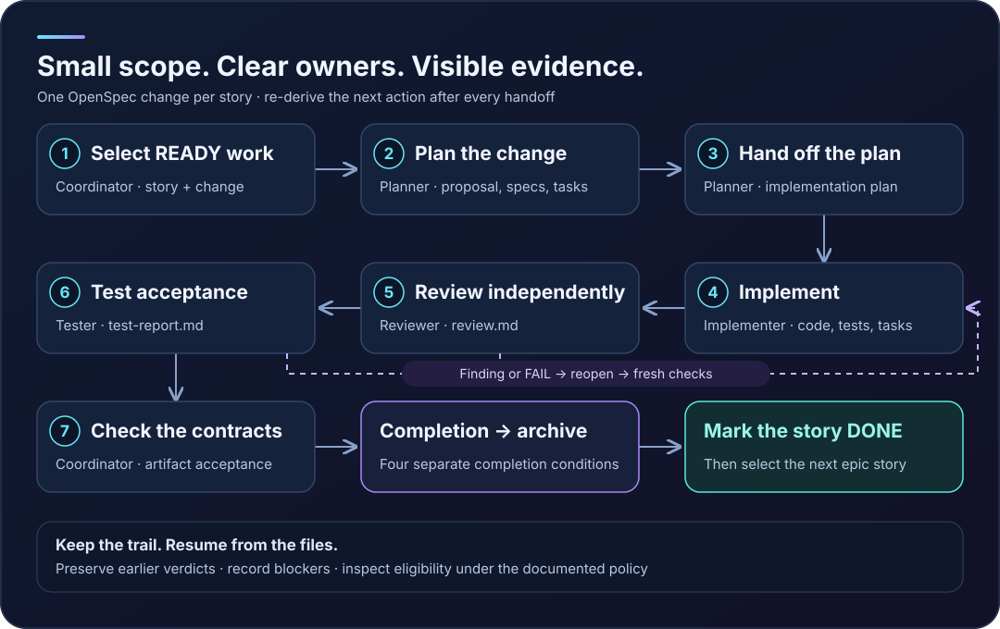
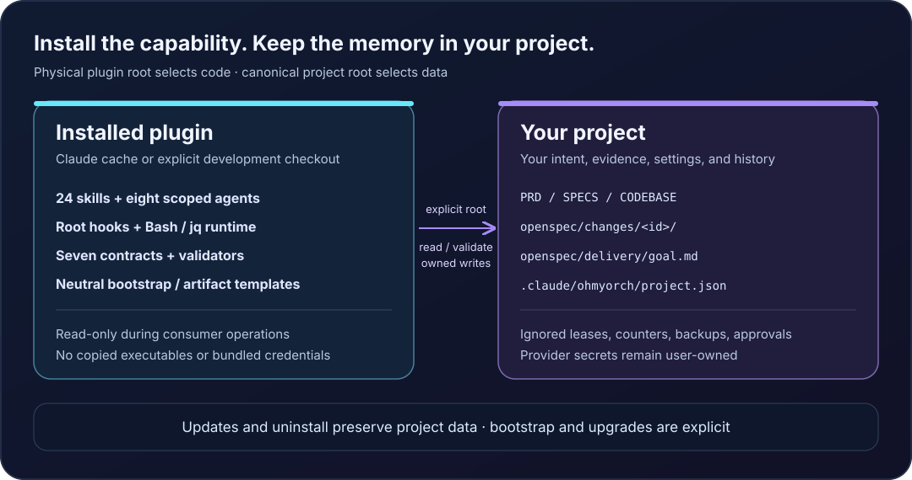

# OhMyOrch


**Pick a READY story**

Follow clear handoffs and keep the evidence when you finish.

OhMyOrch brings a repeatable delivery loop to Claude Code. The main session coordinates one OpenSpec change at a time, delegates each stage to its owner, and derives the next action from project artifacts. You can see what passed, what needs attention, and where to resume.

OhMyOrch **0.0.1** is the version published in this repository. Authenticated delegated-agent/full-delivery tests and the distribution license remain gates for public packaged artifacts and support claims. The features below describe the implemented plugin; examples illustrate the workflow rather than claiming a completed live run.

## Why the loop is useful

A large goal gets a small working unit: one independently verifiable story, one change, one next action. An epic becomes a sequence of those changes. Task focus still carries the parent story's acceptance criteria.

Each handoff has a place to land. The implementation plan tells the implementer what to build and check. The reviewer records findings. The tester records acceptance evidence. The coordinator reads those files and decides what comes next.

A failed verdict becomes history, remediation tasks become visible, and fresh implementation, review, and testing follow. A missing product decision becomes a blocker. A new session can pick up from these files.

### Start the whole loop with one command

In an initialized project, run **`/ohmyorch:deliver <target>`** in Claude Code. It reads the configured `SPECS.md` backlog and coordinates selection, planning, implementation, independent review, acceptance testing, completion checks, archival, and the DONE transition. For example, to deliver an existing epic:

```text
/ohmyorch:deliver EPIC-1
```

Choose the scope that matches your backlog:

| Scope | Example command | What the loop delivers |
|---|---|---|
| Epic | `/ohmyorch:deliver EPIC-1` | Every story in that epic, in SPECS order; one OpenSpec change per story. |
| Feature / user story | `/ohmyorch:deliver US-1.1` | The bounded feature represented by that user story. |
| Task focus | `/ohmyorch:deliver US-1.1#2` | The parent story, with its second task prioritized; all story acceptance criteria still apply. |
| Task description | `/ohmyorch:deliver "Add the password-reset request endpoint"` | The parent story of a uniquely matching task, with that task recorded as the focus. |

These IDs and task text are examples; use targets that actually exist in your mapped `SPECS.md`. Feature selection uses the story's `US-N.M` ID. Stories must be READY with approved acceptance criteria and satisfied dependencies. The loop continues until the goal is COMPLETE or a blocker requires a human decision. Resolve the blocker and repeat the same command to resume.



## Start in a real project

Actual delivery needs an authenticated Claude Code session. Prerequisites are OpenSpec **1.13.2**, Bash **3.2+**, jq **1.6+**, Git, shasum, and standard Unix utilities. OpenSpec is installed separately and has its own Node requirements; the bundled plugin runtime uses Bash and jq.

Claude Code **2.1.292** is the recorded preferred validation target. Format and isolated marketplace/cache checks also passed on **2.1.285**. Full live-agent validation is pending; these are recorded targets, not a claim about the newest available CLI.

With a checkout of this version, run from your consuming project:

```bash
claude --plugin-dir /absolute/checkout/plugins/ohmyorch
```

This loads the plugin for the session. During development, `/reload-plugins` reloads edited components. [Official development guidance](https://code.claude.com/docs/en/plugins/create#develop-without-a-marketplace).

For the actual local marketplace/cache flow, run from the consumer project:

```bash
claude plugin marketplace add /absolute/checkout --scope local
claude plugin install ohmyorch@ohmyorch-marketplace --scope local
```

To install from the repository marketplace:

```text
/plugin marketplace add josoroma/OhMyOrch
/plugin install ohmyorch@ohmyorch-marketplace
```

Choose local scope for a personal project trial, project scope for a team declaration, or user scope across projects. [Official plugin commands and scopes](https://code.claude.com/docs/en/plugins/cli-reference).

## Initialize deliberately

Installation loads code. Bootstrap creates scaffolding only when explicitly requested:

```text
/ohmyorch:doctor --json
/ohmyorch:bootstrap --dry-run --with-openspec
/ohmyorch:bootstrap --apply --with-openspec
```

Review the preview before applying. Existing PRD, SPECS, CLAUDE, README, OpenSpec configuration, and host scripts survive. Missing PRD/SPECS start neutral; CODEBASE comes from analysis. `--mode merge` adds an owned CLAUDE guidance block. Edited owned blocks produce a conflict rather than an overwrite.

Root, `docs/`, and mixed layouts work. If both locations contain a document, select it explicitly with `--prd`, `--specs`, and `--codebase` during bootstrap. Once created, `.claude/ohmyorch/project.json` governs the mapping. Doctor reports actual paths and prerequisite failures.

For an existing codebase:

```text
/ohmyorch:analyze-codebase
/ohmyorch:adapt-project --dry-run
/ohmyorch:adapt-project --apply
```

Analysis produces descriptive CODEBASE evidence. Adaptation creates owned project guidance from actual evidence and records unknowns. Nested guidance requires `--nested` and evidence for the directory. Surrounding human-authored text survives.

## Turn approved intent into READY work

Use `/ohmyorch:generate-prd` with human-approved requirements and `/ohmyorch:ingest-spec` with an approved source. Codebase observations explain what exists; product decisions define what should change. Missing behavior remains NEEDS CLARIFICATION or BLOCKED until a human resolves it.

Start when the selected story exists, is READY, has acceptance scenarios and source traceability, and its dependencies are satisfied. The following IDs are examples; choose real ones from your backlog:

```text
/ohmyorch:deliver US-1.1
```

An epic delivers its stories in backlog order, each with its own change:

```text
/ohmyorch:deliver EPIC-1
```

Task focus uses `/ohmyorch:deliver US-1.1#2` or a uniquely matching task description. The parent story still supplies acceptance; checking one task does not approve the story.

## Follow the owners and gates

The main session is the coordinator and Product Manager. It selects work, persists read-only specialists' handoffs, evaluates gates, records status, and owns archival and backlog transitions. Technical stages are delegated.

| Gate | Owner | Evidence the next stage reads |
|---|---|---|
| 1. Selection | Main coordinator | Selected story and one OpenSpec change |
| 2. Planning | `ohmyorch:planner`, coordinator persists | `proposal.md`, delta `specs/`, `tasks.md` |
| 3. Plan handoff | `ohmyorch:planner`, coordinator persists | `implementation-plan.md` |
| 4. Implementation | `ohmyorch:implementer` | Product code/tests and completed tasks |
| 5. Review | `ohmyorch:reviewer` | Specialist-authored `review.md`, no blocking findings |
| 6. Testing | `ohmyorch:tester` | Specialist-authored `test-report.md`, no FAIL |
| 7. Artifact acceptance | Main coordinator checks | Backlog readiness and codebase-context contracts |

After every result, the coordinator derives the next action again. Actions include selection, proposal, planning, implementation, review, testing, reopening, archival, a DONE transition, completion, or escalation. Stored goal text is a human record; current artifacts govern the next step.

The reviewer and tester persist their own verdicts and return the path and summary. The implementer does not author approval evidence. Blocking findings or FAIL require reopening: preserve the verdict, append remediation tasks, implement fixes, and obtain fresh review and testing.

## Meet the eight agents

Skills are the commands you invoke. Agents are the specialists those commands delegate to. All eight inherit the session's selected model and preload the shared `ohmyorch:contract`.

| Agent | Responsibility and handoff | Example entry point |
|---|---|---|
| [`ohmyorch:codebase-analyst`](../plugins/ohmyorch/agents/codebase-analyst.md) | Inspect actual code and return evidence-backed CODEBASE content; the coordinator persists it. | `/ohmyorch:analyze-codebase` |
| [`ohmyorch:product-specifier`](../plugins/ohmyorch/agents/product-specifier.md) | Turn approved product sources into PRD content; the coordinator persists it. | `/ohmyorch:generate-prd docs/approved-brief.md` |
| [`ohmyorch:spec-ingestor`](../plugins/ohmyorch/agents/spec-ingestor.md) | Return a source-traceable SPECS backlog with stories and acceptance scenarios. | `/ohmyorch:ingest-spec` |
| [`ohmyorch:planner`](../plugins/ohmyorch/agents/planner.md) | Author proposal/spec/task handoffs and the repository-aware implementation plan. | `/ohmyorch:plan-feature add-password-reset` |
| [`ohmyorch:implementer`](../plugins/ohmyorch/agents/implementer.md) | Modify product code and implementation tests; complete the selected change's tasks. | `/ohmyorch:opsx-apply add-password-reset` |
| [`ohmyorch:reviewer`](../plugins/ohmyorch/agents/reviewer.md) | Independently assess the change, record OpenSpec verification, and persist `review.md`. | `/ohmyorch:review-feature add-password-reset` |
| [`ohmyorch:tester`](../plugins/ohmyorch/agents/tester.md) | Independently test acceptance criteria and persist `test-report.md` with evidence. | `/ohmyorch:test-feature add-password-reset` |
| [`ohmyorch:product-manager`](../plugins/ohmyorch/agents/product-manager.md) | Select eligible work, evaluate gates, and control archival/backlog transitions. During `deliver`, the main session performs this role. | `/ohmyorch:deliver US-1.1` or `/ohmyorch:product-iteration US-1.1` |

Analyst, specifier, ingestor, and planner have Read/Grep/Glob/Bash tool budgets and return authored content. Implementer, reviewer, and tester also have Write/Edit; each writes within its role's scope. Product Manager also has Agent for delegation. Read-only roles do not use Bash to bypass their write boundary. The reviewer and tester report defects; the implementer repairs them.

Use the entry-point skills for routine work; the delivery command delegates the stages in order. To request a specific specialist in conversation, name the agent and supply the selected change, mapped project documents, and approved scope. For example, when `add-password-reset` is the selected implemented change and the review preconditions pass:

```text
Use the ohmyorch:reviewer agent to review add-password-reset.
Read its approved specs, tasks, implementation plan, and mapped project context.
Persist only the selected change's review.md, including OpenSpec verification.
Return the artifact path, verdict, and actionable findings to this session.
```

The reviewer persists the verdict; the coordinator reads and validates it. A blocking finding sends the change through reopening, implementation, fresh review, and fresh testing.

## Inspect without advancing

The CLI gives precise answers from the files. Run these in an initialized consumer project; set the plugin directory and change ID to actual values:

```bash
plugin_dir=/absolute/checkout/plugins/ohmyorch
project_root="$(pwd -P)"
change_id=your-change-id

"$plugin_dir/bin/ohmyorch" --project-root "$project_root" delivery next --json
"$plugin_dir/bin/ohmyorch" --project-root "$project_root" workflow-status --change "$change_id" --json
"$plugin_dir/bin/ohmyorch" --project-root "$project_root" status --resume --change "$change_id"
"$plugin_dir/bin/ohmyorch" --project-root "$project_root" completion-gate --change "$change_id" --json
```

These calls are read-only. `workflow-status` reports the seven gates and first incomplete gate. `status --resume` reports the resume point and authored blockers. `completion-gate` returns eligibility and the first failing condition; ineligibility exits nonzero.

Writing status, recording completion, or changing the goal uses the actual Claude session ID through `--session-id`. Skills supply explicit project/plugin/session context; ordinary Bash does not automatically receive the substitutions as environment variables. The [plugin handbook](../plugins/ohmyorch/README.md) covers direct mutation and recovery commands.

## Pause, repair, and resume

| Goal state | Meaning |
|---|---|
| ACTIVE | The owner session is driving the next derived action. |
| BLOCKED | A decision, dependency, reporter failure, or stalled progress needs attention. |
| STOPPED | Delivery was explicitly stopped. |
| COMPLETE | Every story in the selected goal is DONE. |

By default, three unchanged blocked Stop attempts precede the fourth unchanged Stop, which records BLOCKED and permits stopping. The counter belongs to the owner session. Another session's Stop does not drive your goal. Claude's continuation limits also apply. [Official Stop hook behavior](https://code.claude.com/docs/en/hooks).

Resume a resolved BLOCKED or STOPPED goal with `/ohmyorch:deliver` and the **same target**. An ownership conflict requires explicit `--takeover` by the coordinator using the new actual session ID. No lease expiry is inferred. Refresh derived status; preserve authored blockers and earlier evidence. Deleting runtime directories is not a resume procedure.

## Make the finish explicit

Seven progress gates and four completion conditions answer different questions. Passing the gates does not by itself authorize archival. The completion check evaluates:

1. Required tasks are complete.
2. Review has no blocking findings.
3. Acceptance evidence satisfies the current test-report policy.
4. OpenSpec validation/recorded verification has no blocking mismatch.

The coordinator records `completion.md`, archives with a separate standalone `openspec archive <id> -y` Bash call, and then marks the story DONE. An epic moves to the next story. Preserve that order even where a legacy predicate is less strict; see the boundaries below.

## Know where files belong



| Location | Ownership |
|---|---|
| Installed plugin tree or Claude cache | Skills, agents, hooks, runtime, validators, references, neutral templates |
| Mapped PRD/SPECS/CODEBASE | Product intent, iterable backlog, descriptive codebase evidence |
| `openspec/changes/<id>/` | Proposal, specs/tasks, implementation plan, verdicts, status, completion, remediation history |
| `openspec/delivery/goal.md` and archived changes | Durable goal and completed work |
| Project config, ledger, managed bases | Nonsecret configuration and owned guidance provenance |
| Ignored runtime/backups/local approval | Session lease/counters, affected-file recovery, approved script hash |

Update and uninstall preserve project documents/state. Initialization, adaptation, project upgrades, and reset are separate explicit operations. This publisher repository keeps consumer scaffolding in bundled templates for bootstrap into your project.

## Choose the right skill

There are **24 skills: 23 public commands and one internal contract**. Invoke public skills as `/ohmyorch:<name>`. The inventory below covers every installed skill and gives an example for each public command. IDs, change names, task descriptions, and source paths are illustrative; substitute actual approved project inputs.

### Initialize and maintain a project

Lifecycle changes are manually invoked. Preview first, inspect the proposed files, and apply the reviewed operation explicitly.

| Skill | Use it to… | Example |
|---|---|---|
| [`doctor`](../plugins/ohmyorch/skills/doctor/SKILL.md) | Report prerequisite, project, mapping, and interrupted-operation diagnostics. | `/ohmyorch:doctor --json` |
| [`bootstrap`](../plugins/ohmyorch/skills/bootstrap/SKILL.md) | Adopt existing documents and create missing neutral scaffolding. | `/ohmyorch:bootstrap --dry-run --with-openspec` |
| [`adapt-project`](../plugins/ohmyorch/skills/adapt-project/SKILL.md) | Create evidence-backed project guidance and owned blocks. | `/ohmyorch:adapt-project --dry-run --mode merge` |
| [`post-install`](../plugins/ohmyorch/skills/post-install/SKILL.md) | Invoke the explicit adaptation alias. | `/ohmyorch:post-install --dry-run` |
| [`upgrade-project`](../plugins/ohmyorch/skills/upgrade-project/SKILL.md) | Preview a project-state upgrade or recover a retained lifecycle transaction. | `/ohmyorch:upgrade-project --dry-run` |
| [`migrate-legacy`](../plugins/ohmyorch/skills/migrate-legacy/SKILL.md) | Preview adoption and retirement of fingerprinted copied components. | `/ohmyorch:migrate-legacy --dry-run` |
| [`harness-reset`](../plugins/ohmyorch/skills/harness-reset/SKILL.md) | Preview the ownership-based managed-guidance reset. | `/ohmyorch:harness-reset --scope managed --dry-run` |

### Understand intent and drive delivery

| Skill | Use it to… | Example |
|---|---|---|
| [`analyze-codebase`](../plugins/ohmyorch/skills/analyze-codebase/SKILL.md) | Create or refresh descriptive CODEBASE evidence. | `/ohmyorch:analyze-codebase` |
| [`generate-prd`](../plugins/ohmyorch/skills/generate-prd/SKILL.md) | Turn human-approved product source material into the mapped PRD. | `/ohmyorch:generate-prd docs/approved-brief.md` |
| [`ingest-spec`](../plugins/ohmyorch/skills/ingest-spec/SKILL.md) | Turn the PRD/approved sources into a traceable SPECS backlog. | `/ohmyorch:ingest-spec` |
| [`deliver`](../plugins/ohmyorch/skills/deliver/SKILL.md) | Drive or resume an epic, story, or task-focused goal through the whole loop. | `/ohmyorch:deliver EPIC-1` |
| [`product-iteration`](../plugins/ohmyorch/skills/product-iteration/SKILL.md) | Run or resume one story from its first incomplete gate. | `/ohmyorch:product-iteration US-1.1` |

### Work on a selected change

Most stage commands take an OpenSpec change ID; `opsx-explore` also accepts a story or an exploratory question. Use them when that stage's preconditions pass. `deliver` calls for the appropriate stage and specialist as it advances.

| Skill | Use it to… | Example |
|---|---|---|
| [`opsx-explore`](../plugins/ohmyorch/skills/opsx-explore/SKILL.md) | Investigate an idea or clarify the selected story before implementation. | `/ohmyorch:opsx-explore US-1.1` |
| [`opsx-propose`](../plugins/ohmyorch/skills/opsx-propose/SKILL.md) | Author the selected change's proposal, delta specs, and tasks. | `/ohmyorch:opsx-propose add-password-reset` |
| [`opsx-update`](../plugins/ohmyorch/skills/opsx-update/SKILL.md) | Revise existing planning artifacts coherently from approved decisions. | `/ohmyorch:opsx-update add-password-reset` |
| [`plan-feature`](../plugins/ohmyorch/skills/plan-feature/SKILL.md) | Get a repository-aware implementation-plan handoff from the planner. | `/ohmyorch:plan-feature add-password-reset` |
| [`opsx-apply`](../plugins/ohmyorch/skills/opsx-apply/SKILL.md) | Delegate the approved implementation/tasks to the implementer. | `/ohmyorch:opsx-apply add-password-reset` |
| [`review-feature`](../plugins/ohmyorch/skills/review-feature/SKILL.md) | Obtain a reviewer-authored verdict with OpenSpec verification. | `/ohmyorch:review-feature add-password-reset` |
| [`test-feature`](../plugins/ohmyorch/skills/test-feature/SKILL.md) | Obtain a tester-authored acceptance report with criterion-level evidence. | `/ohmyorch:test-feature add-password-reset` |
| [`opsx-verify`](../plugins/ohmyorch/skills/opsx-verify/SKILL.md) | Assess implementation completeness, correctness, and coherence. | `/ohmyorch:opsx-verify add-password-reset` |
| [`opsx-sync`](../plugins/ohmyorch/skills/opsx-sync/SKILL.md) | Merge approved delta specs into canonical specs. | `/ohmyorch:opsx-sync add-password-reset` |
| [`opsx-archive`](../plugins/ohmyorch/skills/opsx-archive/SKILL.md) | Request archival of a change that satisfies the completion policy. | `/ohmyorch:opsx-archive add-password-reset` |

### Explain and share the evidence

| Skill | Use it to… | Example |
|---|---|---|
| [`generate-html-page`](../plugins/ohmyorch/skills/generate-html-page/SKILL.md) | Build a sourced, self-contained page about status, architecture, or delivery. | `/ohmyorch:generate-html-page Explain the password-reset delivery and its evidence` |
| [`contract`](../plugins/ohmyorch/skills/contract/SKILL.md) | Supply shared artifact, authority, and role guidance to skills/agents. | Internal preload: `ohmyorch:contract`; not a slash command. |

`generate-html-page` produces a self-contained themed page with evidence sources, light/dark modes, accessible SVGs, and a bundled validator. This public guide is a separate website with repository-hosted images and SVG assets.

Bundled CLI operations include `delivery`, `workflow-status`, `status`, `completion-gate`, `check-scope`, `check-write-scope`, validators for product artifacts, plans, reviews, test reports, status, verification, and HTML pages, and `run-project-validation`. Host fast validation is disabled by default; enable it explicitly and approve the reviewed script's current SHA-256. Changed/unapproved scripts are skipped.

## Walk through one feature

Suppose your approved product brief describes password reset, and ingestion produces a READY story `US-1.1` in `EPIC-1`. In your initialized consumer project:

1. Run `/ohmyorch:analyze-codebase` for an existing application. The analyst returns current-state evidence; the coordinator persists the mapped CODEBASE document.
2. Run `/ohmyorch:generate-prd docs/approved-brief.md`, then `/ohmyorch:ingest-spec`. Review the resulting intent, traceability, acceptance scenarios, and dependencies. Resolve missing decisions before marking work READY.
3. Run `/ohmyorch:deliver US-1.1`. The main coordinator selects the story; the planner authors the handoffs; the implementer builds the change; reviewer and tester independently persist their verdicts. Findings reopen the change for fresh work and checks.
4. When the completion policy passes, the coordinator records completion, archives the change, and marks the story DONE. The goal becomes COMPLETE. Inspect the archived plan, tasks, verdicts, status, completion record, and any remediation history in your project.

For every story in that epic, choose `/ohmyorch:deliver EPIC-1`. To prioritize its second task while still delivering the parent story, choose `/ohmyorch:deliver US-1.1#2`. When a run is BLOCKED or STOPPED, resolve its cause and repeat the same target to resume from the derived next action. The guide's examples describe expected behavior; authenticated full-lifecycle evidence remains a release gate.

## Update or recover deliberately

```text
/plugin marketplace update ohmyorch-marketplace
/plugin update ohmyorch@ohmyorch-marketplace
/ohmyorch:upgrade-project --dry-run
```

Code update and project-state upgrade are separate. Review the latter before applying. Copied setups use `/ohmyorch:migrate-legacy --dry-run`, then apply the exact reviewed plan ID. Do not enable old and plugin hooks together.

Reset defaults to owned managed guidance; full workflow reset is a separately reviewed scope:

```text
/ohmyorch:harness-reset --scope managed --dry-run
/ohmyorch:harness-reset --scope workflow --dry-run
```

Applied lifecycle operations report recovery IDs. Rollback verifies affected-file backups and current hashes, preserving subsequent edits. Recovery requires the retained backup directory; an ID alone cannot restore files. Read the [handbook](../plugins/ohmyorch/README.md) and [distribution guide](distribution.md) for scope-specific commands.

## Know the current boundaries

Root hooks use Claude's scoped identity fields for supported Write/Edit/MultiEdit payloads, intercept supported standalone archive commands, and evaluate only the owner's Stop events. They are workflow guardrails. Arbitrary Bash/MCP writes and renamed executables can bypass file-tool checks. PostToolUse reports findings after a write; it cannot undo it.

Legacy acceptance allows some partial/mixed PASS/UNVERIFIED reports; all-UNVERIFIED/no-positive-evidence fails. Recorded verification text has a VERIFIED/UNVERIFIED substring ambiguity. The old DONE predicate can allow an eligible active change before archival, so archive-before-DONE also remains a coordinator contract. Eligibility does not prove every criterion received full verified coverage. These behaviors were preserved during the format migration.

Native Windows, custom OpenSpec schemas, registered/global stores, and unsupported prospective file-tool payloads are outside this implementation's supported scope. Linux/macOS CI is configured; recorded local execution was macOS. Authenticated role identity/denials and the complete live lifecycle remain public release gates.

## Build and inspect the source

The plugin has one runtime under `plugins/ohmyorch/`. Seven reference contracts are explicitly loaded through skills and agents. It bundles no MCP server, global default agent, consumer permissions, or install-time project mutation.

Maintainers generate the HTML guide from this Markdown:

```bash
npm ci --ignore-scripts
npm run docs:build
npm run check
npm test
npm run test:marketplace
```

Documentation uses local assets and system fonts. Plugin packaging excludes publisher assets/tools/tests and all consumer state. Public packaging requires license and live-test evidence. See the [release workflow](../.github/workflows/plugin-release.yml).

## Sources

Features are defined by the current [delivery skill](../plugins/ohmyorch/skills/deliver/SKILL.md), [operational contract](../plugins/ohmyorch/references/contract.md), [workflow reporter](../plugins/ohmyorch/scripts/workflow-status.sh), [completion gate](../plugins/ohmyorch/scripts/completion-gate.sh), [root dispatcher](../plugins/ohmyorch/hooks/dispatch.sh), and [lifecycle engine](../plugins/ohmyorch/lib/lifecycle.sh).

The [implementation record](plan/PLUGIN-IMPLEMENTATION.md) separates regression/cache evidence from pending authenticated tests. The [release checklist](plan/plugin-release-readiness.json) governs public packaged artifacts and support claims. Integration guidance comes from official [plugin development](https://code.claude.com/docs/en/plugins/create), [plugin commands](https://code.claude.com/docs/en/plugins/cli-reference), and [hooks](https://code.claude.com/docs/en/hooks) documentation.

The website uses the supplied [shadcn Luma preset](https://ui.shadcn.com/create?preset=b2D0wqNxT) light/dark tokens, with rounded surfaces, soft elevation, and open spacing informed by the official [Luma introduction](https://ui.shadcn.com/docs/changelog/2026-03-luma) and [theme conventions](https://ui.shadcn.com/docs/theming).
