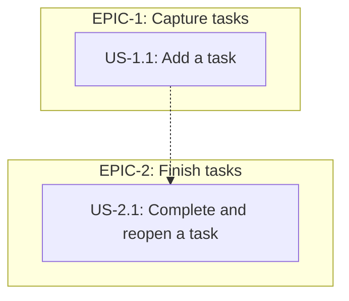
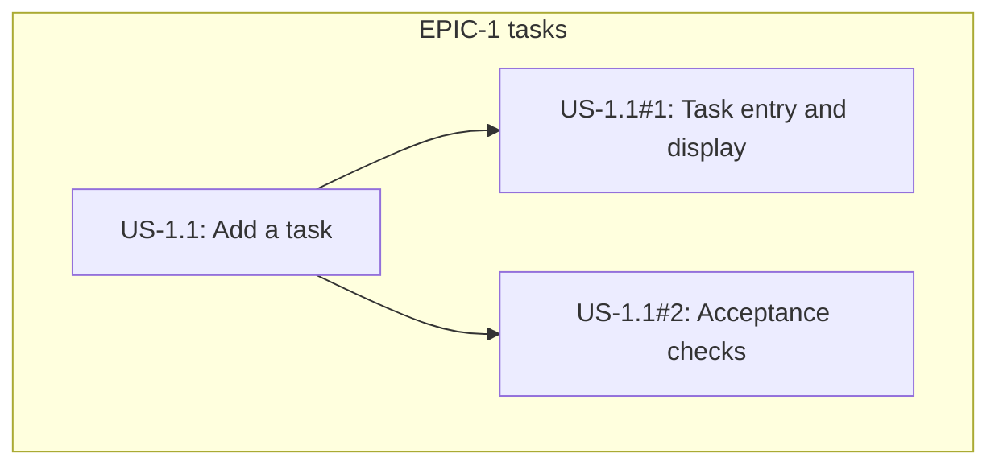
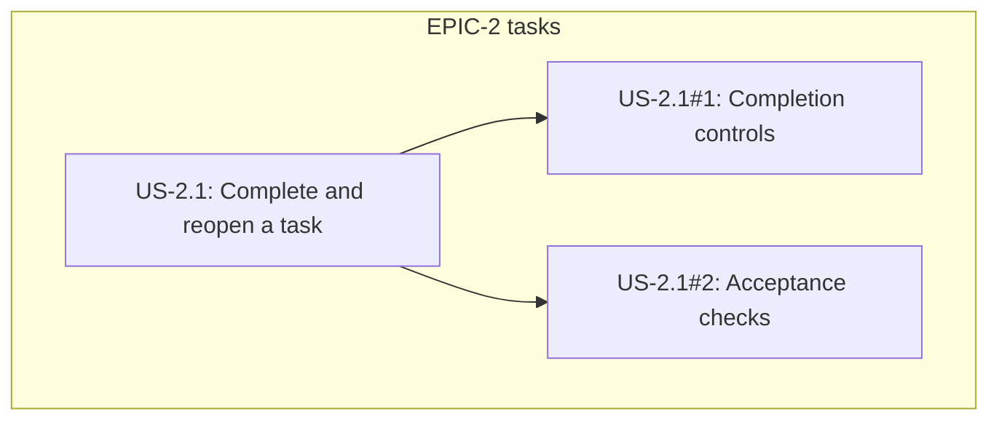

# SPECS — PocketTasks

CODEBASE Context: consumed (pockettasks-docs-v1)

## Table of Contents

- [EPIC-1: Capture tasks](#epic-1-capture-tasks)
  - [US-1.1: Add a task](#us-11-add-a-task)
- [EPIC-2: Finish tasks](#epic-2-finish-tasks)
  - [US-2.1: Complete and reopen a task](#us-21-complete-and-reopen-a-task)

## Work Item Status

| ID | Title | Status | Parent |
|---|---|---|---|
| EPIC-1 | Capture tasks | — | — |
| US-1.1 | Add a task | READY | EPIC-1 |
| US-1.1#1 | Implement task entry and ordered display | TODO | US-1.1 |
| US-1.1#2 | Verify task-entry acceptance scenarios | TODO | US-1.1 |
| EPIC-2 | Finish tasks | — | — |
| US-2.1 | Complete and reopen a task | BLOCKED | EPIC-2 |
| US-2.1#1 | Implement independent completion controls | TODO | US-2.1 |
| US-2.1#2 | Verify completion and reopening scenarios | TODO | US-2.1 |

## Dependency Diagram







## Product Context

This illustrative backlog follows `ohmyorch:spec-ingestor`, invoked through
`/ohmyorch:ingest-spec`. Its source is [PRD.md](PRD.md), with descriptive context
from [CODEBASE.md](CODEBASE.md). No feature, verdict, archive, or delivery result
is claimed to exist.

The first story is READY within the example's defined scope. The second has complete
criteria but is BLOCKED on US-1.1. After US-1.1 is delivered, archived, and marked
DONE, the coordinator can promote US-2.1 to READY and refresh this status table.

For a real trial, approve the brief and initialize a separate consumer project;
use PRD.md and SPECS.md as its product documents. Treat this CODEBASE.md as a
teaching sample, not a report of that checkout: a greenfield project has absent
context, and an existing app needs actual analysis. Regenerate context markers and
review readiness before starting `/ohmyorch:deliver EPIC-1`, then EPIC-2 when ready.
Creating these examples does not activate delivery in the OhMyOrch publisher.

## Goals

Add tasks; complete or reopen them during one browser session.

## Non-Goals

Accounts, saved data, synchronization, editing, deletion, filtering, due dates,
notifications, and collaboration.

## Actors

One person using a mouse or keyboard.

## Global Business Rules

- BR-001: Trim titles; reject an empty result with "Enter a task."
- BR-002: Duplicate titles are separate tasks; preserve insertion order.
- BR-003: Reloading resets the list.

Source: [PRD product principles](PRD.md#6-product-principles).

## Non-Functional Requirements

- NFR-001: One browser page; memory-only state; no login or remote services.
- NFR-002: Labelled controls; Enter submits; Space toggles a focused checkbox.

Source: [PRD non-functional requirements](PRD.md#9-non-functional-requirements).

# EPIC-1: Capture tasks

Deliver task entry and an ordered list. Covers FR-001, BR-001–003, and NFR-001–002.

### US-1.1: Add a task

Status: READY

As a person keeping a short task list
I want to add tasks on one page
So that I can remember what I intend to do.

Source:
- [PRD functional requirements](PRD.md#8-functional-requirements), FR-001.
- [PRD product principles](PRD.md#6-product-principles), BR-001, BR-002, BR-003.
- [PRD non-functional requirements](PRD.md#9-non-functional-requirements), NFR-001, NFR-002.

Codebase Context:
- [Existing Product Behavior](CODEBASE.md#existing-product-behavior): task entry is not implemented.

Acceptance Criteria:

```gherkin
Scenario: Add a trimmed title
  Given the list is empty and Task title contains "  Buy milk  "
  When I click Add task
  Then one Active task titled "Buy milk" appears with an unchecked checkbox

Scenario: Clear the input after adding
  Given Task title contains "Buy milk"
  When I click Add task
  Then Task title is empty

Scenario: Reject an empty title
  Given the list is empty and Task title is empty
  When I click Add task
  Then the validation message reads "Enter a task."

Scenario: Do not create an empty task
  Given the list is empty and Task title is empty
  When I click Add task
  Then the list stays empty

Scenario: Reject a whitespace-only title
  Given the list is empty and Task title contains only spaces
  When I click Add task
  Then the validation message reads "Enter a task."

Scenario: Do not create a whitespace-only task
  Given the list is empty and Task title contains only spaces
  When I click Add task
  Then the list stays empty

Scenario: Append another task using the keyboard
  Given "Buy milk" is listed and the focused Task title input contains "Read a book"
  When I press Enter
  Then "Read a book" appears after "Buy milk"

Scenario: Allow duplicate titles
  Given one task titled "Buy milk" is listed and Task title contains "Buy milk"
  When I click Add task
  Then two separate tasks titled "Buy milk" are listed

Scenario: Display a title as plain text
  Given Task title contains "<b>Read</b>"
  When I click Add task
  Then the task title displays the literal text "<b>Read</b>"

Scenario: Reset the list on reload
  Given the list contains "Buy milk"
  When I reload the page
  Then the list is empty
```

Dependencies:
- None.

Tasks:
- [ ] Implement task entry and ordered display
- [ ] Verify task-entry acceptance scenarios

Open Questions:
- None within the example product brief.

# EPIC-2: Finish tasks

Deliver completion and reopening. Covers FR-002, BR-002, and NFR-002.

### US-2.1: Complete and reopen a task

Status: BLOCKED

As a person working through my task list
I want to complete and reopen individual tasks
So that the list reflects what still needs attention.

Source:
- [PRD functional requirements](PRD.md#8-functional-requirements), FR-002.
- [PRD product principles](PRD.md#6-product-principles), BR-002.
- [PRD non-functional requirements](PRD.md#9-non-functional-requirements), NFR-002.

Codebase Context:
- [Existing Product Behavior](CODEBASE.md#existing-product-behavior): completion and reopening are not implemented.

Acceptance Criteria:

```gherkin
Scenario: Complete a task
  Given "Buy milk" is unchecked and labelled Active
  When I check its checkbox labelled "Buy milk"
  Then that task is checked and labelled Done

Scenario: Leave an identical task unchanged
  Given two separate Active tasks titled "Buy milk" are listed
  When I check the first task's checkbox labelled "Buy milk"
  Then the second task remains unchecked and labelled Active

Scenario: Preserve task order after completion
  Given "Buy milk" is listed before "Read a book"
  When I check the checkbox for "Buy milk"
  Then "Buy milk" is still listed before "Read a book"

Scenario: Reopen a completed task
  Given "Buy milk" is checked and labelled Done
  When I uncheck its checkbox
  Then the same task is unchecked and labelled Active

Scenario: Complete a task using the keyboard
  Given "Read a book" is Active and its labelled checkbox is focused
  When I press Space
  Then that checkbox is checked and the task is labelled Done
```

Dependencies:
- US-1.1 must be delivered, archived, and marked DONE before this story becomes READY.

Tasks:
- [ ] Implement independent completion controls
- [ ] Verify completion and reopening scenarios

Open Questions:
- None. The blocker is the unfinished dependency, not a missing product decision.
