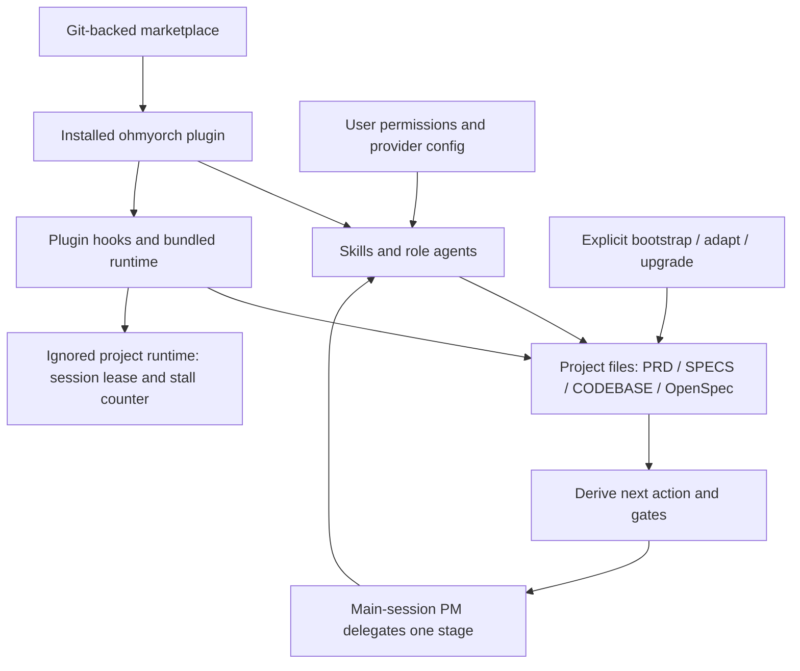

# OhMyOrch: Claude Code plugin architecture and migration plan

Research and repository audit: **2026-10-06**, America/Costa_Rica. Status: **local implementation and legacy cutover completed; public release gates remain**. See [implementation evidence and recovery limits](PLUGIN-IMPLEMENTATION.md) for actual changes, validation, decisions and remaining work. The audit and proposed phase descriptions below retain their original baseline context.

Publisher cleanup follow-up: **2026-10-07**. Obsolete source/backups and blank publisher consumer scaffolding were removed by user direction; the current public guide is generated from `docs/OhMyOrch.md`. The original inventory below remains historical. See the [cleanup record and current recovery limits](PLUGIN-IMPLEMENTATION.md#publisher-cleanup-and-guide-follow-up--2026-10-07).

Compatibility follow-up, same date: the user upgraded Homebrew packages; the active Claude Code CLI is now **2.1.285**. Section 2.3 records local format validation and the resulting plan adjustments. Repository audit counts/revision remain the original snapshot.

Audited revision: `6198da15df78cd5a68d4227abd4e4e5d27372ac8`. Git origin is `https://github.com/josoroma/OhMyOrch.git`; the local directory happens to be named `claude-dev`. Paths in this document are relative to the repository root unless explicitly identified as plugin-relative or consumer-project-relative. Proposed commands and JSON examples are implementation specifications, not files created by this audit.

## 1. Executive summary

Convert OhMyOrch into one self-contained Claude Code plugin named **`ohmyorch`**, initially at **`plugins/ohmyorch/`**, distributed by a colocated marketplace named **`ohmyorch-marketplace`**. Other developers will add the marketplace and install the plugin through Claude Code. They will not copy agents, skills, commands, hooks, or executable harness code into their own `.claude/` directories.

Keep the current artifact-driven orchestration: one bounded story per OpenSpec change, independent implementation/review/testing, seven workflow gates plus four completion conditions, derived resumption, remediation history, and a main-session Product Manager controlling the delivery goal. Preserve the goal vocabulary `ACTIVE`, `BLOCKED`, `STOPPED`, `COMPLETE` and the existing story/change vocabularies. Do not substitute a general purpose loop plugin, an agent team, a monitor, or a new workflow engine merely because those features exist.

The difficult work is enforcing these semantics after installation, not creating the manifest:

- Plugin agents **ignore their `hooks` frontmatter**. The three existing role guards must move to plugin-level hooks and dispatch on the actual agent identity.
- Project `.claude/rules/` files and project `CLAUDE.md` do not become automatically loaded plugin rules by relocating them. Package generic contracts as reference content and explicitly load them; generate only project-specific guidance in the consumer project.
- Plugin code and project data need independent roots. Several scripts currently assume their source directory or working directory is the project, or call sibling validators through `scripts/...` in the consumer project.
- Review/test skill wrappers currently say to return a verdict to the caller and have the caller write it, while the active delivery guard prohibits main-session verdict writes. Make the owning reviewer/tester subagent write its artifact and return its path and summary.
- The current reset replaces `scripts/`, `openspec/`, root product documents, README, and nested `CLAUDE.md` files. This blast radius is inappropriate for arbitrary consumer repositories. Preserve verified backup and explicit reset semantics, but make the default reset ownership-based and require a separate, explicitly destructive full-workflow mode.
- Installation, project initialization, project adaptation, and project-state upgrades are separate operations. Installing/updating/enabling a plugin must not silently initialize or overwrite a project.

Recommend a first release tested against **Claude Code 2.1.292**, the published version observed and reconfirmed during research. This is a preferred release/runtime-validation target, not an asserted minimum version for the plugin format. The local CLI was **2.1.128** at the audit and is now **2.1.285** after the user's update. Local strict validation of representative proposed formats passes on 2.1.285, so plugin development can begin there; live hooks, identity dispatch, cached installation and delivery still require implementation and runtime tests. Older-version support is an optional later deliverable, not a claim of this plan. Treat **OpenSpec 1.13.2** as the first dependency compatibility target, because the checked-in generated prompts and local CLI use it.

The original audit task created only this document. The subsequent explicit implementation request authorized the plugin, maintainer tooling, documentation and recoverable local cutover now recorded in [PLUGIN-IMPLEMENTATION.md](PLUGIN-IMPLEMENTATION.md). On 2026-10-07 the owner authorized repository/tag/Pages publication, then explicitly selected the current 0.0.1 version with literal tag 0.0.1 and a single-commit published history. Earlier publication versions are historical. Authenticated live tests and licensing remain gates for public packaged artifacts and support claims; source publication does not satisfy them.

## 2. Official findings and evidence

### 2.1 Source hierarchy and research boundary

Use current Claude Code documentation for supported behavior, then the installed target CLI's validator and runtime behavior. Use Anthropic-maintained examples to understand composition, not to override newer reference documentation. Local repository comments describe intended behavior and require verification when they disagree with code.

The official repository was inspected through its complete Git tree and relevant raw files at **`d4226d062928f8d9505dbdeadd10217d23361052`**. Its marketplace had 315 entries at that snapshot; this is an observation, not a stable requirement. No third-party blog is an architectural authority here. Direct documentation downloads from this environment returned HTTP 403; official documentation was read through the browsing tool. GitHub raw files and API responses were available. Examples were read, not installed or executed.

| Official source | Verified finding and consequence |
|---|---|
| [Plugins overview](https://code.claude.com/docs/en/plugins) | A plugin is an installed unit of components; a marketplace is its catalog. User, project, and local scopes are supported. Choose local scope for a personal trial and project scope for a team convention. |
| [Create a plugin](https://code.claude.com/docs/en/plugins/create) | `.claude-plugin/plugin.json` identifies the plugin; components are siblings at the plugin root. `skills/<name>/SKILL.md`, `commands/*.md`, `agents/*.md`, and `hooks/hooks.json` are the relevant locations. Default command discovery also supports nested command namespaces. New command behavior should use skills. `--plugin-dir` supports local development and `/reload-plugins` applies changes. Keeping legacy hooks and plugin hooks together causes duplicate execution. |
| [Manifest reference](https://code.claude.com/docs/en/plugins-reference) | The manifest is optional in the general loader, but this product will always ship one. `name` is required when present. Use documented metadata only; custom compatibility data goes under `metadata`, not an invented `engines.claude` field. Declared component paths must exist, remain inside the plugin, and use `./`. |
| [Plugin components](https://code.claude.com/docs/en/plugins/components) | Plugin-agent `hooks`, `permissionMode`, `mcpServers`, and `initialPrompt` are ignored. Plugin settings currently apply only `agent` and `subagentStatusLine`. `bin/` adds executables to the Bash tool's PATH while enabled. These findings drive global role dispatch, consumer-owned permissions, and an executable entry point. |
| [Skills](https://code.claude.com/docs/en/skills) | Skills are both contextual capabilities and slash commands. Supported invocation controls include `user-invocable` and `disable-model-invocation`; `context: fork` is optional. Plugin/skill/project placeholders resolve in skill content and relevant Bash `allowed-tools` rules. Keep destructive initialization/reset skills manually invoked. |
| [Subagents](https://code.claude.com/docs/en/sub-agents) | Agent names carry the plugin namespace. Preloaded skills can supply common contracts. Current subagents can nest, subject to depth controls; the old blanket claim that subagents cannot spawn subagents is obsolete. Keep primary delivery in the main session because that is this harness's existing contract, not because nesting is universally unsupported. |
| [Hooks reference](https://code.claude.com/docs/en/hooks) | Root hooks receive JSON on stdin. Tool events inside subagents include `agent_id` and `agent_type`; use scoped identities. Exec form uses `command` plus `args`, avoiding shell reinterpretation. Exit 2 denies `PreToolUse` and continues `Stop`; `PostToolUse` cannot undo an edit. Stop continuation has an eight-consecutive-continuation cap. |
| [Project memory and rules](https://code.claude.com/docs/en/memory) | `.claude/rules/` is a project/user memory mechanism. A directory of generic rules inside a plugin has no documented automatic rule-loading primitive. Project memory can be excluded by user settings; essential contracts must also reach skills and agents directly. |
| [Plugin loading](https://code.claude.com/docs/en/plugins/loading) | Local directory development can load in place, while remote marketplace installs load a copied plugin tree. External sibling files are unavailable in that copy. Plugin data can persist separately from the version directory. Test actual remote/cached installation, not just the source checkout. |
| [Create a marketplace](https://code.claude.com/docs/en/plugin-marketplaces) and [marketplace reference](https://code.claude.com/docs/en/plugins/marketplace-reference) | Marketplace metadata lives at `.claude-plugin/marketplace.json`. A relative plugin source resolves from the marketplace root. Git-backed catalogs can carry local plugin directories; a catalog fetched only as a JSON URL cannot supply those directories. GitHub, git, git-subdir, archive, npm, and command plugin sources exist, with distinct schemas and compatibility requirements. |
| [Host a marketplace](https://code.claude.com/docs/en/plugins/host-marketplace) | Third-party marketplace auto-update is off by default. Users/admins opt in. Marketplace metadata cannot force auto-update. Version changes determine whether a new plugin copy is fetched. |
| [Publish a plugin](https://code.claude.com/docs/en/plugins/publish) | Choose a permanent name, increment explicit versions on releases, validate, and test marketplace installation. Anthropic directory submission and an official-marketplace listing are different processes. Do not promise official inclusion or approval. |
| [Plugin CLI](https://code.claude.com/docs/en/plugins/cli-reference) and [install/manage](https://code.claude.com/docs/en/discover-plugins) | Use supported add/install/update/disable/uninstall commands and explicit scopes. Current validation supports `--strict`. Updates require reload/new session. Project enablement records intent; each developer still obtains the plugin on their own machine. |
| [Plugin troubleshooting](https://code.claude.com/docs/en/plugins/troubleshooting) | Inspect `/plugin` component counts and Errors, `/agents`, hook traces, and `claude --debug`. Schema validation alone does not prove invocation, role identity, gate enforcement, or resume behavior. |
| [Security and trust](https://code.claude.com/docs/en/plugins/security) | Plugin execution uses the user's privileges. Hook execution requires source review and must not be treated as a sandbox or as inheriting tool permission checks. Keep secrets, downloads, project commands, and destructive operations explicit. |
| [Official changelog](https://github.com/anthropics/claude-code/blob/main/CHANGELOG.md) and [published package metadata](https://registry.npmjs.org/@anthropic-ai/claude-code/latest) | Research observed and reconfirmed 2.1.292 in both sources. The original local 2.1.128 has since been upgraded to 2.1.285. Release-time validation must record the exact CLI version; local format checks do not establish full runtime compatibility. |

The official path substitution reference also makes an important distinction: `${CLAUDE_PLUGIN_ROOT}`, `${CLAUDE_PLUGIN_DATA}`, and `${CLAUDE_PROJECT_DIR}` can resolve in plugin prompt bodies, while ordinary Bash tool subprocesses do **not** automatically receive plugin-root/data environment variables. Hook processes do receive them. This design passes explicit arguments from substituted prompt content and computes bundled-code paths from the actual executable location. [Environment variable reference](https://code.claude.com/docs/en/plugins-reference#environment-variables).

### 2.2 Anthropic-maintained examples reviewed

| Snapshot reference | What to reuse or avoid |
|---|---|
| [Official README](https://github.com/anthropics/claude-plugins-official/blob/d4226d062928f8d9505dbdeadd10217d23361052/README.md) and [catalog](https://github.com/anthropics/claude-plugins-official/blob/d4226d062928f8d9505dbdeadd10217d23361052/.claude-plugin/marketplace.json) | Distinguish Anthropic's `plugins/` from third-party `external_plugins/`. Preserve immutable plugin IDs. Use a normal manifest-backed plugin rather than a skill-bundle exception, because OhMyOrch also requires agents/hooks/runtime. |
| [Example plugin README](https://github.com/anthropics/claude-plugins-official/blob/d4226d062928f8d9505dbdeadd10217d23361052/plugins/example-plugin/README.md) | Demonstrates sibling component directories and prefers skills for new slash commands. Its legacy example and skill coexist for illustration; OhMyOrch should avoid duplicate behavior sources. |
| [Feature-dev coordinator](https://github.com/anthropics/claude-plugins-official/blob/d4226d062928f8d9505dbdeadd10217d23361052/plugins/feature-dev/commands/feature-dev.md) | A coordinator delegates specialist work and reads returned evidence. This supports the existing separation of roles; its parallel exploration pattern does not justify concurrent mutation of OhMyOrch's one active change. |
| [Ralph-loop hooks](https://github.com/anthropics/claude-plugins-official/blob/d4226d062928f8d9505dbdeadd10217d23361052/plugins/ralph-loop/hooks/hooks.json) and [Stop script](https://github.com/anthropics/claude-plugins-official/blob/d4226d062928f8d9505dbdeadd10217d23361052/plugins/ralph-loop/hooks/stop-hook.sh) | Demonstrates plugin-relative Stop code and project-local state, with session isolation. Adopt session ownership for OhMyOrch's counters; retain the current artifact-derived action engine rather than replacing it with transcript-based completion detection. |
| [Plugin-dev manifest reference](https://github.com/anthropics/claude-plugins-official/blob/d4226d062928f8d9505dbdeadd10217d23361052/plugins/plugin-dev/skills/plugin-structure/references/manifest-reference.md) | Some bundled guidance says the manifest is mandatory, unlike the current general loader reference. Always ship a manifest, but describe the difference accurately. The example skill's description of model invocation is also narrower than current documentation. |

The official repository README links a submission form, while current publication documentation distinguishes directory submission from official-marketplace partner listing. Treat this as a publishing-route ambiguity to recheck with the maintained official guidance at release; it does not block a self-hosted marketplace. Do not open a speculative submission PR.

### 2.3 Effect of the user's Claude upgrade

Verified locally after the update: `/opt/homebrew/bin/claude --version` reports **2.1.285 (Claude Code)**; `brew list --cask --versions claude claude-code` reports `claude-code 2.1.285` and desktop `claude 2.26454.0`. The desktop package has a separate version scheme and does not determine the terminal plugin compatibility target.

**The architecture and phase order remain valid. The old local strict-validation blocker is removed.** In isolated temporary directories and a temporary `CLAUDE_CONFIG_DIR`, the following checks were performed without installing a plugin, running hooks, invoking a model, or changing consumer settings:

| Check on 2.1.285 | Observed result and limit |
|---|---|
| Proposed plugin manifest / `--strict --json` | Exit 0, no warnings. Metadata shape accepted; this is not a complete plugin compatibility test. |
| Proposed marketplace / `--strict --json` | Initially exit 1 because the top-level marketplace description was missing. Adding `description` produced exit 0; section 9.2 now includes it. |
| Representative skills, scoped reviewer agent and nested compatibility command frontmatter | Strict validation exit 0. A missing skill description negative control correctly failed with exit 1. Scoped preload acceptance does not prove runtime resolution. |
| Unknown manifest `engines` field negative control | Strict validation exit 1, confirming unsupported top-level compatibility fields are not silently accepted by CI. |
| Install/update/uninstall CLI help | Existing two-step marketplace-add/install, explicit scopes and `--keep-data` examples remain available. No installation/update/uninstall was performed. |

The [official changelog](https://github.com/anthropics/claude-code/blob/main/CHANGELOG.md) dates exec-form hook `args` to **2.1.139**, hook identity fields to **2.1.69**, and plugin `bin/` support to **2.1.91**; these precede 2.1.285. Later fixes still matter: **2.1.288** corrects skipped pre-tool hooks on matching/serialization failures, **2.1.289** corrects stale local-plugin views/reload and validation when plugin/catalog manifests coexist, **2.1.290** corrects intermittent loss of plugin PATH entries, and **2.1.292** adds `plugin install --marketplace` and corrects plugin policy loading/user-only skill invocation edge cases. Retain 2.1.292 as the preferred release test target; 2.1.285 is a usable local authoring candidate, not yet an advertised runtime support claim. Keep the two-step install example, which works with the local CLI. Mods and their camelCase `agentId` events are a different mechanism from the planned shell-hook JSON `agent_id`/`agent_type` dispatch.

Rechecking [component documentation](https://code.claude.com/docs/en/plugins/components#commands) also clarified that default nested command discovery supports `commands/opsx/apply.md` as `/ohmyorch:opsx:apply`. Flat `opsx-*` skills remain the recommended primary interface, but legacy nested aliases are a supported option, not an unsupported format. No orchestration redesign, project-file copying or migration implementation follows from this upgrade.

## 3. Repository audit

### 3.1 Scope, evidence, and exclusions

The audit inventoried tracked files, hidden configuration, ignored/generated files, reset copies, release bundles, dependency references, prompt frontmatter, shell call relationships, templates, and documentation. The initial Git worktree had only an unrelated untracked `.vscode/` directory. No `AGENTS.md` was found in the repository or its checked ancestor locations.

At the audit baseline there were **319 tracked files** and **1,213 non-`.git` filesystem files**, totaling approximately **37.1 MB**. Tracked groups: `.claude/` 173, `scripts/` 115, `docs/` 17, `openspec/` 4, and 10 other files. Ignored resets account for 886 files: `docs/resets/2026-09-27-12-56-02/` 588 and `docs/resets/2026-09-28-21-20-04/` 298. Counts are snapshot evidence, not runtime assumptions.

All non-Git files were enumerated and byte-scanned; live source, configuration, prompt contracts, runtime relationships, and existing plans were inspected. Binary assets and tarballs were classified as assets/output, not executable source. Historical reset contents were inventoried as recovery copies, not mistaken for active definitions. Local settings were inspected for **key names only**, without recording secret values. Git history, user-global Claude settings, credentials, and the contents of remote MCP services were outside the local repository audit.

No runtime regression suite was executed and no production bootstrap/reset/installer was invoked. Case totals mentioned in existing documentation are source claims, not newly verified passing results. Read-only CLI version/help checks were performed; the upgrade follow-up additionally validated disposable format fixtures as recorded in section 2.3.

### 3.2 Live components and ownership

| Current asset | Observation | Target ownership |
|---|---|---|
| `.claude/agents/` | Eight active role definitions plus `README.md`; all use `model: inherit`. Implementer, Reviewer, Tester have write-scope hooks. | Plugin agents; README becomes maintainer documentation outside the scanned agent directory. |
| `.claude/skills/` | Eighteen skills; seven are generated OpenSpec integrations. Reset/adaptation engines and canonical copies are embedded in two skill folders. | Plugin skills and bundled supporting resources, with shorter internal names. |
| `.claude/commands/ohmyorch/opsx/*.md` | Seven nested command prompts duplicate the OpenSpec skill capabilities. | Seven `opsx-*` skills, one behavior source per operation. |
| `.claude/commands/ohmyorch/post-install.md` | Eighth command; invokes a project-relative adaptation engine. | Retain `/ohmyorch:post-install` as a thin documented skill alias to project adaptation. |
| `.claude/rules/` | Seven generic normative rules plus index; no path frontmatter. | Plugin reference contracts, explicitly loaded; no claimed plugin `rules` primitive. |
| `.claude/settings.json` | Permissions allow/deny lists, default mode, hooks, environment, Git/context preferences, attribution. | Move only hook registrations into plugin hooks. Permissions and session/provider preferences remain consumer or maintainer settings. |
| `.claude/settings.local.example.json` | OpenRouter example with Anthropic-compatible provider variables. | Optional documentation example outside plugin runtime; never an install/update payload. |
| `.claude/settings.local.json` | Ignored machine-local `env` configuration: `ANTHROPIC_BASE_URL`, `ANTHROPIC_AUTH_TOKEN`, `ANTHROPIC_API_KEY`. | User-owned secret/provider configuration; never read by runtime bootstrap, backed up wholesale, packaged, or rewritten. |
| Root `CLAUDE.md` | Auto-loaded project contract; contains harness development, copier distribution, old command names, and repo-specific assumptions. | Split generic operational contract into plugin references; retain repository maintainer contract locally. Consumer CLAUDE guidance is optional and managed by bootstrap. |
| Root `PRD.md`, `SPECS.md` | Currently canonical placeholder documents after reset; backlog has no real epics/stories. | Consumer product state when present; sanitized skeleton templates in the plugin. Never distribute a real project's intent/backlog as defaults. |
| `CODEBASE.md` | Absent in the live repository; meaningful brownfield analysis is not supplied. | Generated consumer evidence, created by analysis skill; never invent it during bootstrap. |
| Root `README.md` | Large operational handbook and historical examples. | Publisher documentation; consumer README receives only an optional managed usage block. |
| `SPEC-LOGS/README.md` | Empty delivery-record scaffold. | Optional consumer scaffold and template; later epic records belong to the project. |
| `openspec/config.yaml` | `schema: spec-driven`; hard-coded harness context and rules/operation guidance. | Sanitized template with project context preserved during adoption; existing consumer config remains authoritative. Validate OpenSpec-specific keys independently. |
| `openspec/specs/README.md`, `openspec/changes/archive/README.md`, `openspec/delivery/README.md` | Live directories are scaffolds. No live changes, goal, or counter. | Consumer scaffolding and durable state, not installed plugin components. |
| `scripts/` | Validators, reporters, guards, goal engine, tests, templates, distribution builder, reset launcher, page generator. | Runtime subset inside plugin; tests/build/docs tools in maintainer repository; consumer `fast-validate.sh` stays consumer-owned. |
| Reset `canonical/`, `manifest.tsv`, `PRESERVE.tsv` | 124 tracked canonical files mirror live root documents, `openspec/`, and scripts. A further ignored bytecode file exists there. Every canonical regular file compared equal to its corresponding live path at audit. | Remove duplicated executable tree; retain only sanitized templates/reset policies. Record project file ownership separately. |
| `install.sh`, `uninstall.sh` | Curl/tar copy flow, checksums, file manifest, collision checks, backups. | Legacy migration tooling during transition; Claude Code owns plugin installation/update/uninstall afterward. |
| `dist/` | Ignored `ohmyorch-harness-0.1.0.tar.gz`, stable alias tarball, checksums. | Build output only. Existing files do not prove a published release exists. |
| `docs/resets/`, `docs/pre-install-backup/` | Reset copies exist; adaptation-backup directory is referenced but absent. Backups can contain local credentials. | Ignored recovery state, excluded from plugin and public artifacts. Preserve old backups during migration. |
| `.claude/ohmyorch/` | Installed/adapted manifests/reports/backups referenced by scripts, absent in this checkout. | Consumer integration metadata; keep distinct from Claude Code's private installed-plugin registry. |
| `docs/OhMyOrch.md`, `docs/distribution.md`, `docs/plan/*.md` | Existing explanatory docs and two prior copier/adaptation plans. | Publisher docs; update later to point to this plugin plan, leaving history clearly labeled. |
| `docs/OhMyOrch.html`, `docs/pages/harness-overview.html`, `docs/images/01.png`–`10.png`, `docs/images/OhMyOrch.png`, root `index.html` | Static documentation and generated explanatory visuals. | Publisher assets, not consumer product artifacts or plugin runtime requirements. |
| `.github/workflows/pages.yml` | Publishes repository root as GitHub Pages; uses checkout/configure/upload/deploy actions. | Publisher CI only; later narrow upload to an explicit public site artifact so ignored local files cannot enter a manual/local artifact flow. |
| `.gitignore` | Covers credentials, Claude transient state, counters, backups, `dist/`, Node/Python caches and editor output. | Publisher ignore policy plus minimal project-specific bootstrap additions; preserve existing consumer entries. |
| `.vscode/launch.json`, `.DS_Store`, `__pycache__` | Editor, OS, and Python runtime artifacts; unrelated existing untracked/ignored content. | Excluded; do not modify or package. |
| MCP/LSP/output styles | No live repository `.mcp.json`, MCP server definitions, `.lsp.json`, output-style definitions, plugin manifest, or marketplace manifest found. | None needed for first release. Do not create an empty MCP server or conflate shell validators with MCP tools. |

The 115 tracked `scripts/` files include **82 fixtures**: completion 3, HTML 59 (including the fixture generator), invalid products 3, plans 2, reviews 3, status 3, test reports 3, valid products 3. Four templates and all fixtures are separately classified below. The documentation images are assets, not unexamined runtime dependencies.

### 3.3 Dependencies and path assumptions

| Dependency/assumption | Evidence and migration treatment |
|---|---|
| Claude Code | Audit local `2.1.128`; user subsequently upgraded to active `2.1.285`. Current published `2.1.292`. Use 2.1.285 for initial local authoring/format validation and 2.1.292 as the preferred release/runtime test target. This task did not perform the upgrade. |
| OpenSpec | Local `1.13.2`, generated prompts `metadata.generatedBy: "1.13.2"`. External package `@fission-ai/openspec`; separate from plugin installation and plugin-to-plugin dependencies. |
| Bash and userland | Local `/bin/bash` 3.2.57; runtime uses Bash syntax, arrays in some scripts, and POSIX/BSD utilities. It is not pure POSIX sh. `shasum`, `cksum`, `find`, `awk`, `sed`, `grep`, `cp`, `readlink`, `cmp`, `sort`, `cut`, `date`, `mktemp`, Git are relevant. |
| JSON parsing | Current hooks extract JSON with sed/awk; malformed/escaped input often permits a no-op. Adopt **jq >=1.6** for structured hook/config parsing, an explicit new runtime prerequisite. No Node/Python runtime requirement is introduced by that decision. |
| Node/YAML | `scripts/check-frontmatter.js:12` requires YAML from `/Users/josoroma/.nvm/versions/node/v22.23.2/lib/node_modules/@fission-ai/openspec/node_modules/yaml`. This is a machine-specific development dependency. Replace with current Claude validation plus a declared dev dependency for any remaining custom frontmatter lint. |
| Python | `scripts/pages/make-harness-overview.py` and `scripts/fixtures/html-pages/make-fixtures.py`; authoring/test generation only. Do not run during installation or ship bytecode. |
| Curl/tar/checksums | Required by the existing installer/package builder, not by the new plugin runtime. Retain only in legacy transition tooling or optional release packaging. |
| Source directory equals project | `guard-delivery-loop.sh:92` resolves parent of its script then changes directory there. The reset launcher and engine reconstruct `.claude/skills/...` inside that root. Relocation would read/write plugin cache instead of project state. |
| Current directory equals project | Reporters/validators resolve documents and `openspec/` from working directory; many trim `$PWD` from tool paths. Explicit project root and canonical containment must replace incidental cwd. |
| Consumer `scripts/` contains harness | `delivery.sh`, `workflow-status.sh`, `status.sh`, completion/freshness/archive/DONE guards call `scripts/*.sh`, sometimes skipping unavailable validators. Installed plugin must call its own bundled validators, never shadowing consumer scripts. |
| Repository name/URLs | Installer defaults and `docs/distribution.md` point to `josoroma/claude-dev`; origin and site point to `OhMyOrch`. Choose origin-based publishing links and remove legacy hard-coded download defaults. |
| Document layout | Several scripts prefer `docs/<name>` then root, but prompts contain literal root paths and write-scope checks identify root `SPECS.md`/`PRD.md`. Centralize layout and use it in prompts, classifications, templates, and gates. |
| External OpenSpec stores | Generated prompts support `--store` and custom schema artifact maps; harness scripts assume local `openspec/changes/<id>` and fixed artifact names. First release supports local `spec-driven` projects only; reject unsupported external stores/custom tracking layouts explicitly. |
| Global tool configuration | README describes configuring OpenSpec workflows and regenerating tool files. Global OpenSpec configuration is user-owned; do not silently change it in plugin bootstrap. |

There is no application package/build or repository lockfile. Node 22.23.2, jq, and Python were present locally; presence on this machine is not proof they are available to consumers. The consumer fast-validation entry point `scripts/fast-validate.sh` is intentionally not shipped.

### 3.4 Current hook graph and behavioral gaps

| Event and current matcher | Current handlers | Target |
|---|---|---|
| `PreToolUse`, `Write\|Edit\|MultiEdit` | planning handoff, CODEBASE preflight, DONE transition, delivery verdict ownership | One synchronous plugin dispatcher invoking those predicates in a defined order, then enforcing role scope. |
| `PreToolUse`, `Bash` | archive guard | Same archive predicate via plugin dispatcher; recognize supported OpenSpec command forms and report unsupported forms. |
| `PostToolUse`, `Write\|Edit\|MultiEdit` | product artifact validator, project fast-validation adapter | Separate post-edit dispatcher; diagnostics after the edit, never claim rollback. |
| `Stop` | goal loop guard | Same derived goal engine, owned-session counter, escalation and completion behavior. |
| Implementer/Reviewer/Tester frontmatter `PreToolUse` | `check-write-scope.sh --role ...` | Remove ignored plugin-agent hook fields; dispatch root hooks on `ohmyorch:implementer`, `ohmyorch:reviewer`, `ohmyorch:tester`. |

Existing settings wrappers intentionally return success when a project script is missing. Within an activated installed plugin, a missing bundled validator indicates a broken install, not an optional project command. Diagnose it and refuse relevant guarded actions instead of quietly downgrading gates. For an unrelated, unactivated project, all OhMyOrch enforcement must be a no-op.

The current role classifier treats all `scripts/*` as harness infrastructure and blocks implementers from editing it. This blocks legitimate host application tooling and is why historical harness-on-harness examples performed implementation in the main session. Classify plugin installation paths as plugin code, configured workflow artifacts as controlled state, and ordinary consumer scripts as product code. Plugin-maintainer changes still use the maintainer workflow, not the consumer delivery escape hatch.

The current verdict guard exempts any subagent carrying `agent_id`, relying on per-agent guards. That exemption becomes unsafe when those hooks are ignored. Replace it with exact role identity checks. Arbitrary Bash commands and write-capable MCP tools can still bypass Write/Edit path checks; the resulting enforcement remains a guardrail, not complete filesystem confinement.

### 3.5 Frozen orchestration contract and observed exceptions

Preserve the **ordered first-incomplete-gate decision** from `scripts/workflow-status.sh`, not just its seven-gate count. Individual probe rows can report their own results even when an earlier gate fails; the first failing row determines resumption.

| Gate | Current evidence and decision | Next owner/action |
|---|---|---|
| `selection` | A selected active change directory exists; delivery separately requires an eligible story and resolved change ID. | PM selects/creates the bounded change. |
| `planning` | `proposal.md`, at least one file beneath change `specs/`, and `tasks.md` exist. | Planner / `opsx-propose`. |
| `plan-handoff` | `implementation-plan.md` exists and satisfies its validator when available. | Planner / `plan-feature`; coordinator persists returned plan. |
| `implementation` | A nonempty task checklist has every checkbox completed. | Implementer / `opsx-apply`. |
| `review` | Explicit nonblocking review verdict plus a valid review contract when its validator is available. Blocking findings trigger reopen. | Reviewer / `review-feature`, or PM `delivery reopen`. |
| `testing` | Report has no FAIL result and satisfies the positive report contract when its validator is available. A FAIL triggers reopen. | Tester / `test-feature`, or PM `delivery reopen`. |
| `acceptance` | SPECS readiness/product contract and CODEBASE-consumption marker when CODEBASE exists. This is artifact/context acceptance, not a synonym for acceptance-test completion. | PM resolves the artifact contract or escalates to the human. |

Preserve the separate definition-of-done evaluator in `scripts/completion-gate.sh`: **`tasks`** (nonempty, all completed), **`review`** (nonblocking and contract-valid), **`acceptance`** (positive evaluated criteria and no failure), and **`openspec-verification`** (machine validation and recorded verification, with the existing fallback described below). Both evaluators are consulted before archival; `completion.md` records the latter and is not a replacement for `status.md` or the gate chain.

Code inspection found two important exceptions to the prose contract; these were not exercised as new runtime tests:

- `scripts/validate-test-report.sh:299` treats partial coverage as a warning. `scripts/completion-gate.sh:223` marks a mixed PASS/UNVERIFIED report as passing condition 3 if the other contract checks pass, despite a nearby comment saying unevaluated criteria must not be satisfied. An all-UNVERIFIED/no-evaluated-criteria report fails. **The format migration must not silently claim that every UNVERIFIED result already blocks archival.** First port the actual decisions with explicit mixed/partial fixtures. Complete required-criterion coverage would be a separate, versioned behavior correction requiring a maintainer decision, not an incidental path rewrite.
- Condition 4 can pass on clean machine validation without a recorded verification result, or on recorded evidence when the CLI is unavailable. Its text classifier suppresses a negative match when the same text matches `VERIFIED`; this substring can occur inside `UNVERIFIED`. Do not describe this as an exact semantic outcome parser. Preserve baseline evidence first, report this limitation, and decide separately whether to introduce structured verification outcomes. The proposed supported plugin workflow requires OpenSpec to be installed, so the unavailable-CLI fallback is legacy behavior, not a promised installed-plugin compatibility mode.

Delivery keeps the complete action vocabulary **`select`, `propose`, `plan`, `implement`, `review`, `reopen`, `test`, `archive`, `mark-done`, `complete`, `escalate`**. Choose the first non-DONE story in resolved goal order; require `READY` or `IN PROGRESS` and DONE dependencies before even using an archived-change shortcut. Do not create a new change alongside another active change. A task target focuses implementation but still uses the parent story's acceptance. Reopen preserves prior review/test reports under `history/*-r<round>.md`, appends unticked remediation tasks, and requires implementation, fresh review, then testing again. Preserve these branches and authored notes in golden fixtures before changing roots or role identities.

## 4. Current-to-plugin component mapping

### 4.1 Skills and legacy commands

Every current skill below maps to `plugins/ohmyorch/skills/<target>/SKILL.md`. Change directory and frontmatter `name` together; update all internal slash references, emitted commands, and documented role names. Remove the redundant `ohmyorch-` prefix inside the plugin namespace.

| Current skill suffix after `ohmyorch-` | Target command | Exact semantic treatment |
|---|---|---|
| `analyze-codebase` | `/ohmyorch:analyze-codebase` | Read-only analyst returns evidence; caller writes only configured CODEBASE path. Preserve greenfield detection and context markers. |
| `generate-prd` | `/ohmyorch:generate-prd` | Preserve source authority, CODEBASE consumption, and merge rules. |
| `ingest-spec` | `/ohmyorch:ingest-spec` | Preserve source traceability, Gherkin readiness, navigation/status/dependency sections. |
| `product-iteration` | `/ohmyorch:product-iteration` | Main-session coordinator for one story and gate-derived resume. |
| `deliver` | `/ohmyorch:deliver` | Main-session goal coordinator; no `context: fork`. Preserve epic/story/task-focus resolution, one change at a time, and reopen loop. |
| `plan-feature` | `/ohmyorch:plan-feature` | Read-only planner returns full plan; coordinator persists the handoff. Preserve planning evidence contract. |
| `review-feature` | `/ohmyorch:review-feature` | Reviewer owns writing review.md in its own subagent execution. Coordinator validates/readbacks; it never writes the verdict. |
| `test-feature` | `/ohmyorch:test-feature` | Tester owns writing test-report.md; coordinator validates/readbacks. UNVERIFIED remains distinct from PASS. |
| `generate-html-page` | `/ohmyorch:generate-html-page` | Read plugin HTML template, write consumer `docs/pages/`; preserve theme, CSP, self-contained output, accessibility and source requirements. |
| `post-install` | `/ohmyorch:post-install` | Thin compatibility alias for `/ohmyorch:adapt-project`; keep its familiar supported invocation, changing engine paths and ownership policy. |
| `harness-reset` | `/ohmyorch:harness-reset` | Explicit preview/apply, managed reset by default; full-workflow reset is separately gated. Never replace consumer script directories or unowned nested guidance. |
| `openspec-explore` | `/ohmyorch:opsx-explore` | Thinking/exploration only; retained OpenSpec prompt, adjusted namespace/root contract. |
| `openspec-propose` | `/ohmyorch:opsx-propose` | Generate one bounded change's planning artifacts; preserve planner ownership and schema checks. |
| `openspec-update-change` | `/ohmyorch:opsx-update` | Revise existing planning artifacts coherently; distinguish from the `openspec update` CLI regeneration operation. |
| `openspec-apply-change` | `/ohmyorch:opsx-apply` | Delegate approved implementation to Implementer, not the coordinator. |
| `openspec-verify-change` | `/ohmyorch:opsx-verify` | Preserve independent specification verification and its recorded outcome. |
| `openspec-sync-specs` | `/ohmyorch:opsx-sync` | Explicit delta-to-canonical operation; no delivery-gate bypass. |
| `openspec-archive-change` | `/ohmyorch:opsx-archive` | PM archival after both gate sets pass. Remove generic prompts that offer to continue past incomplete tasks without the harness gates. |

Merge `.claude/commands/ohmyorch/opsx/{explore,propose,update,apply,verify,sync,archive}.md` with their corresponding seven skills above. Diff each pair before selecting text; preserve OpenSpec additions and apply harness boundaries explicitly. The recommended primary `/ohmyorch:opsx:apply` spelling becomes `/ohmyorch:opsx-apply` (and likewise for the other six). Default plugin command discovery supports nested directories: optional thin aliases at plugin `commands/opsx/<operation>.md` can preserve the seven old colon spellings. Do not retain the extra standalone `commands/ohmyorch/` level, which would duplicate the plugin prefix. Aliases must invoke the shared skill rather than copy its behavior; live-test namespace and invocation-control behavior before advertising them. This optional compatibility choice adds seven command components but leaves the 24-skill architecture intact. [Supported nested commands](https://code.claude.com/docs/en/plugins/components#commands).

Add the following new skills: **`bootstrap`**, **`adapt-project`**, **`doctor`**, **`upgrade-project`**, **`migrate-legacy`**, and **`contract`**. `contract` is reference-only (`user-invocable: false`) and can be preloaded by agents. Bootstrap/adapt/post-install/upgrade/migrate/reset are manually invoked (`disable-model-invocation: true`). Delivery retains user-request-driven model invocation; helper `opsx-*` skills remain callable from an authorized delivery workflow.

Do not ship both a legacy command and a skill with the same effective invocation name. Old hyphenated standalone invocations such as `/ohmyorch-deliver` are breaking API changes, documented in a migration table. Optional temporary aliases must be distinct plugin skill names and do not restore an unnamespaced slash command. The default first release has no `commands/` directory.

### 4.2 Agents

Rename `.claude/agents/ohmyorch-<role>.md` to `plugins/ohmyorch/agents/<role>.md` and frontmatter `name: <role>`; actual identity is `ohmyorch:<role>`.

| Role | Tools and output policy to preserve |
|---|---|
| `codebase-analyst` | Read/Grep/Glob/Bash inspection; returns CODEBASE content, never product edits. |
| `product-specifier` | Read/Grep/Glob/Bash; returns PRD content, no invented intent. |
| `spec-ingestor` | Read/Grep/Glob/Bash; returns SPECS content, no invented behavior. |
| `planner` | Read/Grep/Glob/Bash; returns implementation-plan and planning result. |
| `product-manager` | Keep orchestration prompt and main-agent capability; advisory delegated selection/gate evaluation returns decisions. `deliver`/`product-iteration` own main-session orchestration. Do not set this as a global plugin default agent. |
| `implementer` | Read/Grep/Glob/Bash/Write/Edit; product code, tests and selected tasks only. Root plugin hook denies verdict and PM-state writes. |
| `reviewer` | Read/Grep/Glob/Bash/Write/Edit; writes only selected review artifact. No silent repair. |
| `tester` | Read/Grep/Glob/Bash/Write/Edit; writes only selected test-report artifact. No silent repair. |

Keep `model: inherit`; do not force a model or provider. Remove plugin-ignored frontmatter hooks after replacement enforcement is tested. Add `skills: [ohmyorch:contract]` as the intended common preload and verify its scoped resolution on the target CLI; each agent body must also require reading its plugin-relative contracts so a skipped preload is detected. Pass selected story, project root, resolved artifact paths, focus, and prior findings in delegation messages. Never assume subagents see the caller's conversation or invoked skills.

### 4.3 Generic rules and project adaptation

Move `.claude/rules/ohmyorch-<topic>.md` to `plugins/ohmyorch/references/rules/<topic>.md` for all seven topics: `codebase-context`, `delivery-loop`, `gherkin`, `openspec`, `specification-ingestion`, `team-responsibilities`, `testing`. Update internal rule links and command names. Replace obsolete references to filled PRD sections/old story requirements with a shared contract index, preserving traceability to historical documentation where useful.

The common contract skill, every entry skill, and every agent explicitly reference the relevant files. An activated-project SessionStart hook emits a compact invariant summary; it does not copy these seven files into the consumer repository or read project secrets. Post-install-generated `ohmyorch-{codebase,product,delivery,testing}-standards.md` files remain **project-local generated guidance**, derived from that project's evidence, optionally created by `adapt-project`. They are not plugin source or an update mechanism.

### 4.4 Scripts, tests and templates

Runtime destinations below are under `plugins/ohmyorch/scripts/`, with common bundled paths resolved from `lib/runtime.sh`. Add `--project-root` support consistently and route public operations through `bin/ohmyorch`.

| Current script | Destination/treatment |
|---|---|
| `delivery.sh` | Runtime goal/action engine; update owner IDs, command names, configured artifacts and bundled child calls. Keep authored notes, target refusal, ordered stories, reopen history. |
| `workflow-status.sh` | Runtime seven-gate reporter; bundled validators mandatory within activation; preserve read-only reporting and JSON contract. |
| `status.sh` | Runtime durable status writer/resumer; preserve authored blockers and archive discovery. |
| `completion-gate.sh` | Runtime four-condition evaluator/record writer; preserve OpenSpec verification distinction and strict acceptance. |
| `validate-product-artifacts.sh` | Runtime PRD/SPECS/CODEBASE checks; use central document layout and structured hook parsing. |
| `validate-implementation-plan.sh` | Runtime plan contract checks. |
| `validate-review.sh` | Runtime well-formedness/verdict-consistency check, distinct from passing review. |
| `validate-test-report.sh` | Runtime positive acceptance-evidence check; unverified is not passing. |
| `validate-status.sh` | Runtime status schema/freshness via bundled reporter. |
| `validate-verification.sh` | Runtime completion schema/freshness via bundled completion engine. |
| `validate-html-page.sh` | Runtime HTML/CSP/theme/source validator; maintain its existing parser edge-case fixtures. |
| `check-write-scope.sh` | Runtime role classifier, invoked by root role dispatcher; honor project layout and specific selected artifact paths. |
| `check-scope.sh` | Runtime advisory changed-path/plan comparison; preserve reporting semantics. |
| `guard-planning-handoff.sh` | Runtime pre-edit predicate. |
| `guard-context-preflight.sh` | Runtime PRD/SPECS context predicate; resolve actual configured document files. |
| `guard-story-done.sh` | Runtime pre-edit DONE predicate; preserve required archive ordering. |
| `guard-archive.sh` | Runtime pre-Bash archive predicate; own validators and configured root. |
| `guard-delivery-loop.sh` | Runtime Stop/verdict predicate; fix source-root confusion, session ownership and counter isolation. |
| `run-project-validation.sh` | Runtime host fast-check adapter; selected project script remains host-owned. Missing configuration is SKIP, never PASS. |
| `harness-reset.sh` | Replace root launcher with plugin runtime launcher/engine; retire project `.claude/skills/...` lookup. |
| Skill-local `harness-reset.sh` | Move/reset engine into plugin runtime; replace canonical whole-tree reset with template/ownership operations and explicit destructive mode. |
| Skill-local `ohmyorch-post-install.sh` | Refactor into runtime `adapt-project.sh`; preserve evidence selection and verified backup, replace broad backup and marker-only overwrite detection. |
| `check-frontmatter.js` | Development-only lint under `tools/`; remove absolute require. Prefer official validator; declare local YAML dependency if extra lint remains. |
| `package-ohmyorch.sh` | Legacy builder retained during transition, then replace with maintainer `tools/package-plugin.sh` using an explicit plugin-tree allowlist. No namespace text rewrites. |
| `pages/make-harness-overview.py` | Maintainer `tools/pages/`; update source counters/links and stale historical examples. Never run on consumers. |
| `test-{write-scope,guards,status,completion,delivery,html-page,harness-reset,ohmyorch-distribution}.sh` | Move to maintainer `tests/` incrementally; parameterize plugin/project roots. Retain behavior cases, replace copier/reset path assertions. Split distribution tests into marketplace, legacy migration, bootstrap and upgrade tests. |
| `scripts/fixtures/**` | Move all 82 tracked fixtures to `tests/fixtures/`; no runtime scans. Fixture generation Python remains dev-only. |
| `scripts/templates/{implementation-plan,status,completion}.md` | Move to plugin `templates/artifacts/`; validators never require a consumer copy. |
| `scripts/templates/html-page.html` | Move to plugin `templates/html-page.html`; preserve validated content. |
| `scripts/README.md`, agents/rules indexes | Publisher docs/references; rewrite to new invocations and source/state ownership. |

## 5. Target architecture

### 5.1 Directory tree

```text
OhMyOrch/                         # publisher/marketplace repository
├── .claude-plugin/
│   └── marketplace.json           # catalog, not plugin executable metadata
├── plugins/
│   └── ohmyorch/                  # the entire remotely installed unit
│       ├── .claude-plugin/
│       │   └── plugin.json
│       ├── README.md
│       ├── LICENSE                # actual chosen license, not an unsupported claim
│       ├── bin/
│       │   └── ohmyorch            # Claude Code Bash PATH executable
│       ├── skills/
│       │   ├── contract/SKILL.md
│       │   ├── bootstrap/SKILL.md
│       │   ├── adapt-project/SKILL.md
│       │   ├── post-install/SKILL.md
│       │   ├── doctor/SKILL.md
│       │   ├── upgrade-project/SKILL.md
│       │   ├── migrate-legacy/SKILL.md
│       │   ├── harness-reset/SKILL.md
│       │   ├── analyze-codebase/SKILL.md
│       │   ├── generate-prd/SKILL.md
│       │   ├── ingest-spec/SKILL.md
│       │   ├── product-iteration/SKILL.md
│       │   ├── deliver/SKILL.md
│       │   ├── plan-feature/SKILL.md
│       │   ├── review-feature/SKILL.md
│       │   ├── test-feature/SKILL.md
│       │   ├── generate-html-page/SKILL.md
│       │   └── opsx-{explore,propose,update,apply,verify,sync,archive}/SKILL.md
│       ├── agents/
│       │   └── <eight-role>.md
│       ├── hooks/
│       │   ├── hooks.json
│       │   └── dispatch.sh
│       ├── scripts/
│       │   ├── <runtime validators, reporters, guards and delivery engine>
│       │   ├── bootstrap.sh
│       │   ├── adapt-project.sh
│       │   ├── doctor.sh
│       │   ├── upgrade-project.sh
│       │   ├── migrate-legacy.sh
│       │   └── harness-reset.sh
│       ├── lib/
│       │   ├── runtime.sh
│       │   ├── project-config.sh
│       │   └── managed-files.sh
│       ├── references/
│       │   ├── contract.md
│       │   ├── rules/<seven-topic>.md
│       │   └── openspec-provenance.md
│       └── templates/
│           ├── project/{CLAUDE.md,PRD.md,SPECS.md,SPEC-LOGS/README.md}
│           ├── project/openspec/{config.yaml,specs/README.md,
│           │                    changes/archive/README.md,delivery/README.md}
│           ├── guidance/<managed-block-and-project-rule-templates>
│           ├── artifacts/{implementation-plan,status,completion}.md
│           └── html-page.html
├── tests/{fixtures/,integration/,<ported suites>}
├── tools/{package-plugin.sh,lint-frontmatter.*,pages/,regenerate-openspec.*}
├── .github/workflows/{plugin-validation.yml,release.yml,pages.yml}
├── .claude/settings.json          # maintainer/project settings only after cutover
├── CLAUDE.md                      # publisher maintenance guidance
├── README.md
├── docs/                          # publisher documentation and historical recovery
├── install.sh                     # deprecated transition surface, later retired
└── uninstall.sh                   # deprecated legacy-file cleanup only
```

Braces/angle placeholders in the tree describe file groups, not literal filenames. Component locations use the documented standard layout; `scripts/`, `lib/`, `templates/`, and `references/` are ordinary supporting files invoked/read explicitly. There is no plugin `rules/` auto-loader, no `.claude/` payload, no default-agent override, no MCP/LSP server, and no top-level `settings.json` required in the first release. A future integration may add `.mcp.json` using documented plugin server schema, only when an actual service/tool is needed.

The new `bin/ohmyorch` is useful specifically because this product targets Claude Code. It does not install a global shell command for a user's terminal, and a top-level `bin/` excludes installation on claude.ai/Cowork according to current component guidance. Cross-surface distribution would need a separate reviewed package and cannot claim the full shell/hook workflow works there. [Executables component](https://code.claude.com/docs/en/plugins/components#executables).

### 5.2 Manifest and component registration

Proposed `plugins/ohmyorch/.claude-plugin/plugin.json`:

```json
{
  "name": "ohmyorch",
  "version": "0.0.1",
  "description": "Spec-driven delivery with independent planning, implementation, review, testing, and resumable OpenSpec gates.",
  "author": { "name": "OhMyOrch maintainers" },
  "homepage": "https://github.com/josoroma/OhMyOrch",
  "repository": "https://github.com/josoroma/OhMyOrch",
  "keywords": ["openspec", "delivery", "review", "orchestration"],
  "metadata": {
    "testedClaudeCode": ["2.1.292"],
    "testedOpenSpec": ["1.13.2"],
    "projectSchemaVersion": 1
  }
}
```

The `tested*` fields are publisher metadata, **not enforced compatibility fields**, and must only be populated with passing versions when implemented. Default locations avoid redundant component declarations and double hook registration. License is deliberately omitted until the maintainer selects a license and checks OpenSpec-generated material; existing `license: MIT` prompt fields are not a substitute for a repository LICENSE. Validate the final manifest with the target CLI. [Manifest field schema](https://code.claude.com/docs/en/plugins-reference).

### 5.3 Runtime flow and state boundaries



| Boundary | Location and lifecycle |
|---|---|
| Plugin-owned immutable code | Installed plugin root: skills, agents, hooks, scripts, contracts and templates. Never write project records, backups, counters, credentials or generated documents there. |
| Project-owned committed configuration | `.claude/ohmyorch/project.json`, `managed-files.json`, managed-content bases, optional generated rules/managed CLAUDE blocks, OpenSpec config. Contains no absolute install paths or secrets. Team reviews changes in Git. |
| Project-owned durable state | PRD/SPECS/CODEBASE, specs/changes/archive, selected `goal.md`, `status.md`, `completion.md`, review/testing/remediation artifacts, SPEC-LOGS. Preserve through plugin updates/uninstall. |
| Local runtime state | `.claude/ohmyorch/runtime/`, ignored: one shared delivery-owner directory and operation lock, plus `<session-id>/` counters/temporary diagnostics. Lock one mutating delivery owner per project. Migrate/delete old `openspec/delivery/loop.state` only through explicit upgrade. |
| Local recovery | `.claude/ohmyorch/backups/<operation-id>/`, ignored, private permissions; legacy `docs/resets/` and `docs/pre-install-backup/` left intact. Backup only affected project paths. |
| Re-creatable plugin cache/dependencies | `${CLAUDE_PLUGIN_DATA}` if later needed, partitioned by project when appropriate. First release requires no durable product state there. Plugin uninstall may remove this data, so it cannot hold the project's only workflow record. |
| User/session settings | Claude user/local settings, provider credentials, permissions, model and Git/attribution preferences; untouched by plugin code. |
| Publisher-only files | Marketplace catalog, release tooling, tests/fixtures, docs/images/site, maintainer CLAUDE, legacy installers, authoring caches. Not part of `plugins/ohmyorch/` runtime. |

## 6. Path and runtime strategy

### 6.1 Resolve code and project independently

`bin/ohmyorch` determines its plugin code root from its own physical location and validates that `.claude-plugin/plugin.json` identifies `ohmyorch`. It exports a private internal `OHMYORCH_CODE_ROOT` only to its children. `lib/runtime.sh` uses that root for sibling scripts, templates and contracts. Never infer a consumer repository from the plugin directory, walk into its parent, or search Claude's cache implementation directories.

Public runtime invocation contract:

```text
ohmyorch --project-root <absolute-project-path> <operation> [operation-arguments]
```

Operations include `doctor`, `bootstrap`, `adapt-project`, `upgrade-project`, `migrate-legacy`, `harness-reset`, `delivery`, `workflow-status`, `status`, `completion-gate`, and validators. The CLI dispatch table is an allowlist, not an arbitrary script path. Existing engine arguments and JSON fields should remain compatible wherever possible. New flags must be parsed before changing directory, and unknown flags must fail rather than be ignored.

A plugin skill's Bash example should use substituted paths as concrete arguments:

```bash
"${CLAUDE_PLUGIN_ROOT}/bin/ohmyorch" \
  --project-root "${CLAUDE_PROJECT_DIR}" delivery next
```

For `delivery start`, also pass `--session-id "${CLAUDE_SESSION_ID}"` from the skill. These placeholders resolve when Claude Code loads the skill; they are not a promise that ordinary Bash exposes those environment variables. Session substitution is documented by the [skills string substitution reference](https://code.claude.com/docs/en/skills#available-string-substitutions). The example is schematic: after inline substitution, the caller must shell-escape each actual value, including dollar signs, backticks, quotes and command-substitution text. Double quotes around an inserted path alone are insufficient for arbitrary path names. Paths and user target text must be passed as separate shell-safe arguments; never concatenate `$ARGUMENTS` into an executable shell program or use `eval`. Add malicious-literal-path fixtures alongside whitespace/Unicode fixtures; hooks use exec arguments and avoid this shell interpretation entirely.

For a direct shell invocation outside Claude, use the checked-out plugin executable's actual path and `--project-root`; no global CLI install or hidden cache lookup is needed. Prompt examples prefer the absolute plugin executable to avoid a user PATH command named `ohmyorch` taking precedence. Script-generated resume instructions may use the bare `ohmyorch` executable for the active Claude session; durable project files must not contain a cached version-directory path.

Project root resolution precedence: explicit `--project-root`; then the hook's supported `CLAUDE_PROJECT_DIR` when invoked as a hook. For direct developer tooling only, Git worktree root or explicit cwd may be a fallback, printed clearly. **Mutating plugin operations require an explicit, validated root**. A standalone non-Git directory can be supported with an explicit root; reject filesystem roots, home directory, plugin installation tree, and out-of-project symlink destinations.

Normalize tool paths relative to that physical project root, never merely strip `$PWD`. Preserve cwd from hook input as diagnostic context. Resolve existing parent symlinks before allowing a write to a not-yet-existing child; use a tested canonicalization helper rather than GNU-only `readlink -f`. Reject containment escapes, traversal, unexpected case aliases for controlled files, and newline/control characters in managed path names. Test spaces, apostrophes and Unicode; exec-form hooks avoid shell quoting hazards in these paths.

### 6.2 Central project configuration

Create `.claude/ohmyorch/project.json` only through explicit bootstrap/adoption. This is OhMyOrch application configuration, **not a Claude Code settings primitive**. Proposed schema:

```json
{
  "schemaVersion": 1,
  "enabled": true,
  "documents": {
    "prd": "PRD.md",
    "specs": "SPECS.md",
    "codebase": "CODEBASE.md"
  },
  "openspec": {
    "root": "openspec",
    "schema": "spec-driven"
  },
  "output": {
    "pages": "docs/pages",
    "epicLogs": "SPEC-LOGS"
  },
  "delivery": { "maxStalls": 3 },
  "fastValidation": {
    "enabled": false,
    "script": "scripts/fast-validate.sh"
  }
}
```

All paths are relative to the project. No shell commands, provider keys, plugin cache paths or arbitrary environment overrides are accepted. Validate types, allowed keys, path containment, stall bounds and schema version with jq plus shared shell helpers. Internal scripts receive resolved absolute paths and execute from the selected project root. Configuration changes are reviewed project changes, not overwritten by plugin updates.

For the initial release, `openspec.root` must be the conventional `openspec` directory directly under the explicit project root. The field records that supported layout; it does not claim the external CLI supports an arbitrary relocated workspace. Reject other values as UNSUPPORTED until an adapter is verified. A monorepo may explicitly select a package directory as its project root; one activation/lease covers that selected root, not every package implicitly.

When adopting existing documents, infer `docs/` versus root **per document**. When both locations exist, even if their contents match, report the ambiguity and require an explicit mapping before writing or deriving gates. Do not silently pick one source and update the other. A new project defaults to root documents unless `--docs-dir docs` is explicit. Every prompt, role classifier, context marker, validator, page generator and emitted status command uses the resulting mapping.

First-release enforcement is activated only when a valid `enabled: true` project config exists. An installed user-scope plugin in another project has no enforcement and creates no files. Skills requiring workflow state run doctor first; missing activation results in an actionable initialization message. Invalid activation/configuration never silently creates a new root. Relevant guarded writes should be denied with a diagnosis; unrelated tools should remain usable for repairing config.

Retain `OPENSPEC_TELEMETRY=0` as a narrowly scoped environment for OhMyOrch's OpenSpec subprocesses if the maintainer wants the existing behavior. Do not export it globally through user settings. The OpenSpec CLI prerequisite can use Node >=20.19.0 for 1.13.2 according to its [published metadata](https://registry.npmjs.org/@fission-ai/openspec/1.13.2); the observed current Claude npm package requires Node >=22. Native Claude installation has its own requirements and should not be forced into an npm workflow.

### 6.3 Bundled dependencies and prerequisite behavior

Root plugin `dependencies` means dependencies on other plugins; it must not be used to pretend that OpenSpec, jq, Bash, Git, or shell utilities will be installed. Current package-dependency installation exists, but bundling an npm OpenSpec dependency would add package-manager/install lifecycle behavior and change the runtime ownership model. Start with an explicitly documented external OpenSpec prerequisite; reconsider a locked bundled CLI only if measured installation friction warrants that extra mechanism. [Plugin dependencies](https://code.claude.com/docs/en/plugins/dependencies).

Doctor checks executable availability, target versions, project mapping, OpenSpec schema, writable state directories, permissions evidence, duplicate legacy hooks/components, and plugin executable origin. Doctor is read-only and reports `PASS`, `FAIL`, `UNSUPPORTED`, `SKIP` distinctly. No automatic `npm install`, `curl | sh`, OpenSpec global config update, credential collection, or provider switch occurs in a session-start hook.

## 7. Hooks, roles and orchestration preservation

### 7.1 One root dispatcher

Implement plugin `hooks/hooks.json` with the existing three enforcement events plus a read-only context hook. Example hook entry, to be repeated with the appropriate event/matcher and dispatcher mode:

```json
{
  "hooks": {
    "PreToolUse": [
      {
        "matcher": "Write|Edit|MultiEdit",
        "hooks": [
          {
            "type": "command",
            "command": "bash",
            "args": [
              "${CLAUDE_PLUGIN_ROOT}/hooks/dispatch.sh",
              "--project-root", "${CLAUDE_PROJECT_DIR}",
              "--mode", "pre-write"
            ],
            "timeout": 30,
            "statusMessage": "Checking OhMyOrch workflow gates"
          }
        ]
      }
    ]
  }
}
```

This uses documented exec-form hook arguments, added in 2.1.139 and therefore available by the current local 2.1.285. The representative plugin format passes local strict validation, but actual hook execution/substitution remains a Phase 5 runtime check. The original 2.1.128 cannot supply this composition unchanged. Keep gates synchronous. Post-edit host validation may have its own bounded timeout; asynchronous execution is unsuitable for archive, DONE, role or planning decisions.

Read hook stdin once; validate the JSON object and top-level fields with jq, then pass the original payload or normalized fields to handlers without consuming stdin multiple times. A single dispatcher controls sequence, so do not depend on ordering of separately registered hook commands. Emit one valid JSON object when using structured output and put diagnostics on stderr. Preserve engine exit codes at direct invocation; hook wrappers translate denial to exit 2 deliberately, never map every nonzero exit to success.

For activated projects, `pre-write` checks canonical path containment, role ownership, planning, CODEBASE context, DONE transition and goal ownership as relevant. `pre-bash` checks supported archival operations. `post-write` validates changed artifacts and optionally invokes approved project fast checks. `stop` evaluates only the owned delivery session. `session-context` returns compact generic invariants and selected project paths without changing files; register for the supported startup/resume/clear/compact SessionStart sources.

### 7.2 Replace ignored role hooks precisely

`agent_type` equal to `ohmyorch:implementer`, `ohmyorch:reviewer`, or `ohmyorch:tester` selects the corresponding role predicate. `agent_id` identifies a subagent call; its presence alone never grants verdict write permission. Unknown agents may not write protected verdict/PM-state artifacts during active delivery. Main session with `--agent ohmyorch:product-manager` remains PM, not an exempt subagent. A main session run explicitly as reviewer/tester requires a separate documented review-only invocation and must not own an active delivery lease.

Restrict reviewer/tester artifact writes to the **selected change's** configured absolute artifact, not any filename whose basename resembles a verdict. Retain read-only planner/analyst/specifier/ingestor return-to-caller handoffs. Reconcile the Product Manager's allowed authored status/backlog changes with the runtime's writes to goal/status/completion records. Runtime writes do not grant the PM authority to generate specialist verdicts.

For hook payloads missing identity, do not recover role authority by parsing file content, guessing from the transcript, or trusting a role claimed in tool arguments. Use direct documented identity fields. Synthetic tests are insufficient: release requires a live plugin reviewer/tester/implementer invocation to prove real scoped payloads and inherited root hooks. If an older CLI cannot supply that identity reliably, mark that version unsupported; copying local agent files is not the fallback distribution strategy.

`Write|Edit|MultiEdit` preserves the current matchers, but validate which tools exist on the target CLI. Batch edits must inspect every changed path. Native tool renames and write-capable MCP tools need an explicit handler before being claimed as covered. Bash `cat > review.md`, a Python writer, another editor process, hook scripts, and external shell activity are not fully constrained by this predicate. For sensitive projects, reviewed permissions and OS isolation supplement the workflow guardrails; do not claim tamper-proof separation of duties.

### 7.3 Preserve delivery with bounded, owned state

The main-session skill continues deriving the next action from the real artifacts after every specialist result. Keep the existing `resolve/start/next/refresh/reopen/stop/block` behavior, refusal of a different ACTIVE/BLOCKED goal, task focus applying to the parent story's full acceptance, and archival preceding DONE. Keep authored notes/blockers distinct from derived tables.

Store the active runtime lease with goal ID, owner session ID, acquisition/update times and project identity in ignored local runtime state. Use an atomic `mkdir` of the shared `.claude/ohmyorch/runtime/delivery.owner/` and an `owner.json` inside it; per-session directories alone cannot elect a unique owner. Use a separate shared `runtime/operation.lock/` for short mutating transactions and refuse bootstrap/upgrade/reset while another delivery owner is active. Reject control characters/traversal in session IDs before creating counter paths. A new session may explicitly resume/take over a goal; another session's Stop hook must neither block nor mutate it. Reject concurrent mutating owners and support explicit stale-lease recovery, including an interrupted owner-directory creation; never infer that a lease is safe to take because a configurable timer expired while its owner could still be working.

Preserve the code's actual stall rule: with `maxStalls=3`, three unchanged Stop attempts are blocked; the **fourth** records BLOCKED and allows stopping. Progress changes the fingerprint and resets that sequence. The current prose sometimes compresses this to “3 attempts”; tests and new documentation must agree with the actual counter. The fingerprint should retain task/gate progress, not only the next action name.

`stop_hook_active` must not simply exempt the loop after its first continuation, because that abandons the current objective semantics. Use it with progress/counter diagnostics and preserve the independent platform continuation cap. An endless sequence of apparently progressing continuations can still reach Claude's eight-continuation limit; record a resumable state and explain that limit rather than promising the hook forces an unlimited turn. Usage limits, interruption, hook disablement, or hook timeouts likewise prevent absolute completion guarantees.

Do not switch delivery to `context: fork`, a plugin default main agent, agent teams, experimental workflows, mods, cron loops, or monitors in this migration. Those are architectural alternatives requiring separate evidence and acceptance tests. Optional `--agent ohmyorch:product-manager` can be documented for users who want it; ordinary `/ohmyorch:deliver` remains supported.

## 8. Safe and idempotent project bootstrap

### 8.1 Install versus initialization

There is no documented plugin-install lifecycle event that should be assumed to execute project bootstrap. `Setup` is a separate explicitly triggered Claude lifecycle operation, not “plugin installed.” SessionStart fires repeatedly and must remain read-only for project contents. Use **`/ohmyorch:bootstrap`** for project setup, **`/ohmyorch:adapt-project`** for evidence-based guidance, and **`/ohmyorch:upgrade-project`** for project schema/template upgrades.

New operation contracts:

| Operation | Behavior |
|---|---|
| `bootstrap --dry-run [--docs-dir docs] [--with-openspec]` | Full preflight, collision/ownership report and proposed diff, no project writes or persistent lock/backup creation. |
| `bootstrap --apply ...` | Apply the preflight plan after verifying source/destination hashes and prerequisites. Default document policy is create-only. |
| `adapt-project --dry-run --mode merge [--nested]` | Propose evidence-derived rules/managed blocks; list sources, unknowns, changed targets and conflicts. |
| `adapt-project --apply --mode merge [--nested]` | Backup then apply only reviewed managed changes. No whole-file override of unowned guidance. |
| `upgrade-project --dry-run` / `--apply` | Explicit, versioned project-schema/template migration; preserves product content and records rollback metadata. |
| `harness-reset --dry-run` / `--apply --scope managed` | Reset plugin-created scaffolds/managed guidance that have not become edited project content. |
| `harness-reset --dry-run --scope workflow` | Propose removal/reset of specified workflow state; enumerate changes/specs/goal/product docs and ownership exceptions. Applying requires the same explicit scope and a reviewed operation-plan identifier. |

A natural-language request for destructive workflow reset must resolve to a concrete scope/plan; do not interpret merely installing/updating the plugin as consent. This is a designed runtime policy, not a request for permission in this documentation-only task.

### 8.2 File-by-file bootstrap policy

| Consumer path | Missing | Existing | Re-run/update/reset rule |
|---|---|---|---|
| `CLAUDE.md` | Create minimal project guidance only when explicitly bootstrapping. | Preserve all outside a uniquely bounded OhMyOrch block; append only in requested merge mode. | Update a managed block only if previous recorded block hash matches. Multiple/malformed markers or edited managed block yield a conflict. Never store cache-path `@` imports. |
| `PRD.md` / `docs/PRD.md` | Optional neutral template; placeholders and unknown context must be explicit. | Adopt mapped path without rewriting intent. | Once filled/edited, it is project product state. Never refresh from a new plugin template or reset it in managed mode. |
| `SPECS.md` / `docs/SPECS.md` | Empty backlog template; no fabricated READY stories. | Preserve backlog/status/IDs and choose explicit path mapping. | Derived navigation may be updated only by authorized ingestion/workflow logic, not template upgrades. |
| `CODEBASE.md` | Leave absent; suggest analysis where meaningful. | Read only as authorized evidence. | Generation belongs to analysis skill; bootstrap must not claim to have analyzed the project. |
| `openspec/` | Only with explicit `--with-openspec`, initialize using the supported CLI or create reviewed minimal scaffold. | Preserve all changes/specs and project context; verify selected schema compatibility. | Do not call `openspec init` or `update` as an incidental side effect of delivery. Never replace the directory on upgrade. |
| `openspec/config.yaml` | Sanitized `spec-driven` config with accurate project context; no statement that every host lacks an app/test runner. | Propose narrowly identified changes; config is user-owned YAML. | No blind text append or whole-file overwrite. First release may report a manual config merge when semantic YAML editing is not available. |
| `openspec/delivery/` | Create README/parent only when workflow initialization is requested. | Adopt existing durable goal only after schema validation. | Goal/counter state is not a template; preserve or migrate explicitly. |
| `docs/` / `docs/pages/` | Create only an explicitly needed parent or requested output folder. | Preserve all existing content. | Do not copy the publisher's handbook/images/pages into the project. No recursive reset. |
| `SPEC-LOGS/` | Optional explanatory README scaffold. | Preserve delivered-epic records. | Ownership-based only; never wipe the folder by default. |
| `README.md` | Do not generate the publisher handbook; optional minimal managed usage block. | Optional append/merge block using the project's established layout. | Hash/conflict protection exactly as CLAUDE blocks. |
| `scripts/` | Do not copy executable plugin internals. | Preserve every host script, including names that overlap old harness filenames. | `scripts/fast-validate.sh` stays host-owned. Optional wrapper creation must be separately requested and avoid unstable cache-path resolution; not part of default bootstrap. |
| `.claude/rules/ohmyorch-*-standards.md` | Only through explicitly requested adaptation, with evidence/provenance. | Preserve unknown/local edited files; propose conflict. | Generated project guidance may be regenerated only with matching ownership hash or explicit reviewed reconciliation. |
| Nested `<area>/CLAUDE.md` | Only `--nested`, with an evidenced directory and correct relative context references. | Add managed block only, never replace. | Operate solely on individually recorded paths; no global find-and-delete of every CLAUDE.md. |
| `.claude/settings.json` | Plugin installation handles enablement; bootstrap does not grant permissions. | Preserve unrelated settings; legacy cutover removes only proven OhMyOrch hook entries through explicit migration. | Never replace settings or set provider/model/attribution preferences. |
| `.gitignore` | Add a minimal uniquely managed ignore block when project state is generated. | Preserve all existing bytes outside the block. | Verify runtime/backups/local approval paths are ignored before writing sensitive recovery state. |

OpenSpec 1.13.2 local help confirms `openspec init --tools none --no-copilot-cloud --no-animation <path>`. Validate that exact invocation and resulting files in a disposable fixture before using it for bootstrap. `--tools none` avoids generating competing project `.claude/commands`/skills. Regeneration of shipped OpenSpec prompts occurs in a maintainer scratch project, never the consumer project's installed plugin. The [OpenSpec upstream repository](https://github.com/Fission-AI/OpenSpec) remains the dependency authority; this migration must not silently change its global workflow profile or rewrite custom schemas.

### 8.3 Transaction and ownership protocol

1. Resolve roots, validate config/options/prerequisites and canonical containment. Compute a complete file/block plan before mutations; include created paths, updated blocks, collisions, deletions, permissions and source hashes.
2. Use exact owned-path records under `.claude/ohmyorch/managed-files.json`: schema version, plugin/template versions, relative path, full-file versus managed-block ownership, source hash, previous installed content hash, and block boundaries. The record does not grant ownership of an entire directory. An existing `distribution: ohmyorch` marker alone is insufficient.
3. Compare proposed content before writing. Identical output yields SKIP and does not create a backup, rewrite timestamps or change metadata. A second successful identical operation is byte-identical at project level.
4. For apply, acquire an operation lock, stage output in a private temporary directory, and create a collision-resistant operation ID (timestamp plus random suffix). Use `umask 077` for locks/backup/runtime state. Reject symlinked destinations and roots outside the project.
5. Back up only affected files/blocks with a manifest, verify content hashes/link metadata, and abort before edits if verification fails. Do not copy the entire `.claude/` directory: its local settings/credentials/transcripts are unnecessary and may contain secrets.
6. Re-check destination hashes just before writes, refusing concurrent edits. Use same-filesystem temporary files plus atomic per-file rename, preserve file modes, and record each completed step in a transaction journal. Whole-operation atomicity across multiple files is not guaranteed; the journal defines recovery.
7. Validate final config, relevant document contracts, ignored local paths and OpenSpec scaffold. Only then record completion and enable project enforcement. If failure occurs mid-apply, restore affected originals and remove newly created unchanged owned files; report any rollback conflict instead of overwriting a concurrent edit.
8. Provide `upgrade-project --rollback <operation-id>`/equivalent recovery using the journal and hash checks. Never use broad `cp -RP backup/. .` as an automated rollback, since it can overwrite unrelated newer content or recreate retired credentials.

For merges/upgrades use a three-way comparison: prior installed template/block, current project content, proposed new template/block. Retain the exact last-installed owned content in `.claude/ohmyorch/managed-bases/<sha256>`; a hash alone cannot reconstruct it after Claude cleans an old plugin version. These are project-owned generated bases committed with the nonsecret ownership ledger, not private backups of whole user files. Store only owned scaffolds/managed blocks, never surrounding unowned guidance, filled product documents or local settings. Include this content in previews and provenance review. Missing base content/hashes produce a conflict, not guessed overwrite. “Force” must never mean “overwrite the whole user repository.” Dry-run must produce no project writes, including backup directories, lock files, reports or OpenSpec side effects.

### 8.4 Legacy adoption and retirement

`migrate-legacy` previews the existing `.claude/ohmyorch/manifest.tsv` when present and detects this checkout's standalone names without assuming every file is unedited. Compare recorded hashes or known shipped hashes against current content. Quarantine only exact, unmodified legacy OhMyOrch agents/skills/commands/rules and selected root runtime files; edited or unowned collisions require review. No `rm -rf .claude` or `rm -rf scripts`.

Normalize legacy names, imported project layout, state schema and role ownership in a new project config. Identify existing hooks structurally by event/matcher/command, retaining every unrelated hook, permission and setting. Remove the old OhMyOrch registrations in the same explicit cutover as enabling plugin enforcement; do not allow both implementations to enforce a delivery goal. Preserve old backup trees and locally edited legacy components in quarantine until the consumer accepts the migration.

Never use the old uninstall script as a universal cutover: its file manifest can include bootstrapped project documents and an uninstall might remove still-needed product state. The new migration tool distinguishes legacy executable copies from adopted project artifacts. Plugin uninstall afterward is Claude-managed and leaves project product documents and durable history intact; optional managed-guidance cleanup is a separate reviewed operation.

## 9. Marketplace, distribution and release model

### 9.1 Evaluate the distribution options

| Option | Supported arrangement | Benefits | Costs / decision |
|---|---|---|---|
| **Colocated marketplace and plugin** | Repository-root `.claude-plugin/marketplace.json`; entry source `./plugins/ohmyorch`. Add the Git repository as the marketplace. | One repository/versioned review; easiest incremental migration; installed subtree excludes maintainer state. | Catalog/plugin releases share repository governance. **Recommended initially.** |
| **Dedicated single-plugin repository** | Plugin manifest/components at dedicated repository root; a marketplace entry uses `{ "source": "github", "repo": "owner/plugin-repo", "ref": "tag", "sha": "..." }`. A colocated catalog there can use source `"."`. | Small release/download unit, independent ownership, simple external catalog listing. | Additional repository and catalog coordination. Extract after stable boundaries if necessary; keep public plugin name unchanged. |
| **Multi-plugin marketplace** | Root catalog lists multiple `./plugins/<name>` folders or separate git sources. | Separate optional HTML/OpenSpec/integration components and independent versioning. | Shared runtime contracts, plugin dependencies, cross-marketplace policy, partial installation and version skew add complexity. Keep one plugin until optional-component demand is established. |
| **Catalog-only hosted JSON** | Entries use fetchable object sources, such as GitHub or git-subdir; no repository-relative source folders. | Independently hosted lightweight catalog. | `source: ./plugins/ohmyorch` cannot work from a bare downloaded JSON catalog. Not the first-release model. |
| **Archive/npm/command source** | Documented source variants with their respective checksums, package or command schema. | Useful for controlled artifact pipelines or specialized installation. | New compatibility/security surfaces. Do not choose command source to recreate the old remote copier. Optional zip distribution can supplement Git, not replace the marketplace requirement. |
| **Anthropic listing** | Official-marketplace partner route or directory submission, subject to current review process. | Discovery outside the self-hosted catalog. | Approval is external; Claude Code-only `bin/`/hooks behavior limits cross-surface packaging. Defer submission until tested release and resolve publishing-route ambiguity. |

Source-shape details follow the [marketplace reference](https://code.claude.com/docs/en/plugins/marketplace-reference); these are choices, not additional required components.

### 9.2 Initial marketplace metadata

Proposed repository-root `.claude-plugin/marketplace.json`:

```json
{
  "name": "ohmyorch-marketplace",
  "description": "OhMyOrch plugins for independent, spec-driven delivery.",
  "owner": { "name": "OhMyOrch maintainers" },
  "plugins": [
    {
      "name": "ohmyorch",
      "description": "Independent specialist delivery with resumable OpenSpec gates.",
      "source": "./plugins/ohmyorch",
      "category": "development"
    }
  ]
}
```

Do not call the catalog `claude-plugins-official` or another reserved Anthropic name. Include the top-level description: the local 2.1.285 strict validator rejects its omission as a warning. Do not duplicate plugin `version`/components in the catalog; the plugin manifest is authoritative and default `strict: true` is sufficient. Validate the catalog and plugin separately, including `name` agreement and source resolution; validating the catalog alone does not check every listed plugin's components.

Use the existing canonical remote `josoroma/OhMyOrch` in public examples unless the owner deliberately transfers/renames the publisher repository. Runtime code must not depend on that repository name, GitHub availability, or a maintainer home directory. If later extracted, update source metadata and documentation while preserving `ohmyorch` and its project-state schema. A marketplace migration may still require consumers to add the new catalog; do not promise a transparent cross-catalog transfer.

### 9.3 Naming and versioning

Use `ohmyorch` permanently for plugin ID and `ohmyorch-marketplace` for catalog ID. Slash commands and agent identities are the public API. Use kebab-case internal component names and avoid nested slash namespace assumptions. Describe the move from existing copier version 0.1.0 to plugin **0.0.1** as a distribution/API migration, not a backward-compatible patch.

Use SemVer for release discipline: major for incompatible command/config/state behavior, minor for additive capabilities, patch for compatible fixes. Each distributable content change gets a new manifest version; committing new code with the same version does not deliver it through normal updates. Keep a separate integer `schemaVersion` for project metadata. Record schema ranges in release notes and enforce them with doctor/runtime checks, because publisher metadata is informational.

Use immutable Git release tags matching the manifest version exactly, without a `v` prefix. The owner explicitly selected the sole literal tag **0.0.1** and a single-commit published history on 2026-10-07, replacing the earlier v1.0.0 publication. This one-time authorized reset is not the normal update or rollback mechanism. Future released tags must not move. This is a repository Git tag; it does not claim that `claude plugin tag` was used. Stable releases and prereleases should have distinct reviewed catalog refs/channels; do not switch stable users to a prerelease in the same catalog ref without explicit release policy. A versioned tag-ref marketplace is also the rollback/pinning mechanism; do not assume `plugin install name@1.2.3` means a version, since `@` normally identifies the marketplace.

Release CI builds an allowlisted plugin subtree and verifies no secrets, snapshots, old `.claude/` payload, test caches, developer absolute paths, or unneeded binaries are present. Include real LICENSE/provenance and a changelog. Optional zip assets contain the plugin root layout directly and carry SHA-256 checksums. Sign tags/artifacts if the maintainer has an established signing process; avoid inventing unverifiable guarantees.

### 9.4 Updates and rollback

Plugin update installs immutable code; it does not migrate project content automatically. Run doctor after update. For older supported project schema, continue compatible operation or show `upgrade-project --dry-run`; for an unsupported schema, refuse mutating operations with a repair path. Keep existing goal/status/verdict records readable across the initial schema transition.

Do not reload or upgrade the plugin halfway through an owned change/reset transaction. Complete or explicitly halt/record the operation first. Different installed versions used by different developers must not race to rewrite shared project metadata. Project schema upgrades acquire the same project mutation lock and record the old version/hash.

To roll back code, disable the problematic plugin, select a marketplace pinned to a previous immutable release ref, and reinstall/reload that release at the same scope. Revalidate this complete sequence before release; adding a different ref under an already registered catalog name can require removing/re-adding its declaration and must not accidentally affect other scopes. Project state rollback is a separate journaled operation. Never delete Claude Code's cache/installed-plugin registry manually to force a downgrade.

Third-party auto-update stays the user's/admin's choice. Publish manual update commands and clearly identify what schema migrations, if any, require explicit project action.

## 10. Developer workflow and validation

### 10.1 Local development

Work on an isolated branch/checkout. Keep legacy and plugin source available for comparison, but load the plugin in a **separate disposable host project** with no legacy hooks. Loading it directly in this repository while its existing settings hooks are active can double-run gates and invalidate test conclusions.

Representative development commands, executed only during implementation:

```bash
claude --version
claude plugin validate --strict /path/to/OhMyOrch/plugins/ohmyorch
claude plugin validate --strict /path/to/OhMyOrch
claude plugin validate --strict /path/to/OhMyOrch/plugins/ohmyorch/skills
claude plugin validate --strict /path/to/OhMyOrch/plugins/ohmyorch/agents
cd /path/to/disposable-host
claude --plugin-dir /path/to/OhMyOrch/plugins/ohmyorch
```

Inside that test session, run `/plugin`, `/agents`, `/ohmyorch:doctor`, and the relevant skills; after edits use `/reload-plugins`. Start `claude --debug --plugin-dir ...` when traces are needed. Verify component counts: **24 skills** initially (18 migrated plus six new) and **eight agents**. Verify hooks execute once and no generic references/rule README accidentally load as an agent/command.

These authoring commands are available on local 2.1.285; release evidence still requires the preferred 2.1.292 target and latest stable. Validate `commands/` too if compatibility aliases are chosen. Keep manifest and component checks separate and include a negative control when changing validation tooling: an older JSON report may omit clean component rows, so an empty `contents` array alone does not prove files were skipped or fully exercised. The combined plugin/catalog-directory validation fix is documented for 2.1.289+, which is another reason to retain separate commands across the matrix. [Validator directory behavior](https://code.claude.com/docs/en/plugins/cli-reference#validate-a-directory).

Test local marketplace installation as a second step. Current local relative sources can load in place, so that does not prove a remotely installed copy contains every dependency. Add a Git-backed test marketplace from a disposable repository or reviewed test ref and test installation in a clean Claude configuration profile to exercise cached copies. Do not alter the developer's normal plugin registry/settings to run automated tests.

Use a declared development package/lockfile only if additional frontmatter lint is retained; remove the global OpenSpec-node_modules YAML path. Keep Python fixture/page generation optional developer tooling. Do not require consumers to install test packages or generate templates.

### 10.2 Compatibility matrix

| Dimension | First-release target and required evidence |
|---|---|
| Claude version | Preferred release/runtime target 2.1.292 plus latest stable at release; record both. Local 2.1.285 is an authoring candidate with representative strict formats checked, not full runtime support. Add it to the integration matrix if support is desired. Original 2.1.128 requires adaptation for exec args and remains unsupported. Role identity, actual hook execution, cache loading and bin/PATH behavior require live target testing. |
| OpenSpec | 1.13.2 local `spec-driven` schema with expected artifact/tracking paths. Test a newer minor only before extending advertised support. No external stores/custom tracking schema support initially. |
| Shell/OS | macOS Bash 3.2 with BSD tools; Linux Bash with GNU tools. jq >=1.6, Git and SHA-256 utility available. Normalize line endings and executable Git modes. |
| Windows | WSL/Linux invocation is a candidate requiring tests. Native Windows/Git Bash, PowerShell and mixed paths are unsupported until script/utility behavior is demonstrated; no implied support from plugin-format portability. |
| Claude surfaces | Local terminal first; local VS Code/desktop sessions as separately tested surfaces sharing settings. Remote/cloud execution needs its own prerequisites/network tests. No full Cowork/claude.ai support claim. |
| Provider/model | `model: inherit`, no hard-coded Claude model or authentication provider. Tool-call/hook behavior on custom Anthropic-compatible gateways is unverified, not guaranteed by the existing OpenRouter example. |
| Install origin/scope | `--plugin-dir`, local catalog, Git-backed cached install; user/project/local scope; same plugin enabled in two projects without state leakage. |
| Project layout | Blank Git repository; brownfield app; root docs; docs-directory docs; mixed explicit paths; monorepo launched from root/subdirectory; standalone non-Git project; Git worktree. |
| Coexistence | Unrelated `.claude` agents/skills/rules/hooks/settings, existing secret local config, locally edited legacy OhMyOrch files, missing/disabled hooks and managed-policy restrictions. |
| Upgrade paths | Previous plugin version, unchanged template, edited managed block, active goal, unknown project schema, plugin disable/uninstall, code rollback and transaction rollback. |

The current documentation lists several feature-specific minimum versions, but it does not supply one universal oldest version for this complete composition. Choosing a current release-validation target is deliberate; 2.1.292 has not yet been runtime-tested here, and local 2.1.285 format success is narrower evidence. A legacy compatibility mode must never quietly omit ignored role hooks or lose verdict enforcement while claiming the same semantics.

### 10.3 Test layers and debug evidence

| Layer | Required checks |
|---|---|
| Static/package | Official strict manifest/catalog validation; frontmatter/script syntax; references and namespace checks; executable bits; JSON parse; explicit subtree contents; absence of absolute developer paths/escaping symlinks/secrets. |
| Runtime unit/regression | Port all existing gate, scope, status, completion, delivery and HTML cases. Run with plugin source outside a host lacking harness `scripts/`. Fixture changes should retain previous semantic assertions, not merely change paths until green. |
| Hook protocol | Real/synthetic main and scoped-agent payloads; Unicode/escaped JSON; every batch edit path; malformed JSON; missing jq/validator; correct exit 2 versus non-blocking failure; exact diagnostics and no false success. |
| Bootstrap/adaptation | Dry-run byte-identical project; two applies idempotent; ambiguous docs mapping; unowned/edited collisions; malformed/duplicate managed markers; nested guidance opt-in; no secret wholesale backups. |
| Fault injection | Backup/hash failure, unwritable target, file race, partial rename failure, interrupted apply, traversal and symlink swaps, lock contention, rollback conflict. Verify originals/sentinels and journal, not only exit status. |
| Delivery integration | Tiny two-story epic: selection, planning, implementation, independent review/test, archive, DONE, resume. Include failing review, failing test, reopen history, ambiguity escalation, missing context, unverified acceptance and user stop. |
| Session isolation | Two sessions/projects; non-owner Stop does nothing; explicit takeover; stale lease; unchanged counter fourth-stop behavior; platform cap remains acknowledged. |
| Distribution/update | Remote Git install; all skills/agents discovered; hook execution once; version increment delivers new code; unchanged version produces expected no-update; plugin update/uninstall leaves project data unchanged. |

Automated LLM integration needs an authorized authenticated test environment; record skips as skips. Use temporary Claude config directories and disposable hosts to keep installation/config writes out of real user settings. Avoid broad permission bypass as a testing convenience. Assertions must show the actual reviewer/tester writes succeeded and implementer verdict writes failed; seeing a prompt or an agent in `/agents` is insufficient.

Debug in this order: exact CLI version and enabled scope; `/plugin` errors/component listing; selected project config/root; runtime doctor; `claude --debug` hook match/exit/payload identity; individual engine JSON; gate artifacts. Do not log token values or whole local settings. Hook timeout/process failure can leave tool execution unblocked, so diagnostics must not describe enforcement as successful when a handler never completed. [Troubleshooting guidance](https://code.claude.com/docs/en/plugins/troubleshooting).

## 11. Security, compatibility limits and unsupported behavior

### 11.1 Concrete security changes

- Keep provider credentials and machine-local settings outside all plugin templates, catalogs, assets, backup scopes and diagnostics. Existing reset snapshots may contain credentials; exclude them from distribution and site artifacts without deleting recovery history.
- Replace unstructured hook JSON extraction with jq. Read config as data; use fixed dispatch/arguments, canonical paths, private temporary files and locks. Never `source` project configuration or execute user-configured strings with `eval`.
- Host `scripts/fast-validate.sh` can execute arbitrary repository code from a hook. Default it off; enabling requires explicit local approval tied to the current script hash in ignored `.claude/ohmyorch/approvals.local.json`. Changed script content invalidates approval. Report SKIP when unapproved. Bound runtime and preserve actual failure evidence.
- Do not copy current broad Bash allowlists into the plugin or write permissions automatically. Document minimal permission examples using current supported syntax and resolved bundled paths; consumers/admins own permission decisions. Hook scripts are not secured by these allowlists.
- Review all generated upstream prompts and templates for unexpected commands. Do not automatically fetch “latest” generated prompts/MCP executables in runtime. Record OpenSpec version, generator command, local customization patch and licensing in provenance.
- Keep the copied plugin subtree self-contained; reject escaping component paths and symlinks. Packaging from the whole repository is prohibited because snapshots, dist files and developer artifacts exist outside the intended runtime tree.
- Retain human authority and no silent product assumptions. Evidence in project files is input to analyze, not permission to upload secrets, publish code, change a provider, run unreviewed commands, or bypass user settings.

Project JSON and generated guidance are necessarily editable by the consumer. A developer who disables hooks, modifies plugin code, runs arbitrary shell writes, or uses another external process can evade workflow checks. State this plainly; independent role prompts and hooks improve normal workflow compliance, not adversarial OS isolation.

### 11.2 Explicit unsupported/ambiguous cases

| Case | Policy for implementation |
|---|---|
| Plugin agent hooks copied unchanged | Unsupported enforcement strategy; fields ignored. Root dispatcher is a release blocker. |
| Automatic plugin-root `rules/` or `CLAUDE.md` loading | No documented primitive to rely on. Explicit context loading plus optional project-local guidance. |
| Permissions/provider/env copied into plugin `settings.json` | Unsupported general settings bundle. Keep consumer settings separate. |
| Plugin variables in ordinary Bash environment | Not automatically supplied. Pass prompt-substituted paths/IDs and compute bundled root from executable. |
| Nested `/ohmyorch:opsx:*` command compatibility | Official default command discovery supports it. Flat `opsx-*` skills remain primary; optional thin `commands/opsx/*.md` aliases require live invocation tests before claiming compatibility. |
| Global standalone alias preservation | Not supplied by a normally namespaced plugin. No manual `.claude` alias copying as the default install flow. |
| Plugin-install hook/bootstrap | No such assumed event. Explicit initialization skill. Setup/SessionStart are different lifecycle events. |
| External OpenSpec stores/custom artifact schemas | Current generated prompts support more than harness scripts. First release rejects them; a later version needs a root/artifact adapter and gate contract. |
| `operations` guidance keys in existing OpenSpec config | Presence is repository evidence, not verified CLI consumption. Test 1.13.2 behavior; retain essential instructions in plugin prompts if config keys are ignored. |
| Complete required acceptance / exact verification parsing | Current code permits some mixed PASS/UNVERIFIED and partial-coverage cases, and has text-based verification ambiguity. Preserve/report these observed decisions first; stricter acceptance or structured outcomes require a separate versioned decision and regression cases. |
| Agent contract preloading/scoped identities on old CLI | Target test required; no fallback that silently trusts any subagent. |
| Shell/MCP/alternative editor writes | Existing write guards do not provide complete coverage. Extend explicit tool handlers or document gaps. |
| PostToolUse rollback | Tool has already run; corrective workflow only. |
| Absolute enforcement under disabled/timed-out hooks | Not guaranteed by platform. Doctor/debug report limitations and release tests cover behavior. |
| Unlimited Stop-loop completion | Platform continuation/usage limits apply. Preserve durable resume and bounded stalls. |
| Custom gateways, native Windows, cloud/Cowork | Separate verification required; outside initial support claim. |
| Installing OpenSpec via plugin `dependencies` | Wrong dependency category. External CLI prerequisite initially. |
| Licensing / official marketplace approval | Cannot infer from a prompt header or public repository. Resolve actual license and current publication route before release. |

## 12. Migration risks

Probability is a qualitative estimate for an unmitigated migration, based on the audited code; impact describes the concrete failure, not a numerical prediction.

| Risk | Impact | Probability | Mitigation / release gate |
|---|---|---|---|
| Ignored agent hooks | Critical: implementer can write its own approval | High | Plugin root identity dispatch plus live positive/negative role tests. |
| Script root becomes plugin cache | Critical: wrong project state or installed-code writes | High | Independent roots; immutable-plugin hash sentinel; remote copied-install tests. |
| Consumer sibling validator missing | High: gates silently pass/downgrade | High | Bundled mandatory validators, explicit corruption diagnostics, host with no harness scripts. |
| Rules disappear after relocation | High: authority/role constraints lost | High | Contract references/preload and activated context injection; behavior tests with project memory excluded. |
| Old and plugin hooks both run | High: doubled counters/validation and incorrect stalls | High during cutover | Structural legacy detection, atomic enforcement cutover, execution-count assertions. |
| Main-session review/test writes | High: ownership guard blocks normal flow or self-authorship persists | High | Specialist persists verdict, coordinator validates/reads path. |
| Broad reset destroys host docs/scripts | Critical: data loss or tooling deletion | High if old reset moved unchanged | Ownership-based default; explicit workflow scope; verified backup/fault/rollback tests. |
| Bootstrap overwrites project intent | Critical: product decisions/backlog lost | Medium | Create-only/adopt, block hashes, conflicts, never template-refresh product state. |
| Secret-bearing backups packaged | Critical: credential disclosure | Medium | Affected-file backup only; explicit packaging/site allowlist and secret scan. |
| JSON/path escaping bypass | High: scope bypass or unintended shell execution | Medium | jq, exec-form hooks, canonical containment, special-character and injection tests. |
| Shared project goal used by two sessions | High: inconsistent ownership/stall state | Medium | Atomic session lease, non-owner no-op, explicit resume/takeover. |
| CLI feature/bug differences across versions | High: missing API on 2.1.128 or older-platform hook/loading defects | Medium after the local update | 2.1.285 strict-format blocker resolved; retain 2.1.292 release target, live tests and separate claims for any older supported combination. |
| Namespace/reference drift | High: wrong agent or missing skill | High | Complete mapping, static reference audit, loaded component checks. |
| OpenSpec update regenerates local duplicates | High: divergent workflow prompts/hooks | Medium | Maintainer-only scratch regeneration; `--tools none` initialization; provenance diff. |
| Custom OpenSpec stores/schemas | High: gates inspect wrong artifacts | Medium | Explicit local spec-driven support check and UNSUPPORTED result. |
| Prose promises stronger completion than code | High: partial acceptance or ambiguous verification can be labeled complete | High for affected reports | Freeze observed mixed/partial/text cases; publish the limitation; decide and test stricter outcome policy separately from format migration. |
| Same version after content release | Medium: consumers never receive fix | High without CI | Version/tag/content release gate and real update test. |
| Missing jq/utility on consumer | Medium: hooks non-blocking or broken | Medium | Doctor prerequisites, explicit enabled-project diagnosis; supported OS matrix. |
| Hook fast-check runs unreviewed host code | High: code execution with user privileges | Medium | Off by default; explicit hash-bound local approval, bounded execution. |
| Plugin update during active transaction | High: code/schema mismatch | Medium | Complete/halt operations before reload; journal and compatible schema reads. |
| Licensing/provenance missing | High: redistribution rights and support claims remain unresolved | Medium | Actual LICENSE, generator provenance and upstream terms reviewed before public packaged artifacts or license claims. |

## 13. Incremental implementation plan

Each phase should be a reviewable commit or small series. Do not remove the legacy working setup before replacement behavior is demonstrated in disposable consumer projects. “Validation” below is future implementation work, not checks performed by this documentation task. Maintain a phase evidence record with exact CLI/OpenSpec versions, commands, outcomes/skips, fixture/project roots and the approved scope of any live model tests.

### Phase 0 — Freeze audit and behavior contracts

**Files affected:** this document; new implementation records under `docs/plan/`; existing tests inspected; no consumer/runtime relocation yet.

**Exact changes:** snapshot file/role/hook/dependency inventory and current revision; select canonical remote/IDs/license owner; encode observable gate, handoff, goal, counter and reset contracts independently of existing paths. Freeze section 3.5's ordered gates, complete action vocabulary, mixed/partial acceptance and verification-text edge cases. Distinguish current prompt contradictions and known bypasses from intentional behavior; record any separately approved behavior correction explicitly. Record hashes of legacy shipped components for migration classification, excluding local settings/snapshots. Keep a private local worktree baseline without secret contents in committed artifacts.

**Dependencies:** none. Decisions on license/support policy can proceed alongside skeleton work, but release waits for them.

**Validation:** run current suites in a disposable clone, including existing frontmatter lint after temporarily resolving its declared dependency in that clone; validate existing product/OpenSpec artifacts. Record the results rather than assuming the historical case counts pass. Preserve failing baseline evidence before repair.

**Acceptance:** every asset in sections 3–4 has an owner/destination; baseline semantics and failures are documented; no secrets enter the inventory. **Rollback:** remove planning-only implementation records; legacy source remains unchanged.

### Phase 1 — Create and validate plugin skeleton

**Files affected:** new `plugins/ohmyorch/.claude-plugin/plugin.json`, plugin README/LICENSE, `bin/ohmyorch`, initial `lib/`, and a harmless `skills/doctor/SKILL.md`; new validation tooling/CI scaffolding. Do not activate enforcement hooks yet.

**Exact changes:** establish name/version/metadata; add allowlisted executable dispatch and explicit-root parser; compute code root from executable location; provide a read-only version/root diagnostic. Keep all components inside plugin root. Decide whether additional custom lint needs a declared dev package/lockfile; eliminate any global-library require from new tooling.

**Dependencies:** Phase 0 inventory; supported Claude binary available in a test environment. Actual LICENSE choice before publishing.

**Validation:** strict plugin manifest validation on available 2.1.285 for initial development, then repeat on preferred release target 2.1.292; load with `--plugin-dir` from an unrelated empty host; check `/ohmyorch:doctor` and actual executable origin, including PATH collision and path-with-spaces fixture. Hash host and plugin before/after read-only invocation.

**Acceptance:** skeleton loads without warnings, reports separate roots, and changes no host content. **Rollback:** delete/revert the new plugin subtree; standalone setup continues.

### Phase 2 — Migrate skills and commands

**Files affected:** all 18 current `.claude/skills/ohmyorch-*/SKILL.md` source contracts; seven `.claude/commands/ohmyorch/opsx/*.md` plus `post-install.md`; new plugin `skills/`; `references/contract.md`, seven reference rules and OpenSpec provenance; publisher docs mapping.

**Exact changes:** implement section 4.1's one-to-one names; consolidate each command/skill pair by semantic diff; change all slash/agent/script references. Add common contract preamble and root/argument handling. Preserve invocation triggers where safe; manually invoked destructive skills are explicit. Keep orchestration skills in main session. Turn post-install into an alias rather than a second engine. Mark lifecycle skills unavailable for apply until their engines land.

**Dependencies:** Phase 1; Phase 4 runtime destinations agreed. Skills may be staged before the runtime is complete but cannot be advertised as functional.

**Validation:** official frontmatter validation; static search for old `/ohmyorch-*`, nested `opsx:` and project `.claude/skills` paths in new runtime prompts; all old references must be removed or appear only in a labeled migration explanation. Inspect discovered skill names and argument expansion. Compare upstream OpenSpec prompt pairs, readiness/gate exceptions and source preservation.

**Acceptance:** 24 final skill names are accounted for; seven OpenSpec operations have one definition each; no new skill assumes a consumer script copy or filled product template. **Rollback:** revert new skill/reference changes; retain legacy sources until cutover.

### Phase 3 — Migrate agents and specialist handoffs

**Files affected:** eight `.claude/agents/ohmyorch-*.md` source definitions; eight plugin agent files; plugin plan/review/test/product skills and generic role contracts.

**Exact changes:** rename frontmatter/filenames to eight scoped roles; preserve tool budgets and inherited model. Add scoped common-contract preload plus explicit contract paths. Replace bare/unprefixed delegation names. Make reviewer/tester write their selected artifact themselves and return an evidence summary/path; callers validate/readback. Keep read-only agents' return-content handoffs. Retain PM main-session delivery behavior and avoid a global agent default. Remove ignored agent hooks only in the new files, tracking replacement need as a failing gate until Phase 5.

**Dependencies:** Phases 1–2; root role dispatcher in Phase 5 required before release.

**Validation:** `/agents` shows exactly eight scoped definitions; read-only analyst/planner cannot use Write/Edit; specialist invocation receives concrete roots/story/artifacts. Capture actual role identities in disposable live tests. Do not call the migrated agents safely enforced until Phase 5 proves denials.

**Acceptance:** all specialist results reach their intended artifacts, and coordinator never writes review/test verdicts. **Rollback:** revert new agents and skills together; no project-state conversion yet.

### Phase 4 — Relocate runtime scripts and remove path coupling

**Files affected:** runtime scripts in section 4.4; `bin/ohmyorch`, `lib/{runtime,project-config,managed-files}.sh`; artifact/HTML templates; maintainer tests/fixtures; `scripts/check-frontmatter.js` and package/page tooling development paths.

**Exact changes:** introduce explicit `--project-root` consistently; replace all bundled `scripts/...` calls with code-root paths. Centralize document layout and selected artifact resolution. Move templates once; remove need for mirrored executable canonical trees. Fix loop/root launcher assumptions and script output command names. Preserve existing direct-mode/JSON contracts where possible and add versioned migration only when unavoidable. Add jq prerequisite and JSON/config readers; keep validators' semantic checks intact. Stop treating every consumer `scripts/` file as plugin infrastructure.

**Dependencies:** Phase 1 roots; Phase 2 names; section 6 config schema. Bootstrap engines may be staged separately in Phase 6.

**Validation:** port/run write-scope, guards, status, completion, delivery and HTML suites against plugin code outside disposable hosts. Delete all host harness runtime scripts to prove absence cannot downgrade gates. Test root/docs/mixed layout, cwd changes, symlinks, case handling, Unicode and immutable plugin hashes. Test actual source/target HTML fixtures after template relocation.

**Acceptance:** all engine data goes to the chosen project, bundled helpers are mandatory, and no `/Users/...`, `.nvm/...`, consumer harness path or parent-of-plugin lookup remains. **Rollback:** revert runtime/tests together; old engine remains available on the legacy branch.

### Phase 5 — Migrate hooks and prove role enforcement

**Files affected:** new plugin `hooks/{hooks.json,dispatch.sh}`; role/archive/context/planning/DONE/loop predicates; project runtime lease/counter helper; plugin doctor; current `.claude/settings.json` retained for now.

**Exact changes:** build single-read structured dispatch and deterministic pre-write order; root role checks use exact scoped identities and selected artifacts. Register pre-write, pre-Bash, post-write, Stop, and read-only SessionStart. Preserve correction-versus-block semantics and existing gate conditions. Add project opt-in and owner-session lease; migrate the stall counter location through a separate state upgrade. Add fast-check hash approval and explicit missing-handler diagnostics.

**Dependencies:** Phases 3–4; jq; target CLI real payload behavior.

**Validation:** actual plugin implementer is denied review/test and PM-state writes; reviewer/tester allowed only their selected artifact and denied product repairs; generic agent not exempt. Test main `--agent` identity, payloads mentioning escaped identity text, batch edits, missing identity/JSON/dependencies and timeouts. Prove every legacy gate still rejects its forbidden transition and fires once. Test two session IDs and fourth unchanged-stop behavior. Document non-covered Bash/MCP writes.

**Acceptance:** separation of duties is not lost by ignored frontmatter; activated unrelated-tool repair paths remain usable; unactivated projects get no side effects. **Rollback:** disable test plugin/revert hook registration; legacy hooks remain the production implementation until Phase 9.

### Phase 6 — Implement project bootstrap, adaptation, reset and upgrades

**Files affected:** new plugin lifecycle engines/skills; sanitized project/guidance templates; ownership/transaction helper; refactored old reset/adaptation logic; new bootstrap/reset/upgrade fixture suites; consumer files only in disposable test hosts.

**Exact changes:** implement the file policy, plan/apply split, exact ownership/block hashes, private affected-file backups, verified journaled writes and rollback. Adopt existing product docs without overwrite; map ambiguity explicitly. Initialize OpenSpec with tools disabled only on explicit request; preserve existing config or return a narrow manual-merge plan. Generate project-specific rules only with provenance. Narrow reset scope, remove wholesale scripts replacement/global nested CLAUDE deletion, and preserve old recovery history. Add explicit schema-upgrade planning.

**Dependencies:** Phases 4–5 paths/config/enforcement; target OpenSpec initialization behavior; license/provenance for redistributed templates.

**Validation:** root/docs/monorepo/brownfield/blank fixtures; first apply and identical second apply; dry-run makes no project changes; hash mismatch/malformed marker conflicts; failure before and during writes; symlink escapes, lock contention, interrupted backup/apply, rollback with concurrent edits. Secret sentinel in local settings must never be copied/read/written by operations. Preserve every host script and nested unowned CLAUDE file.

**Acceptance:** install/update creates no project artifacts; explicit operations are idempotent; product content/host code is preserved; every destructive plan is bounded and recoverable. **Rollback:** journal restores only affected paths; revert lifecycle engines; no consumer migration outside test fixtures yet.

### Phase 7 — Add marketplace distribution and release tooling

**Files affected:** root `.claude-plugin/marketplace.json`; plugin manifest/version; new `tools/package-plugin.sh`; `.github/workflows/plugin-validation.yml`, `release.yml`, narrowed Pages artifact; `docs/distribution.md`, root/plugin README; legacy package builder retained as deprecated.

**Exact changes:** add one relative plugin catalog entry; centralize metadata/version; introduce allowlisted packaging and provenance/license checks. Publish precise add/install/scope/update commands in draft docs. CI validates both metadata files and package contents, then tests version increments. No automatic publishing until final release gate. Do not bundle ignored snapshots, `.claude/settings.local.*`, dist aliases, fixtures or caches.

**Dependencies:** Phases 1–6 functional plugin; publisher repo/IDs finalized. External official listing not a dependency.

**Validation:** local catalog discovery plus actual Git-backed cached install in isolated Claude profile; manifest names/source containment; all runtime resources present without repository siblings; manifest-to-next-patch fixture update with new version; unchanged-version behavior; zero project content changes on add/install/update/uninstall.

**Acceptance:** another developer can consume the unit through marketplace flow with no `.claude/` copying. **Rollback:** remove test catalog declarations and draft artifacts; revert catalog/tooling; legacy downloads remain available until retirement policy is met.

### Phase 8 — Validate end-to-end compatibility and security

**Files affected:** `tests/integration/`, ported suites/fixtures, CI matrix, release evidence/support matrix, any targeted runtime fixes.

**Exact changes:** implement the matrix in section 10; run representative complete stories and remediation/resume loops. Verify docs excluded from project memory still leave essential agent/skill contracts available. Validate supported OpenSpec keys/schema rather than accepting config comments. Add boundary/transaction/session tests and realistic coexistence fixtures. Tighten only demonstrated gaps and update architectural claims accordingly.

**Dependencies:** Phases 1–7; authenticated authorized live Claude test environment for role/loop evidence.

**Validation:** all required static and regression tests pass on macOS/Linux and supported CLI/OpenSpec versions; live evidence shows independent artifacts/gates, no duplicated hooks, no source/cache writes, no backup secrets and no cross-project leakage. Unsupported dimensions report explicitly. Skipped live tests block corresponding release claims.

**Acceptance:** supported combinations have actual evidence; each limitation is in release docs; integration tests demonstrate both allowed and forbidden behavior. **Rollback:** fix on plugin branch without consumer cutover; no need to restore production files because legacy remains.

### Phase 9 — Perform explicit legacy cutover

**Files affected:** `migrate-legacy` skill/engine; current `.claude/agents`, `.claude/skills`, `.claude/commands`, generic `.claude/rules`, selected hook entries in `.claude/settings.json`; legacy script copies and `.claude/ohmyorch` ownership records; maintainer root CLAUDE/README/docs; migration/rollback tests.

**Exact changes:** preview/quarantine only verified owned legacy components, preserve edited/unknown files, adopt root/docs product and OpenSpec state. Structurally remove OhMyOrch settings hooks while preserving unrelated settings. Enable plugin integration and project config only after replacement checks. Keep publisher developer tools/tests outside consumer runtime; remove canonical executable copies once no runtime reads them. Mark copier installer/uninstaller deprecated and stop presenting curl as recommended install.

**Dependencies:** Phase 8 acceptance and Phase 6 recovery. Must be a reviewed explicit operation, not first-start auto cleanup.

**Validation:** migration from pristine legacy bundle, this checkout, locally edited legacy files, existing arbitrary `.claude`, root/docs product files and active/interrupted goals. Verify hook count once, matching next-action/gate results, protected artifact hash preservation, settings/secret sentinel preservation and complete rollback of component activation. Check publishing docs resolve to the canonical remote.

**Acceptance:** one authoritative runtime per project; users retain unrelated customizations/product artifacts; removed legacy components are recoverable. **Rollback:** disable plugin at affected scope, restore quarantined legacy components and only their previous hook entries via recorded hashes, restore compatible state schema. Do not activate legacy and plugin enforcement concurrently.

### Phase 10 — Release, update and support

**Files affected:** plugin manifest/version, immutable release tag, CHANGELOG/release notes, root/plugin installation docs, support/compatibility/evidence records, marketplace release ref and CI artifacts.

**Exact changes:** the owner selected 0.0.1 with the sole literal tag 0.0.1 and single-commit history for repository/tag/Pages publication. Finalize actual license/provenance and authenticated consumer trials before public packaged artifacts or support claims; enforce manifest version changes; produce signed/checksummed allowlisted artifacts where configured; document new command mappings, prerequisites, reset changes, local development, update versus project upgrade and rollback. Artifact publication remains gated; repository publication alone is not evidence of live validation. Recheck current official submission guidance if an Anthropic listing is desired.

**Dependencies:** Phases 0–9; release owner and support commitment. Approvals required by publisher governance belong at the concrete release step, not at initial skeleton creation.

**Validation:** clean external consumer install from final immutable ref; doctor; representative story lifecycle and independent role denials; upgrade and rollback rehearsal; verify artifact contents/licenses/URLs; all required checks and supported-matrix claims backed by recorded evidence.

**Acceptance:** section 14 release criteria pass; release instructions work without copied `.claude` resources; no undocumented schema migration occurs on update. **Rollback:** withdraw/promote catalog pointer to tested prior release with its distinct version, publish advisory/corrected release, and supply the rehearsed same-scope pin/reinstall procedure. Never rewrite tags or wipe user caches/state.

## 14. Release acceptance criteria

Public release acceptance requires all of these to be true. Local implementation can be reviewed with authenticated live tests deferred by the user's explicit instruction; the deferred checks still prevent public release and full runtime compatibility claims.

1. Marketplace add plus plugin install discovers the published `ohmyorch` with the documented scope; all 24 skills and eight agents are available under intended names.
2. Runtime functions from a remotely copied plugin subtree in a host with no manually installed `.claude/agents`, `.claude/skills`, `.claude/commands`, generic rules, or harness `scripts/` copies.
3. Add/install/enable/update/uninstall changes no consumer product documents, OpenSpec history, host scripts, provider configuration or credentials.
4. Bootstrap/adaptation previews are read-only, identical re-runs are byte-idempotent, collisions/edited blocks are protected, and fault recovery is demonstrated.
5. The planner→implementer→reviewer→tester→PM artifact flow remains independent; live role-hook tests reject self-approval and product repairs by reviewer/tester.
6. Seven workflow gates and four completion conditions retain their distinct meaning; blocking findings, FAIL results, absent positive acceptance evidence and failing verification prevent archival, and DONE follows archival. Mixed/partial UNVERIFIED and text-verification limitations match the explicitly chosen/documented policy from section 3.5; never advertise stricter coverage than the implemented checks prove.
7. Epic/story/task goals retain ordered bounded changes, focus semantics, reopen history and derived resume without relying on prior chat. Session-owned stalls/takeover are tested.
8. No supported runtime uses a maintainer absolute path, repository-parent code dependency, unstable cache-path import, or consumer script as a substitute for a bundled validator.
9. Project-local state, generated guidance, user configuration, build output and publisher source have documented ownership and independent upgrade/uninstall rules.
10. Strict metadata validation, ported suites, remote install/update tests and the supported OS/CLI/OpenSpec matrix pass; skipped checks and unsupported surfaces are not advertised as working.
11. Reset cannot erase unowned scripts/guidance by default, and destructive workflow reset has a concrete plan, verified private backup and tested recovery.
12. Actual license/provenance, version/tag discipline, changed command/reset behavior, prerequisites and support policy are published; rollback is rehearsed.

## 15. Example supported installation and update flow

These examples become runnable **after the plugin is implemented and released**. They are not a claim that the current repository already publishes a marketplace.

For a personal trial inside the consumer repository:

```bash
claude plugin marketplace add josoroma/OhMyOrch
claude plugin install ohmyorch@ohmyorch-marketplace --scope local
claude
```

In Claude Code:

```text
/ohmyorch:doctor
/ohmyorch:bootstrap --dry-run --with-openspec
/ohmyorch:bootstrap --apply --with-openspec
/ohmyorch:analyze-codebase
/ohmyorch:generate-prd <approved-source-material>
/ohmyorch:ingest-spec <approved-source-material>
/ohmyorch:deliver US-1.1
```

Skip analysis for a genuinely greenfield project; an empty template alone does not make a story READY. Doctor explains missing prerequisites. If OpenSpec is absent, an independently chosen prerequisite installation such as `npm install -g @fission-ai/openspec@1.13.2` is available; the plugin does not run it silently. jq and supported userland must also be provisioned explicitly.

For team enablement, install at `--scope project` instead, review the resulting `.claude/settings.json` diff, and commit only shared enablement/project configuration. Each teammate still adds/obtains the catalog/plugin on their machine and respects workspace trust. The optional recommendation example uses supported settings fields, not executable hook copying:

```json
{
  "extraKnownMarketplaces": {
    "ohmyorch-marketplace": {
      "source": { "source": "github", "repo": "josoroma/OhMyOrch" }
    }
  },
  "enabledPlugins": { "ohmyorch@ohmyorch-marketplace": true }
}
```

Review/merge this into existing settings; do not replace them. These declarations do not mean a user's GitHub credentials or plugin code are committed into the project. Settings scopes and precedence remain Claude-managed. [Settings ownership](https://code.claude.com/docs/en/settings).

For a release pin, add the marketplace from a tested immutable tag ref such as `josoroma/OhMyOrch#0.0.1` in an isolated profile first. A pre-existing marketplace with the same name may need explicit declaration replacement; test the published procedure before recommending it as rollback.

For an ordinary update at local scope:

```bash
claude plugin marketplace update ohmyorch-marketplace
claude plugin update ohmyorch@ohmyorch-marketplace --scope local
```

Then start a new session or run `/reload-plugins`, followed by `/ohmyorch:doctor`. If doctor reports a project schema upgrade, run `/ohmyorch:upgrade-project --dry-run`, review its plan, and explicitly apply it. Stop/record an active delivery before reloading. Use the same actual install scope for update/disable/uninstall.

```bash
claude plugin disable ohmyorch@ohmyorch-marketplace --scope local
claude plugin uninstall ohmyorch@ohmyorch-marketplace --scope local --keep-data
```

Project documents/history remain. `--keep-data` protects optional plugin-owned persistent caches, not a backup of consumer project artifacts. Old copier consumers first use `/ohmyorch:migrate-legacy --dry-run`; applying that migration is separate from installation and from project reset.

## 16. Open questions and implementation decisions

These questions are recorded for the implementation/release owner. None requires guessing or modifying production files during this audit.

| Question | Proposed default / required decision | Blocks |
|---|---|---|
| Confirm permanent publisher/plugin/catalog names? | Existing origin `josoroma/OhMyOrch`, plugin `ohmyorch`, catalog `ohmyorch-marketplace`. | First publication metadata, not local prototyping. |
| What actual distribution license applies? | Review ownership and upstream generated prompt terms; add LICENSE/provenance. Do not infer MIT from skill headers. | Public packaged artifacts and license/support claims. |
| Which older Claude Code versions need runtime support? | User now has 2.1.285 and can begin authoring; strict representative formats pass. Keep 2.1.292 as the preferred release target. Advertise 2.1.285 only after live integration; supporting original 2.1.128 requires a deliberate reduced-API design. | Older-version claims only. |
| Preserve the seven old nested OpenSpec commands? | Supported optional `commands/opsx/*.md` thin aliases; default primary interface stays flat skills. Choose in Phase 2 and validate the resulting 24 skills/eight agents/seven optional commands without copied behavior. | Legacy invocation compatibility claims only. |
| Is jq acceptable as an explicit new prerequisite? | Yes, to preserve Bash runtime while parsing JSON safely. If rejected, choose a declared packaged parser and revisit dependency/installation model. | Hook/parser implementation. |
| Do consumers need external OpenSpec stores/custom schemas? | Local spec-driven only initially; fail explicitly for other layouts. | Broader schema/store claims. |
| Should HTML generation become a separate plugin? | Keep it in the first single unit; split only after usage/context-cost evidence and shared-version design. | None initially. |
| How much legacy reset behavior is retained? | Managed reset by default; explicit workflow reset with enumerated targets. No wholesale host scripts or unowned nested CLAUDE deletion. | Reset acceptance and migration notes. |
| Does `operations` config guidance affect OpenSpec 1.13.2? | Verify in disposable project; essential requirements remain explicit plugin prompts regardless. | Claims of OpenSpec config enforcement. |
| Should partial/UNVERIFIED acceptance and ambiguous verification be tightened? | Preserve actual legacy decisions during the format migration and publish the limitation. A complete-coverage requirement/structured verification result is a separate versioned hardening decision with new cases and release notes. | Any claim that all required criteria already pass or that verification text is parsed exactly. |
| Can native Windows/custom gateways/cloud sessions be supported? | Treat as unverified; require the same hooks/path/delivery evidence before expanding support. | Corresponding support claims. |
| How are release branches/channels and maintenance owned? | Beta and stable reviewed refs, immutable versioned releases, named release owner; user-controlled auto-update. | Publishing/update commitments. |
| Which Anthropic listing route is available now? | Reconcile README submission link with current directory/partner guidance at release. Own marketplace remains independent. | Anthropic listing only. |
| Do stricter adversarial write guarantees matter? | Current scope preserves and improves workflow guardrails; OS confinement/alternate editor and MCP control is a separate architecture requirement. | Any claim of complete security isolation. |

The recommended architecture and file policies above are the defaults for implementation. Reopen a decision only when a consumer requirement or runtime validation contradicts it; retain the artifact-driven orchestration and ownership boundaries as the migration's acceptance contract.
